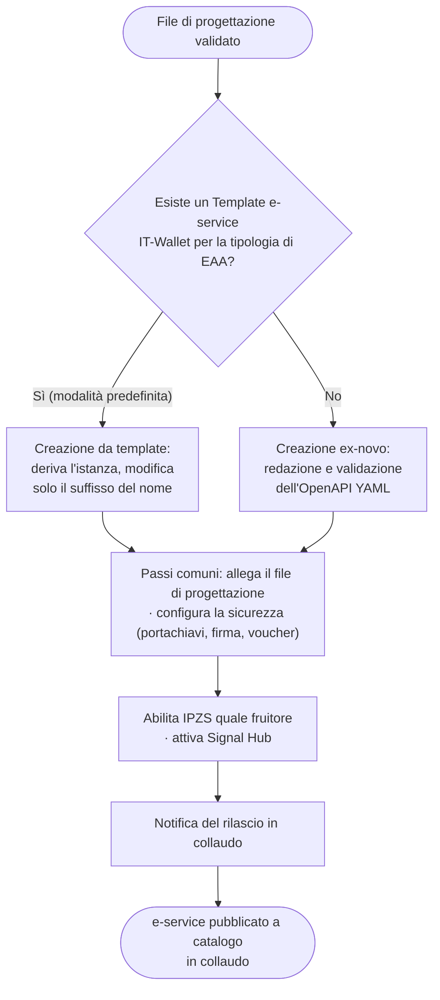

# Come pubblicare e configurare l'e-service in collaudo

In questa fase il progetto si concretizza in un servizio funzionante. L'attività in ambiente di **collaudo** consente di verificare dati, sicurezza e stati senza impatti reali: gli errori individuati in questa sede comportano costi contenuti, a differenza di quelli rilevati in produzione. La scelta tra template ed ex-novo, illustrata di seguito, determina l'entità delle attività di conformità a carico dell'AS.

**Prerequisiti.** [File di progettazione validato](come-progettare-le-caratteristiche-delleaa.md),  [adesione PDND completata](come-aderire-alla-pdnd-e-configurare-lambiente.md); per il percorso _ex-novo_, OpenAPI YAML [conforme ai requisiti](../riferimenti-tecnici/requisiti-dellopenapi-yaml-e-delle-service.md).

## Scelta della modalità di creazione

* **Modalità predefinita — da template.** Qualora per la tipologia di EAA sia disponibile un **Template e-service IT-Wallet** pubblicato, l'istanza è derivata da tale template: la conformità è garantita per costruzione e i cicli di correzione si riducono.
* **Modalità alternativa — ex-novo.** In assenza di un template adeguato, l'e-service è creato ex-novo mediante caricamento dell'OpenAPI YAML conforme; il file è sottoposto alla validazione del Service Management.

## Passi comuni successivi alla creazione (entrambe le modalità)



### **Allegare il file di progettazione validato**

Il file di progettazione validato deve essere allegato quale documentazione aggiuntiva dell'e-service (è ammesso il caricamento di file PDF o testuali).



### Configurare la sicurezza

Associare un **portachiavi** e predisporre la **firma delle risposte** (`INTEGRITY_REST_02`) e i **voucher**, coerentemente con i `pdnd_metadata` del file. Dettaglio in 3.4.



### Abilitare l'issuer alla fruizione

Per EAA di **interesse pubblico**, aggiungere l'attributo certificato **IPZS**, ove possibile con accettazione automatica



### Attivare Signal Hub in collaudo

Procedere all'attivazione di Signal Hub in collaudo coerentemente con `mappatura stati` (dettaglio in → [Signal hub: soglie di carico, probing e tracing](../riferimenti-tecnici/signal-hub-soglie-di-carico-probing-e-tracing.md)).



### Sviuppare il Credential Offer (opzionale)

Lo step che prevede lo sviluppo del Credential Offer è utile in particolare con discovery via touchpoint dell'Ente.



### **Notificare il rilascio in collaudo**

Notificare all'issuer (IPZS per EAA di interesse pubblico) il rilascio in collaudo




**Approfondimento PDND.** [Come creare e rendere disponibile un e-service](https://developer.pagopa.it/pdnd-interoperabilita/tutorials/come-creare-e-rendere-disponibile-un-e-service); [E-service — operazioni e ciclo di vita](https://www.developer.pagopa.it/it/pdnd-interoperabilita/guides/manuale-operativo-pdnd-interoperabilita/riferimenti-tecnici/e-service/operazioni-e-ciclo-di-vita); [Guida alla nomenclatura degli e-service](https://italia.github.io/pdnd-guida-nomenclatura-eservice/)


## Procedura operativa: creazione dell'e-service **da template**

**Ambito di applicazione.** Si applica quando per la tipologia di credenziale esiste già un **Template e-service IT-Wallet** pubblicato (ad esempio i tesserini degli ordini sanitari: psicologi, veterinari, ostetriche, farmacisti). In questo percorso l'AS non redige né valida un OpenAPI YAML: deriva la propria istanza da un template che ne fissa la specifica.

**Presupposto — esistenza del template.** Il template per una nuova tipologia di credenziale è predisposto a monte: l'AS si registra a IT-Wallet dichiarando il proprio **ambito/categoria tassonomica** (es. salute) e la **credenziale** da emettere; a valle di un'approvazione, il template viene creato.

> **Da verificare.** Dettagli del passaggio di registrazione/approvazione del template (nel materiale di lavoro è citato un termine pronunciato come «IAMO», con riferimento a un destinatario «Marco»): non confermati.

**Passaggi (UI PDND).**



### Avvio da template

Accedere a «crea e-service → usa template» e selezionare il template dalla **pagina Template IT-Wallet**, organizzata in **nove tile/categorie** (ciascuna raccoglie le attestazioni di un ambito, es. mondo salute). Per ciascun template è possibile consultare le implementazioni già realizzate.



### Assegnazione del nome

È modificabile **unicamente il suffisso**: la denominazione di base resta quella del template, garantendo la riconoscibilità degli e-service derivati; il suffisso distingue la singola istanza.



### **Completamento di configurazioni e informazioni di contatto**

Le informazioni di contatto hanno funzione **tecnica** (consentono a un fruitore di contattare il creatore del template) e di norma non corrispondono ai recapiti di una persona fisica.



### Pubblicazione

L'e-service è quindi pubblicato a **catalogo**.



> **\[Screenshot — PDND]** _Percorso «crea e-service → usa template»: pagina Template IT-Wallet con le nove tile/categorie._

> **\[Screenshot — PDND]** _Dettaglio di un template (es. badge sanitario) con l'elenco delle implementazioni realizzate e il campo nome con suffisso editabile._


**Vincoli per l'ente che deriva l'istanza.** Non è consentito: modificare la specifica; aggiungere claim; modificare l'ordine dei claim; eliminare claim. È modificabile unicamente il **suffisso** del nome. La personalizzazione riguarda i **valori** restituiti (popolati a livello di codice in fase di implementazione), non i campi..&#x20;



**Approfondimento PDND**    [Relazione tra template e istanza](https://www.developer.pagopa.it/it/pdnd-interoperabilita/guides/manuale-operativo-pdnd-interoperabilita/v1.0/riferimenti-tecnici/template-e-service/relazione-tra-template-e-istanza)


## Procedura operativa: creazione dell'e-service **ex-novo**

**Ambito di applicazione.** Si applica agli EAA di nuova tipologia o atipici, in assenza di un template adeguato.

**Passaggi (UI PDND).**



### Creazione

Da **Erogazione → I tuoi e-service → «Crea nuovo»**, inserire **nome e descrizione** (regole di nomenclatura AgID; denominazione _«Creazione EAA \[Nome/tipologia] – IT-Wallet»_), dichiarare la **tecnologia** (REST → OpenAPI), impostare la modalità su **«eroga»** e indicare l'eventuale disponibilità del servizio **Signal Hub**. Alcune informazioni (es. la tecnologia) non sono più modificabili dopo la pubblicazione della prima versione.



### **Caricamento dell'interfaccia API.**

Allegare l'**OpenAPI YAML** conforme ai requisiti di 3.7. Il file è validato a valle dal **Service Management** (validatore automatico): cfr. 3.7.5.



### Proseguire con i passi comuni

[**Proseguire con i passi comuni** ](come-pubblicare-e-configurare-le-service-in-collaudo.md#proseguire-con-i-passi-comuni)(allegato JSON, sicurezza, abilitazione Issuer, Signal Hub, notifica) descritti sopra.



> **\[Screenshot — PDND]** _Erogazione → I tuoi e-service → «Crea nuovo»: informazioni generali (tecnologia REST, modalità «eroga», flag Signal Hub)._

> **\[Screenshot — PDND]** _Step «Interfaccia API»: caricamento del file OpenAPI e della documentazione aggiuntiva._


**Approfondimento PDND.** [Come creare e rendere disponibile un e-service](https://developer.pagopa.it/pdnd-interoperabilita/tutorials/come-creare-e-rendere-disponibile-un-e-service); [Italian OpenAPI Checker](https://italia.github.io/api-oas-checker/) (auto-validazione del livello formale).


> <mark style="color:yellow;">**Da verificare.**</mark> <mark style="color:yellow;"></mark><mark style="color:yellow;">Se per IT-Wallet la modalità ex-novo sia ammessa o sia imposta la derivazione da template; chi crea e governa i template.</mark>

Pubblicato l'e-service in collaudo, è opportuno [sottoporlo a verifica prima della produzione](come-testare-lintegrazione-in-collaudo.md).&#x20;
