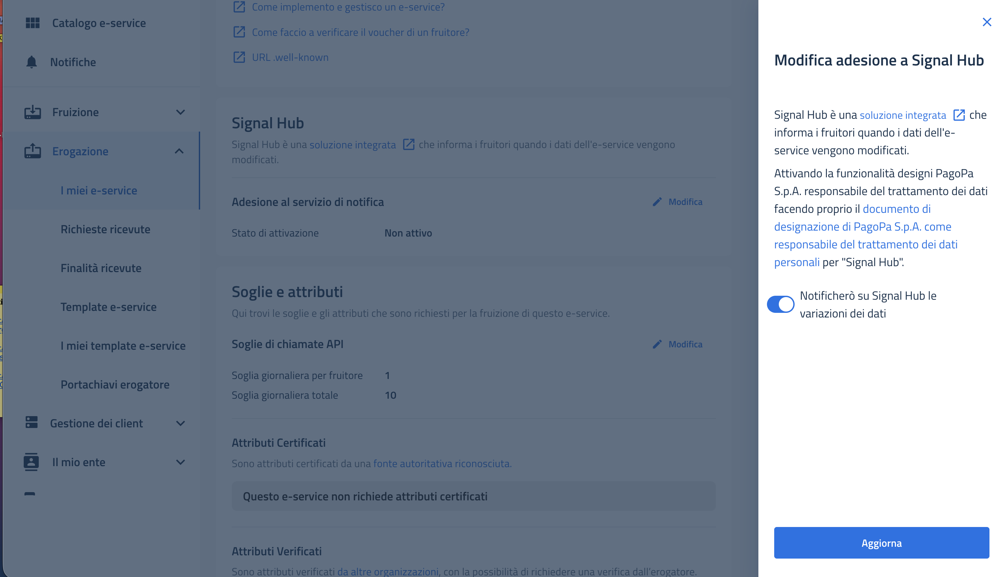
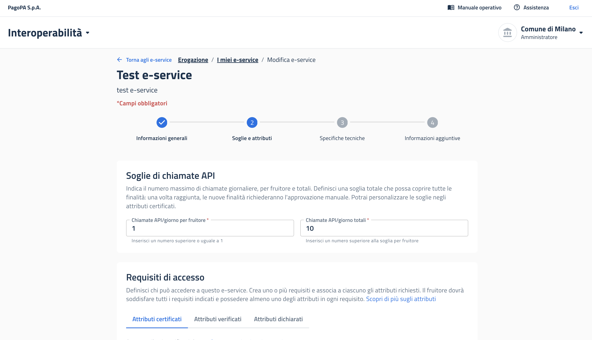

# Come pubblicare in produzione

Questa fase costituisce il passaggio dall'ambiente di prova a quello reale. Due elementi risultano determinanti: l'abilitazione del fruitore competente affinché possa effettivamente utilizzare l'e-service, e il dimensionamento realistico delle **soglie di carico**, al fine di evitare il rifiuto delle richieste o, all'opposto, il sovraccarico dell'infrastruttura.

**Prerequisiti.** Esito positivo (ove eseguiti) dei test in collaudo; autorizzazione interna al rilascio.

## Passaggi



### **Pubblicare l'e-service in produzione**

Per EAA di interesse pubblico, **abilitare IPZS** alla fruizione, ove possibile con accettazione automatica.



### **Attivare Signal Hub in produzione**

Come già fatto in collaudo, procedere all'attivazione di Signal Hub in produzione coerentemente con `mappatura stati` (dettaglio in → [Signal hub: soglie di carico, probing e tracing](../riferimenti-tecnici/signal-hub-soglie-di-carico-probing-e-tracing.md)).

<figure><figcaption></figcaption></figure>




### **Portare in produzione il Credential Offer (opzionale)**

Esclusivamente se sviluppato in collaudo.



### **Configurare le soglie di carico**

Procedere alla configurazione delle soglie di carico  (per fruitore e totali) e la stima di carico della finalità. Dettaglio in → [Signal hub: soglie di carico, probing e tracing](../riferimenti-tecnici/signal-hub-soglie-di-carico-probing-e-tracing.md).

<figure><figcaption></figcaption></figure>



### **Notificare il rilascio in produzione**

L'ultimo step è la notifica a IPZS (interesse pubblico) e a PagoPA (soluzione pubblica IT-Wallet) il rilascio in produzione




**Approfondimento PDND.** Versionamento e passaggio di versione: [Come aggiornare un e-service pubblicando una nuova versione](https://developer.pagopa.it/pdnd-interoperabilita/guides/manuale-operativo-pdnd-interoperabilita/tutorial/tutorial-per-lerogatore/come-aggiornare-un-e-service-pubblicando-una-nuova-versione).

