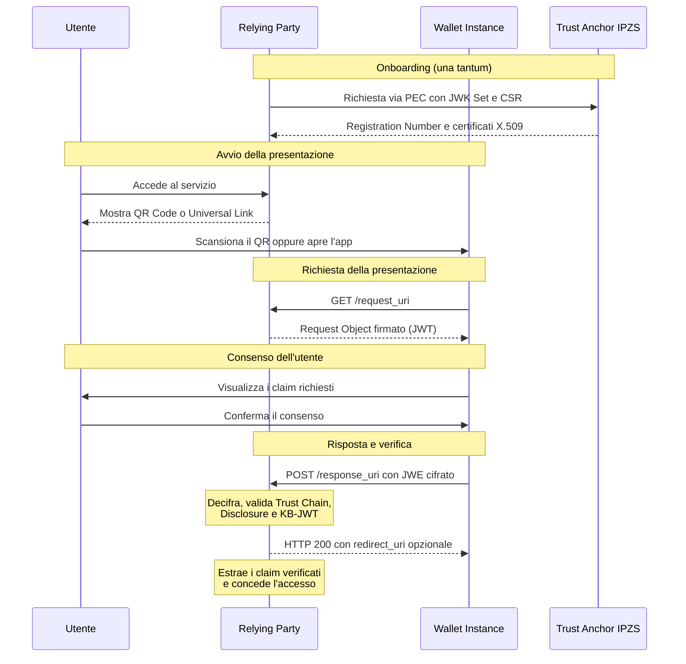

# Architettura del flusso e ambienti

## Il flusso end-to-end di presentazione remota

Il flusso remoto coinvolge tre attori principali: l'utente con la propria _Wallet Instance_, il Relying Party e il Trust Anchor IPZS. Il diagramma seguente sintetizza le interazioni nello scenario ideale.



**Onboarding** _(una tantum, propedeutico)_ — Il Relying Party invia a IPZS la propria richiesta di registrazione via PEC, con chiavi pubbliche e CSR; in risposta riceve un Registration Number e i certificati X.509 che certificano le proprie chiavi.



**Avvio** — L'utente accede al servizio del RP. Il RP mostra un QR Code (flusso _Cross-Device_) oppure un Universal Link (flusso _Same-Device_).



**Richiesta** — Il Wallet contatta il `request_uri` del RP per ottenere il Request Object firmato, che dichiara quali credenziali e quali claim sono richiesti.



**Consenso** — Il Wallet mostra all'utente i claim richiesti e il nome del RP; l'utente conferma o nega il consenso.



**Risposta** — In caso di conferma, il Wallet invia al `response_uri` del RP la presentazione cifrata (JWE) contenente il `vp_token`.



**Verifica** — Il RP decifra il JWE, risolve la Trust Chain dell'issuer della credenziale, verifica la firma del _Issuer-Signed-JWT_, valida ciascuna Disclosure contro l'array `_sd`, controlla il KB-JWT e lo stato di revoca; quindi estrae i claim verificati e concede l'accesso.



## I quattro momenti cardine dell'integrazione

Le attività operative del Relying Party si concentrano in quattro momenti distinti, ciascuno coperto da un Tutorial dedicato.

<table><thead><tr><th width="203.35546875">Momento</th><th width="559.30078125">Attività</th></tr></thead><tbody><tr><td><strong>Onboarding</strong></td><td>Registrazione presso IPZS via PEC, ricezione del Registration Number, pubblicazione di un Entity Configuration certificato con <code>authority_hints</code>, <code>x5c</code> e Trust Mark. <em>( →</em> <a href="../tutorial/come-onboardare-il-relying-party-nella-federazione-ipzs.md"><em>Come onboardare il relying party nella federazione IPZS</em></a><em>)</em></td></tr><tr><td><strong>Esposizione metadati</strong></td><td>Implementazione degli endpoint <code>request_uri</code>, <code>response_uri</code> ed <code>erasure_endpoint</code>; registrazione dei relativi URL nei metadati <code>openid_credential_verifier</code> dell'Entity Configuration. <em>( →</em> <a href="../tutorial/come-implementare-gli-endpoint-di-presentazione.md"><em>Come implementare gli endpoint di presentazione</em></a><em>)</em></td></tr><tr><td><strong>Richiesta</strong></td><td>Composizione e firma del Request Object; configurazione della Selection Page e del QR Code o Universal Link che instrada l'utente al Wallet. <em>( →</em> <a href="../tutorial/come-costruire-e-firmare-il-request-object.md"><em>Come costruire e firmare il request object</em></a><em>)</em> <em>( →</em> <a href="../tutorial/come-indirizzare-lutente-al-wallet-same-device-e-cross-device.md"><em>Come indirizzare l'utente al wallet same device e cross device</em></a><em>)</em></td></tr><tr><td><strong>Verifica</strong></td><td>Ricezione e decifratura della risposta sul <code>response_uri</code>, validazione crittografica della credenziale, estrazione dei claim verificati. <em>( →</em> <a href="../tutorial/come-verificare-la-risposta-del-wallet-ed-estrarre-i-claim.md"><em>Come verificare la risposta del Wallet ed estrarre i claim</em></a><em>)</em></td></tr></tbody></table>

## Gli ambienti

IT-Wallet espone due ambienti tecnicamente separati. Le attività di integrazione e collaudo si svolgono interamente in pre-produzione; solo dopo la conferma del corretto funzionamento si procede alla replica in produzione (_cfr. §5.2 Promuovere il Relying Party da pre-produzione a produzione_).

| Ambiente           | Trust Anchor                    | Onboarding                                                                          |
| ------------------ | ------------------------------- | ----------------------------------------------------------------------------------- |
| **Pre-produzione** | `https://pre.ta.wallet.ipzs.it` | PEC a `identitadigitale@pec.ipzs.it` con riferimento all'ambiente di pre-produzione |
| **Produzione**     | `https://ta.wallet.ipzs.it`     | PEC a `identitadigitale@pec.ipzs.it` con riferimento all'ambiente di produzione     |


**Principio operativo: prima pre-produzione, poi produzione.**&#x20;

L'intera procedura di onboarding, esposizione dei metadati, esecuzione dei conformance test e validazione con app IO deve essere portata a termine in pre-produzione prima di essere replicata in produzione. Per i due ambienti è richiesto l'uso di **domini distinti** (ad esempio `pre.relying-party.example.org` per pre-produzione e `relying-party.example.org` per produzione), poiché l'Entity Identifier registrato presso IPZS coincide con il dominio del RP.

