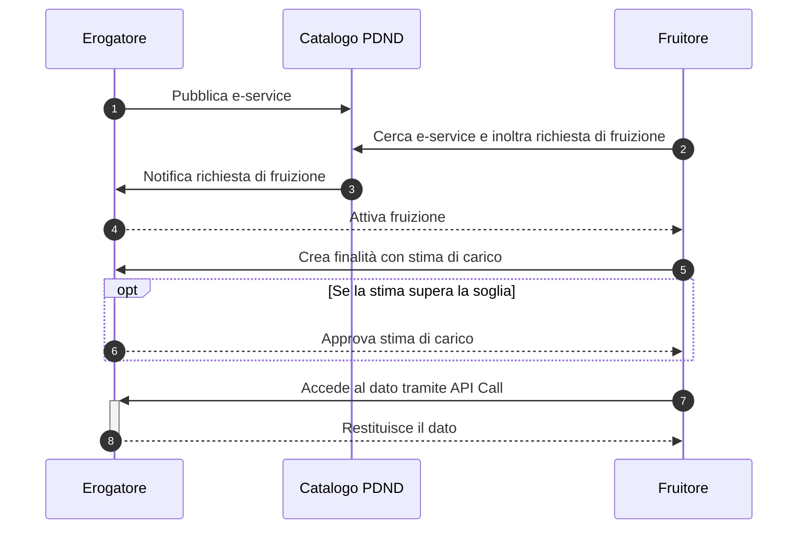

# Come funziona: il flusso operativo

### Ecosistema e ruolo della piattaforma

L’interoperabilità è un **ecosistema** composto da componenti, protocolli e standard. **PDND Interoperabilità** è la **piattaforma abilitante** al centro dell’ecosistema, che rende possibile la pubblicazione e la fruizione degli e-service.

### Percorso per condividere i dati su PDND Interoperabilità

1. **Adesione**\
   **Solo la prima volta**, [effettuare l’adesione](guida-alladesione.md) a PDND Interoperabilità.
2. **Verifica del catalogo**\
   Accedere alla piattaforma e **verificare le API già presenti** nel **Catalogo degli e-service**.
3. **Sviluppo dell’API conforme al ModI**\
   Scrivere una **API** che **rispetti il perimetro di sicurezza** e gli **standard del Modello di Interoperabilità (ModI)**, definito da AgID, che descrive il perimetro dell’interoperabilità tra pubbliche amministrazioni. Maggiori dettagli nella [sezione dedicata](../riferimenti-tecnici/e-service/strumenti-e-riferimenti.md).
4. **Controllo del voucher**\
   Aggiungere **un controllo sulla propria API** per verificare la **legittimità e validità** dei **voucher** presentati da chi richiede i dati. Il voucher è valido solo se **rilasciato da PDND Interoperabilità**, **in corso di validità** e **riferito alla risorsa corretta**. Maggiori dettagli nella [sezione dedicata](../tutorial/tutorial-per-lerogatore/come-verificare-la-validita-di-un-voucher-bearer.md).
5. **Pubblicazione come e-service**\
   Pubblicare sul **Catalogo di PDND Interoperabilità** l’API **sotto forma di e-service**, corredandola di **tutte le informazioni di contorno e contesto** necessarie ai casi d’uso.

### Modalità di utilizzo della piattaforma

* La piattaforma ha due modalità: **erogazione** e **fruizione**.
* Ogni aderente a PDND Interoperabilità può essere **solo erogatore** di e-service, **solo fruitore** oppure **entrambi** (erogando alcuni e-service e fruendone di altri).
* PDND Interoperabilità fornisce un’**interfaccia grafica (front office)** per gestire tutte le operazioni di **creazione, modifica, aggiornamento e archiviazione** del ciclo di vita degli e-service, sia per gli erogatori sia per i fruitori. Inoltre, mette a disposizione **un set di API** per interagire con la piattaforma e **automatizzare i processi**.

### Flusso minimo erogatore/fruitore

Di seguito un **flusso semplificato** per offrire una panoramica generale sul funzionamento della piattaforma. Alcuni passaggi verranno approfonditi nelle sezioni specifiche.

#### Flusso dell’erogatore

* Un aderente che desidera **erogare un e-service** può **crearlo e gestirlo** attraverso la piattaforma, come descritto in una [sezione precedente](funzionamento-generale.md#percorso-per-condividere-i-dati-su-pdnd-interoperabilita).
* **Una volta pubblicato**, il servizio è **disponibile nel Catalogo** degli e-service, dove potrà essere visualizzato in **modalità fruizione**.
* Gli aderenti interessati, **se in possesso dei requisiti minimi** richiesti dall’erogatore (**attributi**), possono **inoltrare una richiesta di fruizione**.
* L’erogatore ha la possibilità di **valutare e gestire** tali richieste.
* **Dopo l’approvazione** della richiesta di fruizione, il fruitore può **presentare le proprie finalità** e **iniziare a fruire** dell’e-service.

#### Flusso del fruitore

* Un aderente che desidera **fruire di un e-service** può **consultare il Catalogo** per visualizzare quelli disponibili.
* Se **possiede i requisiti minimi** richiesti, può **richiedere l’iscrizione** presentando una **richiesta di fruizione**, che verrà **valutata dall’erogatore**.
* Una volta che la richiesta è **approvata e attiva**, il fruitore può **creare finalità**, specificando:
  * **Dettagli sull’accesso e trattamento dei dati** (_analisi del rischio_).
  * **Stima di carico**, cioè il **numero stimato di chiamate API giornaliere** verso l’erogatore.
* Se la **stima di carico** **supera la capacità** dell’infrastruttura dell’erogatore, è necessaria un’**ulteriore approvazione tecnica** prima di utilizzare la finalità per accedere all’e-service.
* Quando la **finalità è attiva**, il fruitore può **finalizzare l’integrazione tecnica** per **ottenere un voucher** da PDND Interoperabilità e **accedere all’API** dell’erogatore.
* Tutti questi aspetti verranno **approfonditi nelle relative sezioni** della guida.

***

Pagina successiva [→ Come aderire: la guida completa](guida-alladesione.md)
