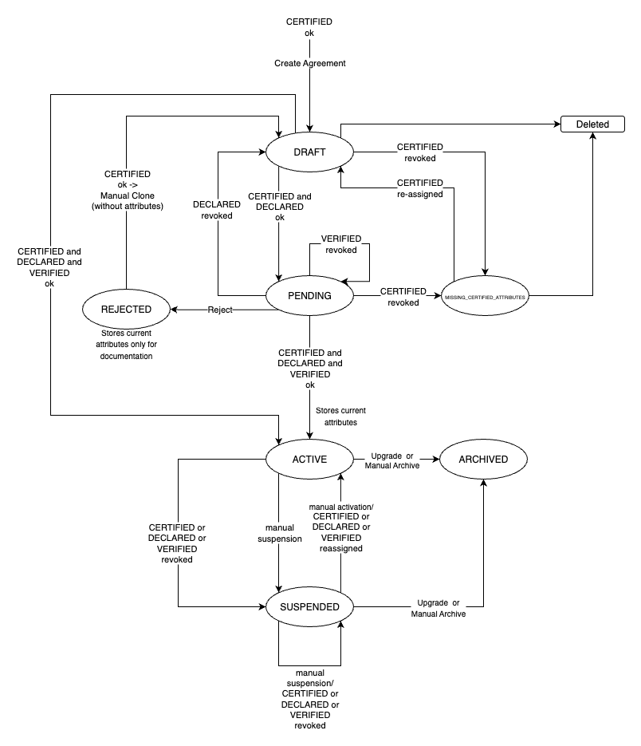

# Richiesta di fruizione (Agreement)

Questa sezione illustra i concetti e le operazioni relative alla **richiesta di fruizione** nell’ambito delle **API di PDND Interoperabilità**. Per l’inquadramento funzionale e il ciclo di vita della richiesta di fruizione nella piattaforma, consultare la [sezione dedicata](../richieste-di-fruizione/).

### Attributi

Alcune condizioni di stato e di transizione delle richieste di fruizione dipendono dagli **attributi** richiesti dall’e-service e **posseduti** dal fruitore. In particolare:

* **Attributi soddisfatti**: attributi **richiesti dall’e-service** e **assegnati** al fruitore.
* **Attributi persi**: attributi **richiesti** e **in precedenza assegnati**, successivamente **revocati**.

**Tipologie di attributi**:

* **CERTIFIED** (certificati) · **DECLARED** (dichiarati) · **VERIFIED** (verificati).

### Stati e transizioni — Quadro di insieme

<table><thead><tr><th width="109.38125610351562">Stato</th><th>Descrizione sintetica</th><th>Transizioni in uscita</th></tr></thead><tbody><tr><td><strong>DRAFT</strong></td><td>Stato iniziale alla creazione dell’Agreement; richiede attributi <strong>CERTIFIED</strong> soddisfatti (se previsti).</td><td>
→ <strong>ACTIVE</strong> (tutti i requisiti soddisfatti);

→ <strong>PENDING</strong> (richiede validazioni dell’erogatore);

→ <strong>MISSING_CERTIFIED_ATTRIBUTES</strong> (perdita di un <strong>CERTIFIED</strong>);

→ <em>cancellazione</em>.
</td></tr><tr><td><strong>PENDING</strong></td><td>In validazione da parte dell’erogatore; <strong>CERTIFIED</strong> e <strong>DECLARED</strong> soddisfatti; presenti <strong>VERIFIED</strong> non soddisfatti <strong>oppure</strong> approvazione manuale richiesta.</td><td>
→ <strong>ACTIVE</strong> (tutti i requisiti soddisfatti);

→ <strong>REJECTED</strong> (rifiuto erogatore);

→ <strong>DRAFT</strong> (perdita di <strong>DECLARED</strong>);

→ <strong>MISSING_CERTIFIED_ATTRIBUTES</strong> (perdita di <strong>CERTIFIED</strong>).
</td></tr><tr><td><strong>ACTIVE</strong></td><td>Agreement operativo; <strong>unico stato</strong> che abilita la <strong>generazione del voucher</strong>; tutti gli attributi soddisfatti.</td><td>
→ <strong>SUSPENDED</strong> (sospensione manuale o perdita di requisiti);

→ <strong>ARCHIVED</strong> (archiviazione manuale o automatica per <em>upgrade</em>).
</td></tr><tr><td><strong>SUSPENDED</strong></td><td>Sospensione temporanea attivata da fruitore, erogatore o piattaforma (perdita attributi). Stato <strong>reversibile</strong>.</td><td>
→ <strong>ACTIVE</strong> (nessuna sospensione in corso e requisiti soddisfatti);

→ <strong>SUSPENDED</strong> (permane condizione di sospensione o requisiti non completi);

→ <strong>ARCHIVED</strong> (archiviazione manuale o dopo <em>upgrade</em>).
</td></tr><tr><td><strong>ARCHIVED</strong></td><td>Stato <strong>definitivo</strong> di accordo non più in uso; per accedere nuovamente all’e-service è necessario <strong>creare un nuovo Agreement</strong>.</td><td>— (nessuna transizione ulteriore).</td></tr><tr><td><strong>REJECTED</strong></td><td>Rifiuto dell’erogatore; il fruitore può <strong>presentare una nuova richiesta</strong> nel rispetto delle indicazioni ricevute.</td><td>— (stato definitivo).</td></tr><tr><td><strong>MISSING_CERTIFIED_ATTRIBUTES</strong></td><td>Mancanza di uno o più <strong>CERTIFIED</strong> richiesti <strong>prima</strong> dell’attivazione; l’Agreement resta <strong>immodificabile</strong> fino al ripristino.</td><td>
→ <strong>DRAFT</strong> (ripristino di tutti i <strong>CERTIFIED</strong>);

→ <em>cancellazione</em>.
</td></tr></tbody></table>

### Dettaglio degli stati

<figure><figcaption>
Diagramma di flusso che descrive i passaggi di stato
</figcaption></figure>

#### DRAFT

**Caratteristiche**

* Stato iniziale dei nuovi Agreement.
* Raggiungibile solo con **CERTIFIED** richiesti **soddisfatti** (se previsti).

**Transizioni**

* **ACTIVE**: tutti i requisiti sono soddisfatti; non servono ulteriori validazioni.
* **PENDING**: occorrono validazioni dell’erogatore.
* **MISSING\_CERTIFIED\_ATTRIBUTES**: perdita di almeno un **CERTIFIED** richiesto.
* _Cancellazione_.

#### PENDING

**Caratteristiche**

* **CERTIFIED** e **DECLARED** soddisfatti.
* Presenti **VERIFIED** non soddisfatti **oppure** è richiesta **approvazione manuale** dell’erogatore.
* Il cambio di stato successivo è in capo all’**erogatore**.

**Transizioni**

* **ACTIVE**: requisiti completi, nessuna ulteriore validazione.
* **REJECTED**: rifiuto da parte dell’erogatore.
* **DRAFT**: perdita di almeno un **DECLARED** richiesto.
* **MISSING\_CERTIFIED\_ATTRIBUTES**: perdita di almeno un **CERTIFIED** richiesto.

#### ACTIVE

**Caratteristiche**

* Agreement **operativo**.
* **Unico stato** che consente la **generazione del voucher**.
* **Tutti gli attributi** risultano soddisfatti.

**Transizioni**

* **SUSPENDED**: sospensione manuale o perdita dei requisiti.
* **ARCHIVED**: archiviazione manuale del fruitore, **oppure** automatica a seguito di **upgrade**.

#### SUSPENDED

**Condizioni di accesso**

* Sospensione **manuale** del fruitore.
* Sospensione **manuale** dell’erogatore.
* Sospensione da **piattaforma** per perdita di uno o più attributi.

**Caratteristiche**

* Agreement **temporaneamente non operativo**.
* Stato **reversibile**.

**Transizioni**

* **ACTIVE**: nessuna sospensione in corso e requisiti completi.
* **SUSPENDED**: permane sospensione o requisiti non completi.
* **ARCHIVED**: archiviazione manuale del fruitore **oppure** successiva a **upgrade**.

#### ARCHIVED

**Caratteristiche**

* Stato **definitivo** (privo di transizioni in uscita).
* Per un nuovo accesso all’e-service è necessario **creare un nuovo Agreement**.

#### REJECTED

**Caratteristiche**

* Esito di **rifiuto** da parte dell’erogatore.
* Stato **definitivo**; il fruitore può **presentare una nuova richiesta** secondo le indicazioni fornite.

#### MISSING\_CERTIFIED\_ATTRIBUTES

**Caratteristiche**

* Perdita di uno o più **CERTIFIED** richiesti **prima** dell’attivazione.
* L’Agreement resta **immodificabile** per fruitore ed erogatore fino al ripristino.

**Transizioni**

* **DRAFT**: ripristino di **tutti** i **CERTIFIED** richiesti.
* _Cancellazione_.

### Operazioni

#### Aggiornamento di una richiesta di fruizione (_upgrade_)

L’**upgrade** consente al fruitore, che utilizza una **versione deprecata** dell’e-service, di **aggiornare** la propria richiesta di fruizione alla **versione più recente**. L’operazione prevede: richiesta-di-fruizione

* **Creazione** di un **nuovo Agreement** collegato alla **nuova versione** dell’e-service, **mantenendo lo stato** dell’Agreement esistente.
* **Archiviazione** dell’**Agreement esistente**.

***

Pagina successiva [→ Finalità (Purpose)](finalita-purpose.md)
