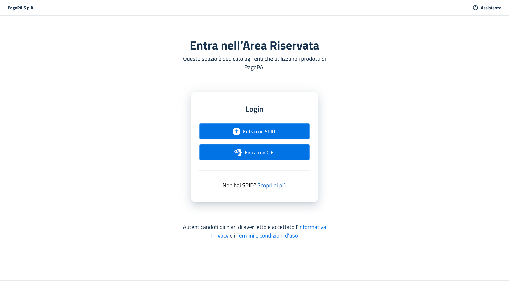
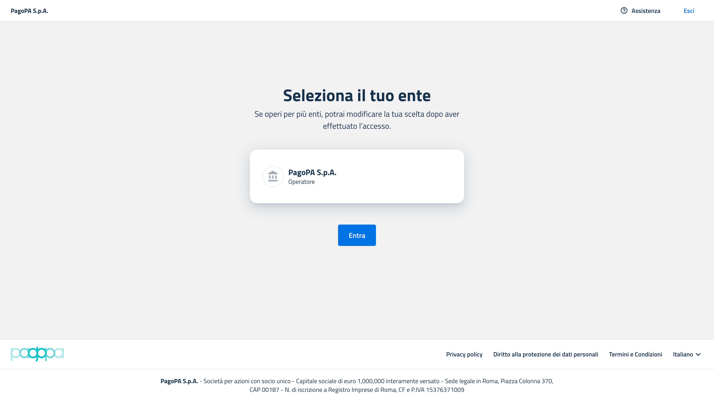

# Come accedere al front office di PDND Interoperabilità

## Step 1 - Login

Effettuare il login con SPID o CIE.

<figure><figcaption>
Schermata di login alla Piattaforma Area Riservata (Self Care) attraverso SPID.
</figcaption></figure>

## Step 2 - Selezionare l'Ente

Scegliere l'ente per il quale si opera.

<figure><figcaption>
Schermata di selezione ente sulla Piattaforma Area Riservata (Self Care).
</figcaption></figure>

## Step 3 -Selezionare Interoperabilità

Selezionare il prodotto _**Interoperabilità**_.

<figure><figcaption>
Schermata di selezione prodotto sulla Piattaforma Area Riservata (Self Care).
</figcaption></figure>

## Step 4 - Selezionare l'ambiente

Viene richiesto l'ambiente in cui si intende operare: _**Collaudo**_, _**Attestazione**_ o _**Produzione**._&#x20;

Si viene indirizzati a PDND Interoperabilità nell'ambiente richiesto.

<figure><figcaption>
Schermata di selezione ambiente, dopo aver selezionato il prodotto, sulla Piattaforma Area Riservata (Self Care).
</figcaption></figure>


Se non ti viene chiesto di scegliere l'ambiente, vuol dire che la tua utenza è associata solamente ad uno dei tre ambienti disponibili. Per farti abilitare agli altri ambienti, contatta un tuo amministratore.


***

Pagina successiva [→ Come creare un nuovo amministratore](come-creare-un-nuovo-amministratore.md)
