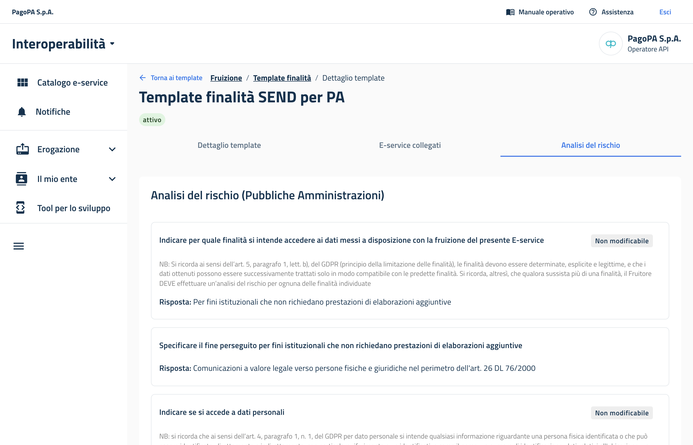
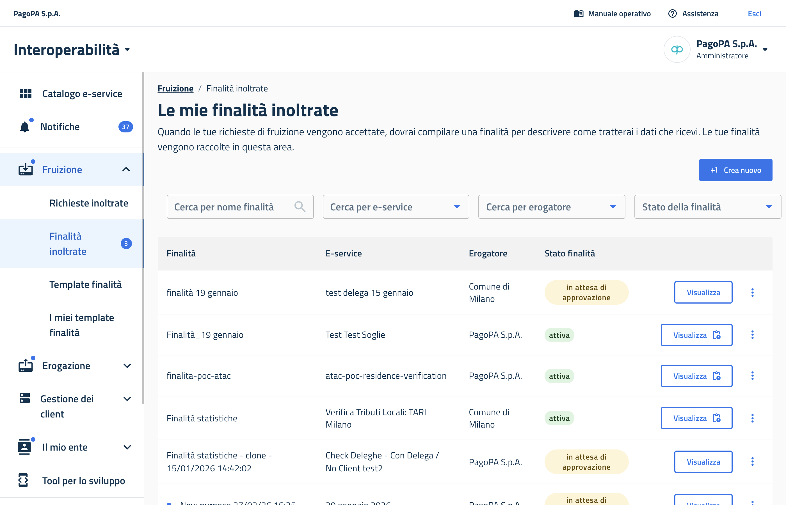
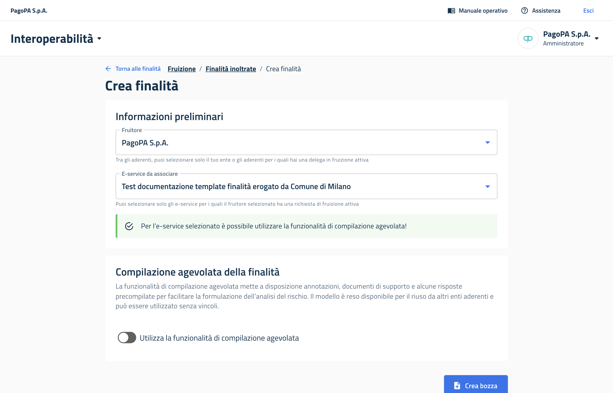

# Come generare una finalità da un template


L'operazione è eseguibile solamente dagli utenti con ruolo di amministratore per il proprio aderente, esattamente come per una finalità standard.


È possibile per ogni aderente riutilizzare dei modelli precompilati di finalità, chiamati "template di finalità". Il principale vantaggio è di trovare l'analisi del rischio già compilata per il caso d'uso di interesse. Maggiori informazioni nella [sezione dedicata](../../riferimenti-tecnici/template-finalita/).

La funzionalità è disponibile solo per gli e-service che erogano dati (erogazione diretta). In questo caso, è il fruitore che si trova a compilare l'analisi del rischio.

Un esempio è il template di finalità che PagoPA ha messo a disposizione delle Pubbliche Amministrazioni per l'utilizzo del proprio e-service SEND.

<figure><figcaption>
Template di finalità messo a disposizione per l'e-service SEND
</figcaption></figure>

### Step 1: Avviare la creazione di una nuova finalità

Andare su _Fruizione > Finalità_ inoltrate e selezionare _Crea nuovo._

<figure><figcaption></figcaption></figure>

### Step 2: Selezionare fruitore e e-service

Come per ogni finalità standard, selezionare il fruitore e l'e-service per il quale si vuole creare la finalità.&#x20;

Il campo del fruitore è sempre compilato di default con l'indicazione dell'aderente per il quale si sta operando. È possibile modificarlo nel caso in cui si abbiano delle deleghe per la fruizione attive.

Una volta selezionato l'e-service, il sistema indica se sono presenti template per la compilazione agevolata della finalità.

<figure><figcaption></figcaption></figure>

### Step 3: Attivare la compilazione agevolata

Attivando l'interruttore _Utilizza la funzionalità di compilazione agevolata_, si apriranno le opzioni per selezionare il template di interesse da utilizzare.

Attivando anche l'interruttore _Mostra solo template suggeriti per l'e-service che ho selezionato_, verranno mostrati solo quei template che il creatore ha suggerito per quell'e-service.

Questo vuol dire che il creatore del template ha esplicitamente indicato quel template finalità perché sia utilizzato per quello specifico e-service.

Prima di poter proseguire, è necessario attivare anche l'ultimo interruttore. Serve per ricordare a chi utilizza i template che la responsabilità della correttezza delle informazioni ricade sempre su chi presenta la finalità (cioè l'utilizzatore del template, e non il creatore). Ciò è coerente con quanto previsto dalle Linee Guida AgID.&#x20;

<figure><figcaption></figcaption></figure>

### &#x20;Step 4: Rivedere le informazioni di base della finalità

È possibile modificare il nome della finalità ed eventualmente il suggerimento di chiamate API predisposto dal creatore. Una volta finito, selezionare _Salva bozza e prosegui_.

<figure><figcaption></figcaption></figure>

### Step 4: Rivedere l'analisi del rischio

È quindi possibile rivedere l'analisi del rischio predisposta dal creatore del template. Le domande del questionario possono essere:

**Non modificabili**: il creatore ha risposto e chi lo utilizza non può modificare.

<figure><figcaption>
Esempio di domanda con risposta non modificabile
</figcaption></figure>

**Modificabili, da selezionare**: il creatore ha risposto con più opzioni, e sta a chi lo utilizza selezionare l'opzione che si applica nel suo caso.

<figure><figcaption>
Esempio di domanda con opzioni di risposta tra le quali scegliere
</figcaption></figure>

**Modificabili, da completare**: il creatore ha indicato come deve essere compilato il campo, lasciando un'annotazione ed eventuale documentazione a corredo. Sta a chi lo utilizza completare la risposta.

<figure><figcaption>
Esempio di domanda con annotazioni per guidare la compilazione
</figcaption></figure>

Una volta finito, selezionare _Salva bozza e prosegui_.

### Step 5: Rivedere e pubblicare la finalità

Nella vista riassuntiva, verificare che tutto sia compilato correttamente. Quindi, selezionare _Pubblica bozza_.

<figure><figcaption>
La vista riassuntiva della bozza di finalità
</figcaption></figure>

***

Pagina successiva [→ Come presentare una richiesta di fruizione tramite API](come-presentare-una-richiesta-di-fruizione-tramite-api.md)
