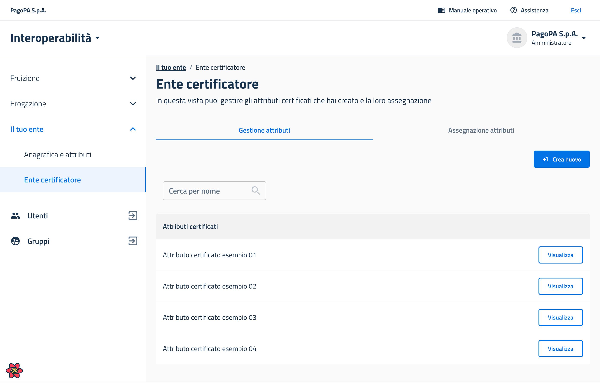

# Come creare un nuovo attributo certificato

## Precondizioni

Per creare nuovi attributi certificati, è necessario essere accreditati come _Ente Certificatore_. Per maggiori informazioni, si veda la [sezione dedicata](../../riferimenti-tecnici/attributi/enti-certificatori.md).

## Step 1 - Accedere al back office

Gli utenti con permessi di _amministratore_ possono accedere attraverso il back office nel menu di sinistra alla voce _**Il mio ente > Ente certificatore**,_ che permette di accedere alla schermata seguente.

<figure><figcaption>
La schermata che mostra la tab <em><strong>Gestione attributi</strong></em> all'interno della pagina <em><strong>Il mio ente > Ente certificatore</strong></em>
</figcaption></figure>

## Step 2 - Creazione di un attributo

Per creare un nuovo attributo devono clliccare su _**Crea nuovo**_, inserire il nome e la descrizione del nuovo attributo e viene creato.

L'attributo appena creato diventa disponibile per tutti gli enti nell'elenco degli attributi certificati che possono essere richiesti per l'iscrizione ad un e-service presente nel catalogo di PDND Interoperabilità. I potenziali enti fruitori che rispettano tutti i requisiti potranno iscriversi all'e-service.

## Step 3 - Assegnazione o revoca di un attributo

Gli enti certificatori possono assegnare gli attributi certificati che hanno creato a sé stessi e ad altri aderenti. Per farlo, entra su _**Il mio ente > Ente certificatore**_, tab _**Assegnazione attributi**_.

Da lì può cliccare su _**Assegna attributo**_ per assegnare un proprio attributo certificato ad un ente, oppure individuare l'ente dalla lista sottostante per revocare l'attributo.

***

Pagina successiva [→ Come associare un portachiavi ad un e-service](come-associare-un-portachiavi-ad-un-e-service.md)
