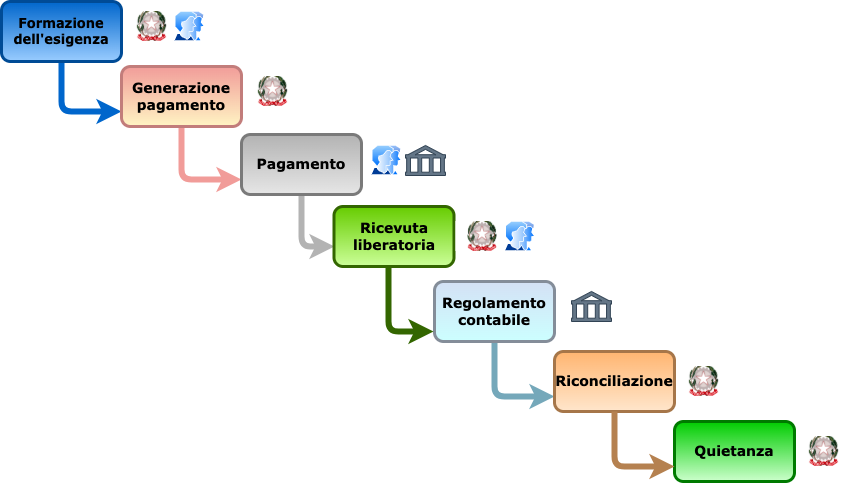

---
metaLinks:
  alternates:
    - >-
      https://app.gitbook.com/s/EnBg5c1okkV2J4KL0TcG/specifiche-attuative-del-nodo-dei-pagamenti-spc/funzionamento-generale/ciclo-di-vita-di-un-pagamento
---

# Ciclo di vita di un pagamento

Il pagamento mediante la piattaforma pagoPA è un’operazione complessa, composta di diverse fasi, che, in linea generale, seguono un preordinato “Ciclo di vita” condizionato da procedimenti amministrativi che prevedono il rispetto di regole per il loro corretto svolgimento, tale “Ciclo di vita” può essere rappresentato dal flusso contenuto nella figura seguente.

