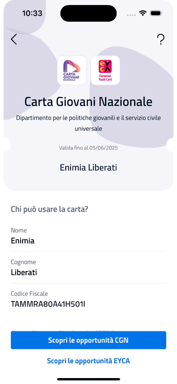

# 1️⃣ Presenza fisica del Beneficiario

Nel caso di acquisti effettuati presso luoghi fisici, il protocollo di riconoscimento prevede che il Beneficiario dimostri all’Operatore il possesso della CGN, esibendo la carta virtuale presente nella sezione Portafoglio all’interno dell’App IO. Nella schermata dell’App verrà visualizzata la versione digitale della carta (Fig. 1) su cui sono riportate le seguenti informazioni:

* Nome e Cognome Beneficiario;&#x20;
* Codice Fiscale Beneficiario;&#x20;
* Stato e data di attivazione della CGN;&#x20;
* Data di scadenza della CGN.

<figure><figcaption>
<mark style="color:purple;"><strong>Fig.1</strong> La sezione Portafoglio e il dettaglio della Carta Giovani Nazionale in App IO</mark>
</figcaption></figure>

Le forme grafiche presenti sullo sfondo della carta virtuale CGN saranno animate, per garantire al personale di vendita dell’Operatore l’autenticità della carta e le generalità dell'avente diritto.\
L’Operatore può riservarsi di richiedere un documento di riconoscimento in corso di validità (carta d'identità, patente, passaporto), che attesti l'identità del Beneficiario.

<figure><figcaption>
Animazione della CGN
</figcaption></figure>


A differenza di quanto avviene per la carta EYCA, la CGN in App IO **non espone un identificativo univoco** e **non è** al momento **rilasciata in versione fisica**. &#x20;

