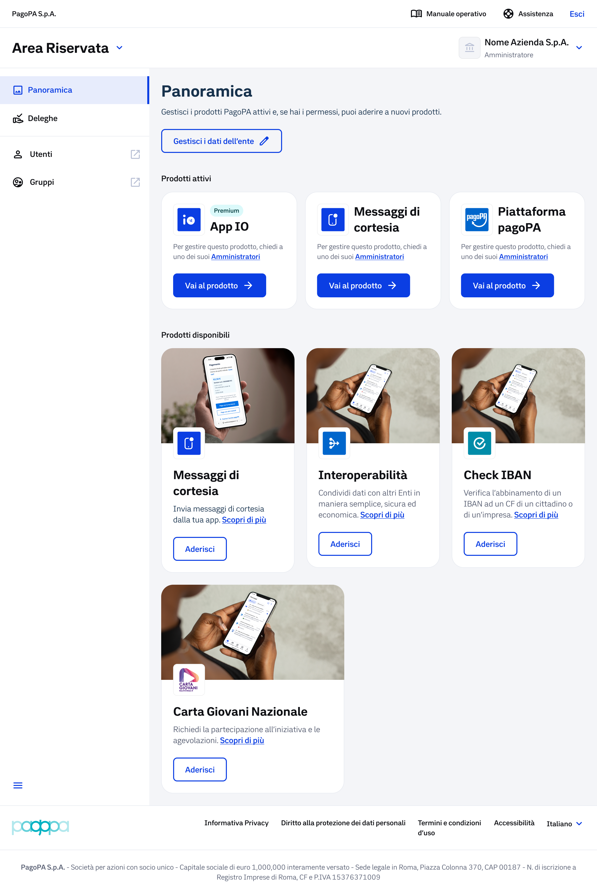
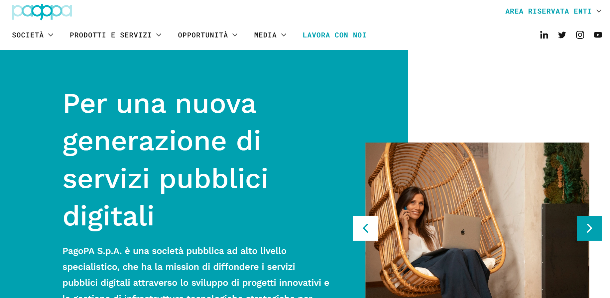
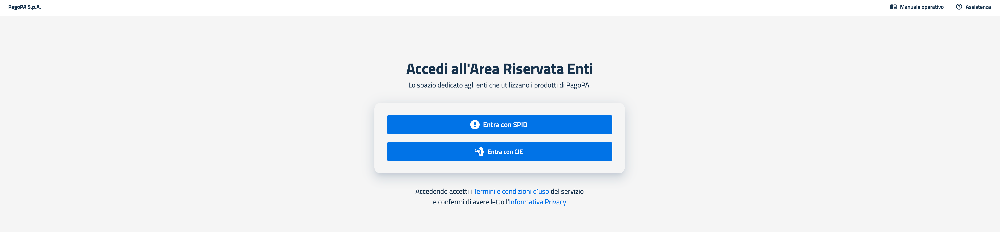
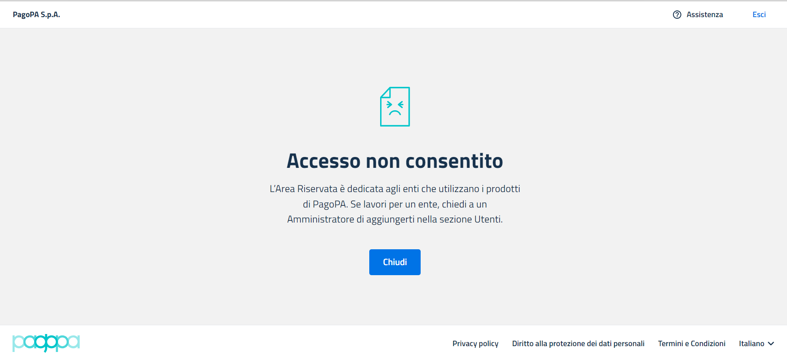
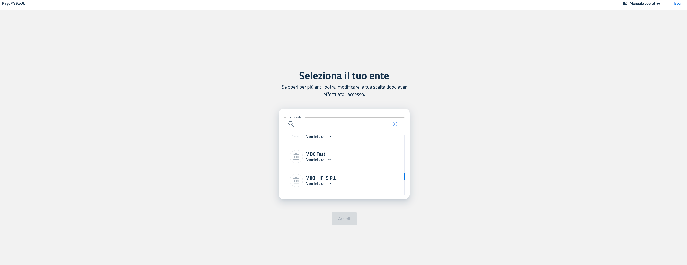

# Accesso Area Riservata

Questa sezione ospita la lista dei prodotti a cui il PSP ha aderito e da cui è possibile effettuare l'accesso al portale dedicato al singolo prodotto, tra cui la Card di "Messaggi di Cortesia".

<figure><figcaption></figcaption></figure>

## Accesso all'Area Riservata

Per gestire il prodotto "Messaggi di Cortesia, è necessario prima accedere all'Area Riservata di PagoPA nella sezione Panoramica, in cui è presente la sezione dedicata ai prodotti disponibili.

Per poter accedere all'Area Riservata, è necessario aver completato l'adesione ad un prodotto (vedi [Manuale onboarding: sezione Processo di adesione](https://developer.pagopa.it/it/pago-pa/guides/manuale-bo-psp/v1.0/manuale-operativo-pagamenti-pagopa-prestatore-di-servizi-di-pagamento/accesso)) e che l'utente sia stato censito come Amministratore o Operatore sul prodotto stesso.

#### Step 1: Accedere al sito PagoPA

È possibile accedere all'Area Riservata recandosi sul sito [https://www.pagopa.it ](https://www.pagopa.it/)e cliccando in alto a destra su "AREA RISERVATA ENTI".

<figure><figcaption></figcaption></figure>

#### Step 2: Autenticarsi con SPID o CIE

L'accesso all'Area Riservata di PagoPA può essere effettuato tramite:

* Autenticazione mediante SPID (Sistema Pubblico di Identità Digitale);
* Autenticazione mediante CIE (Carta d'Identità Elettronica).

All'interno della pagina di accesso sono disponibili i link per visualizzare i Termini e condizioni d'uso della piattaforma e l'Informativa Privacy.&#x20;

<figure><figcaption></figcaption></figure>

Una volta effettuato l'accesso mediante una delle modalità disponibili, in base al numero di aderenti a cui si è associati, si incorre in uno dei seguenti scenari:&#x20;

1. **Utente con profilo non associato a nessun soggetto aderente**

Se si tenta di effettuare l’accesso senza avere un soggetto aderente associato, non è permesso l'accesso all’Area Riservata:

<figure><figcaption></figcaption></figure>

In questo caso non è permesso l'accesso all’Area Riservata fino a che l'utente non sia stato abilitato.\
Da qui sarà solo possibile tornare alla schermata di login tramite il tasto "Chiudi", effettuare il log-out oppure contattare l'Assistenza.

2. **Utente associato ad un unico soggetto aderente e ad un prodotto per cui non è ancora stata completata l'adesione**

Se l'unico aderente a cui si è associati non ha ancora portato a termine l'adesione al primo prodotto, in pagina sarà mostrata l'etichetta dell'ente con le seguenti informazioni:

* Nome del soggetto aderente con richiesta di adesione in corso;
* Indicazione del proprio ruolo per quel soggetto aderente (Amministratore/ Operatore);
* Tag “Da Completare” che indica una richiesta inviata ma per cui non è ancora stato caricato l’Accordo di adesione firmato.

In questo caso non è possibile accedere all’Area Riservata fino a quando l’adesione al prodotto non sarà stata completata (vedi [Prerequisiti per accesso al portale](https://developer.pagopa.it/it/pago-pa/guides/manuale-bo-psp/v1.0/manuale-operativo-pagamenti-pagopa-prestatore-di-servizi-di-pagamento/prerequisiti-per-accesso-al-portale)).Da qui è solo possibile effettuare il log-out oppure tornare alla pagina di accesso tramite tasto “Torna alla home”.Nel momento in cui l’adesione al prodotto viene portata a termine, il tag “Da completare” non è più visibile e si può accedere al portale cliccando su “Accedi”.

3. **Utente associato a più soggetti aderenti di cui almeno uno ha correttamente terminato l’adesione ad un prodotto**

Nel caso in cui si sia associati a più soggetti aderenti, all’interno della pagina “Seleziona il tuo ente” viene esposta la relativa lista.

Per facilitare la ricerca all’interno della lista, è disponibile un campo di ricerca in cui poter digitare manualmente il nome dell'aderente. Nel caso in cui si ricerchi un ente a cui non si è associati, viene visualizzato il messaggio "Nessun risultato".È possibile selezionare l'ente di interesse ed accedere alla relativa Area Riservata se quest'ultimo ha concluso almeno un’adesione.

#### **Step 3: Selezionare l’Ente**

Selezionare l’Ente (o PSP) per cui si vuole operare dall’elenco disponibile.

<figure><figcaption></figcaption></figure>

L'Area Riservata di PagoPA è accessibile agli utenti che possiedono un ruolo attivo da Amministratore o Operatore su almeno uno dei prodotti che sono stati attivati dal proprio aderente ed è composta da tre sezioni principali:

* Panoramica, pagina principale che riporta:
  1. Dati anagrafici dell'aderente;
  2. Prodotti attivi, ovvero i prodotti a cui l’ aderente ha già aderito;
  3. Prodotti disponibili, ovvero i prodotti per cui non è ancora stata effettuata una richiesta di adesione;
* **Utenti**: sezione dedicata alla gestione delle utenze collegate all’aderente per ogni specifico prodotto;
* **Gruppi**: sezione dedicata alla gestione dei gruppi nei quali sono suddivisi i vari utenti abilitati sui prodotti.

La visualizzazione e l’operatività all’interno delle diverse sezioni dipenderà dal ruolo attribuito all'utente per quel determinato prodotto.

