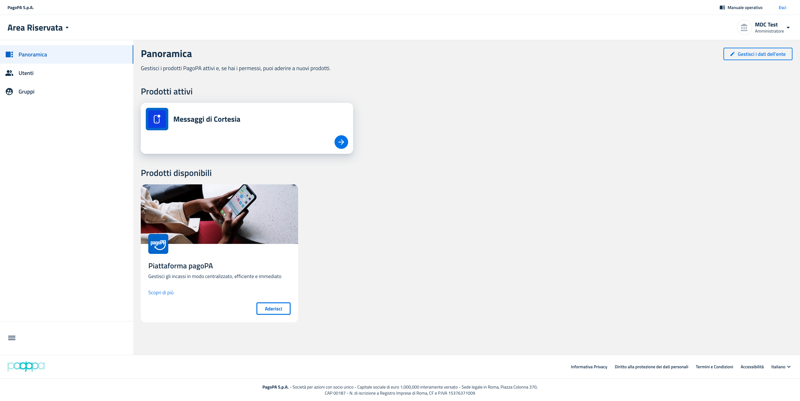

# Accesso Panoramica prodotti

#### Card Messaggi di Cortesia

Nella sezione Panoramica dell’Area Riservata, individuare la card dedicata al prodotto “Messaggi di Cortesia”.

<figure><figcaption></figcaption></figure>

#### Step 5: Selezione dell'Ambiente

Il BackOffice "Messaggi di Cortesia" è disponibile in due ambienti distinti: Collaudo e Produzione.\
Cliccando sul pulsante "Vai al prodotto" dalla card Messaggi di Cortesia nella sezione Panoramica, viene presentata una wizard che consente di selezionare l'ambiente su cui si intende operare:&#x20;

* Collaudo (UAT): ambiente di test, dedicato alle verifiche funzionali. In questo ambiente è presente un banner di avviso: "Attenzione: i dati non devono essere reali".&#x20;
* Produzione: ambiente operativo reale, dedicato all'operatività a regime.&#x20;

<figure><figcaption></figcaption></figure>

Per accedere al prodotto è necessario scegliere l'ambiente target cliccando sul relativo bottone.\
&#x20;Una volta selezionato l'ambiente, il sistema verifica se l'Ente/PSP è già registrato o meno in quell'ambiente ([vedi Meccanismo di Single Sign-on](accesso-in-modalita-single-sign-on-sso.md)).l'utente atterra nella pagina principale del BackOffice.
