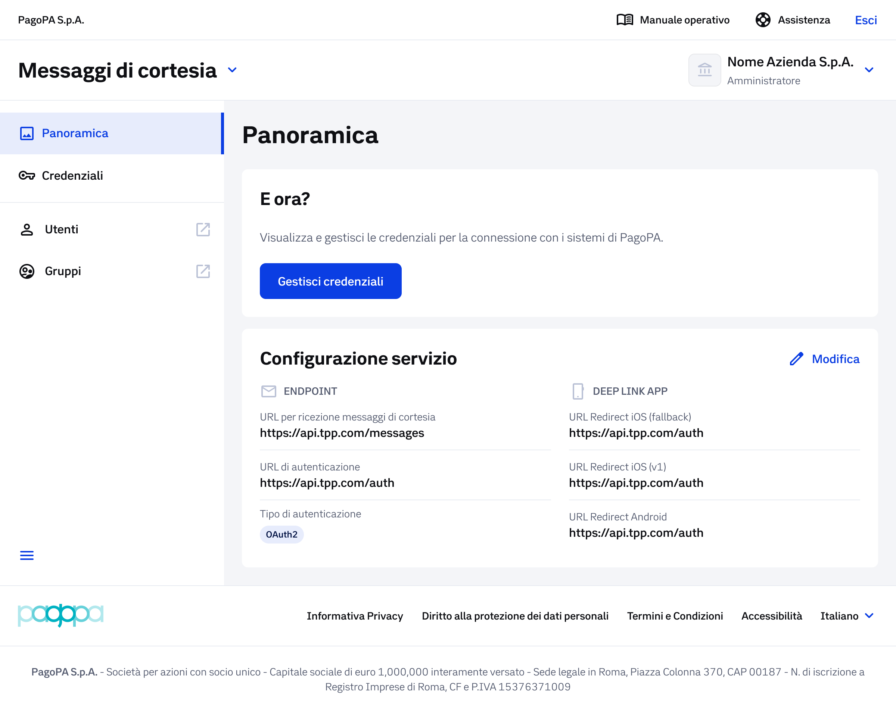

# Navigazione del servizio su Prod e Collaudo

## Home page BackOffice

Questa schermata rappresenta la vista completa del BackOffice per un PSP già registrato.

Dopo aver effettuato l'accesso tramite Token Exchange, l'utente atterrerà nella sezione **Panoramica**. La struttura è identica tra l'ambiente di Collaudo e quello di Produzione, ad eccezione del banner di avviso presente esclusivamente in Collaudo.

La navigazione avviene tramite il menu laterale sinistro, suddiviso nelle seguenti sezioni: **Panoramica, Credenziali, Utenti, Gruppi**.

<figure><figcaption></figcaption></figure>

### **Panoramica**

La sezioni è composta dal box per:

**1. Configurazione servizio che r**iepiloga i valori attualmente impostati:

* URL per la ricezione dei messaggi di cortesia
* URL di autenticazione
* Tipo di autenticazione
* URL di redirect per le app mobile

Per modificare questi valori, cliccare sulla label **"Modifica"**: si aprirà la wizard di configurazione.

**2. E ora?** Contiene il pulsante **"Gestisci credenziali"**, che consente di accedere alla configurazione e alla gestione delle credenziali PagoPA e TPP (vedi sezione configurazione e modifica Credenziali)

***

### **Credenziali**

**Cliccando sulla label** Credenziali' dal menu di navigazione laterale sinistro, si visualizza la wizard divisa in due blocchi distinti:&#x20;

<figure><figcaption></figcaption></figure>

1. **Credenziali PagoPA**: (CLIENT ID, CLIENT SECRET, GRANT TYPE, TPP ID). I campi non sarano modificabili.
2. **Credenziali TPP**: (CLIENT ID, CLIENT SECRET, GRANT TYPE). Entrambi i blocchi hanno un pulsante 'Modifica'.

