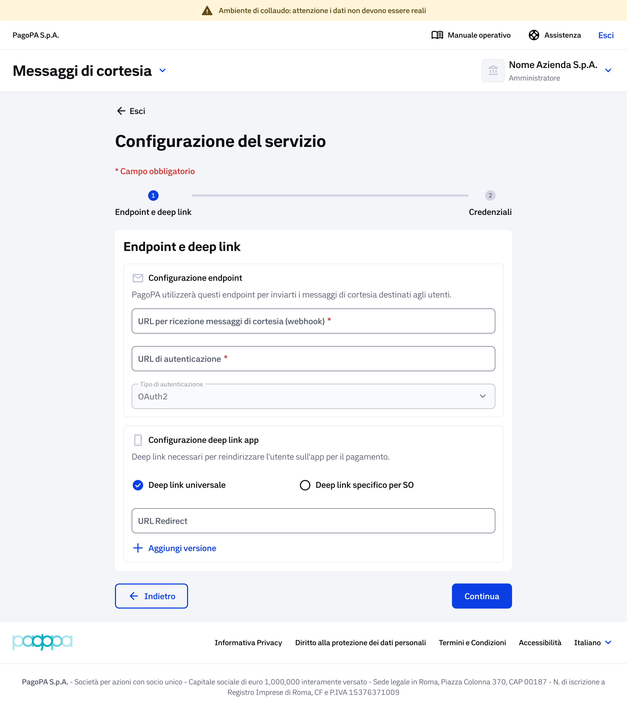
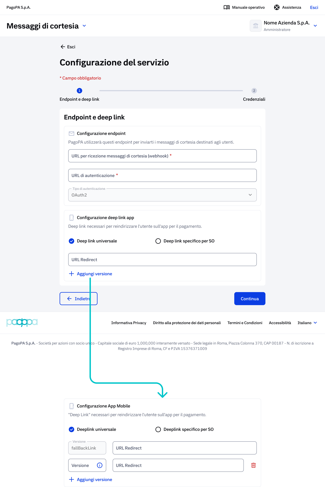
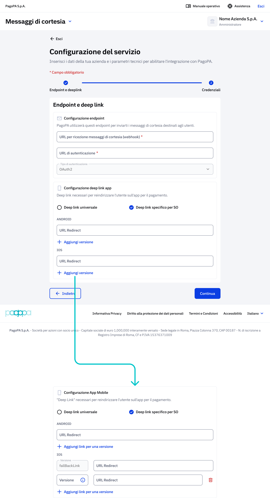

# Onboarding Ambiente di Collaudo (UAT)

L'onboarding in ambiente UAT è il primo passo operativo e permette di verificare la configurazione tecnica prima di replicarla in produzione. Si tratta di un ambiente di test: tutti i dati inseriti NON devono essere reali.


In ambiente di Collaudo (UAT) è sempre presente un banner in cima alla pagina con il messaggio 'Attenzione: i dati non devono essere reali'. Utilizzare esclusivamente dati di test.


### Configurazione del servizio - Endopoint e Deep Link

La funzionalità di Configurazione del Servizio viene attivata nel momento in cui un Ente/PSP accede per la prima volta al BackOffice in un determinato ambiente (Collaudo o Produzione) e non risulta ancora registrato.&#x20;

Il processo di configurazione è suddiviso in 2 fasi sequenziali, visibili nella barra di progressione in alta nella pagina:

1. Endpoint e Deep Link
2. Credenziali

<figure><figcaption></figcaption></figure>

### Step 1 -  Configurazione Endpoint

Questo step richiede l’inserimento degli endpoint tecnici che PagoPA utilizzerà per inviare i messaggi di cortesia agli utenti.

I campi da compilare o modificare sono:

<table><thead><tr><th>Campo</th><th width="311.40625">Descrizione</th><th>Obbligatorio</th></tr></thead><tbody><tr><td>URL per ricezione messaggi di cortesia (webhook) *</td><td>Inserire l'URL webhook del PSP che riceverà le notifiche da pagoPA</td><td>si</td></tr><tr><td>URL di autenticazione *</td><td>Inserire l'URL del servizio di autenticazione del PSP</td><td>si</td></tr><tr><td>Tipo Autenticazione</td><td>Selezionare dal menu a tendina: OAuth2 (valore predefinito)</td><td>si</td></tr></tbody></table>

(\*) campi obbligatori. \
In ambiente UAT è possibile usare URL di test (es. https://test.miopsp.com/webhook). La struttura deve essere comunque un URL valido e ben formato.

### Step 1 -  Configurazione Deep link

La configurazione del Deep link è necessaria per reindirizzare l'utente all'app del PSP per il pagamento. Sono disponibili due modalità selezionabili con il radio button.


Se il PSP non ha un'app mobile, lasciare la checkbox deselezionata e procedere al passo successivo.


* **Deep link universale** – un unico URL di redirect valido per tutte le piattaforme.  \
  Compilare il campi 'URL Redirect 'corrispondenti. Fare clic su '+ Aggiungi versione' se si vogliono gestire più versioni dell'app.

<figure><figcaption></figcaption></figure>

* **Deep link specifico per SO** – URL distinti per Android e iOS con supporto al versionamento. <\
  Fare clic su '+ Aggiungi versione' se si vogliono gestire più versioni dell'app.&#x20;

<figure><figcaption></figcaption></figure>

Le versioni devono avere valori diversi, in caso d'inserimento di una stessa versione, il sistema restituirà un errore di duplicazione.

<figure><figcaption></figcaption></figure>

Dopo aver compilato tutti i campi necessari, cliccando sul pulsante "Continua", il sistema valida i dati inseriti e avanza alla fase successiva di compilazione della wizard successiva relativa alle&#x20;

### Configurazione del servizio - Credenziali

da aggiornare con la nuova maschera.

On

