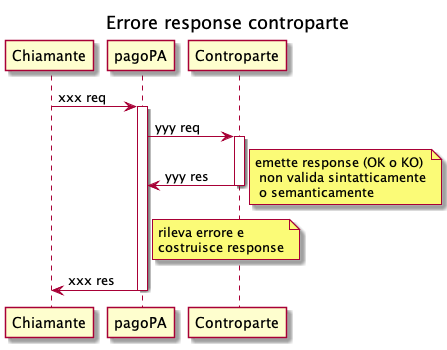

# Errore response controparte

La piattaforma pagoPA rileva un errore nella response fornita dalla controparte e restituisce in response al chiamante un [..](../ "mention") con le seguenti caratteristiche:

* **id** = _NodoDeiPagamentiSPC_
* **faultCode** = _PPT\_CANALE\_ERRORE\_RESPONSE_ (se controparte è PSP) / _PPT\_STAZIONE\_INT\_PA\_ERRORE\_RESPONSE_ (se controparte è EC)
* **faultString** = _"La response ricevuta dal Canale è vuota o non corretta sintatticamente o semanticamente"_ (se controparte è PSP) / _"Errore di risposta dalla stazione"_ (se controparte è EC)
* **description** = _\<description>_
* **serial** = (se necessario)
