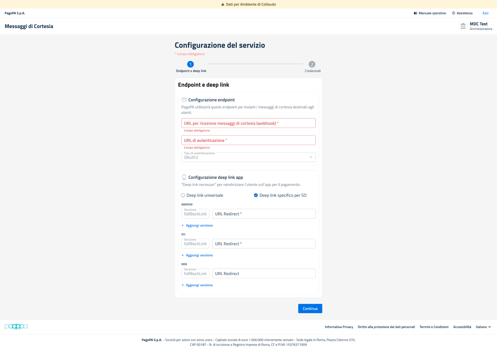
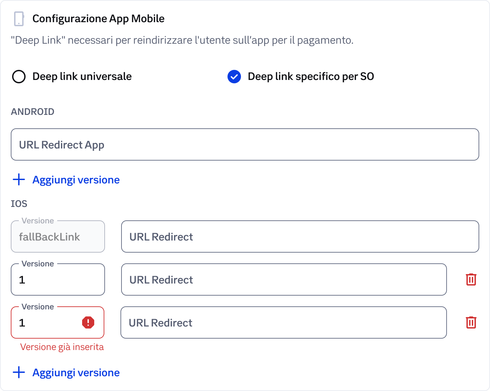

# Copy of Onboarding Ambiente di Collaudo (UAT)

L'onboarding in ambiente UAT è il primo passo operativo e permette di verificare la configurazione tecnica prima da replicarla in produzione. Si tratta di un ambiente di test: tutti i dati inseriti NON devono essere reali.


In ambiente di Collaudo (UAT) è sempre presente un banner in cima alla pagina con il messaggio 'Attenzione: i dati non devono essere reali'. Utilizzare esclusivamente dati di test.


### Configurazione del servizio - Endopoint e Deep Link

La sezione "**Configurazione del Servizio**" viene attivata nel momento in cui un Ente/PSP accede per la prima volta al BackOffice in un determinato ambiente (Collaudo o Produzione) e non risulta ancora registrato.&#x20;

La maschera consente di configurare gli endpoint necessari alla ricezione dei Messaggi di Cortesia e gli eventuali deep link utilizzati per il reindirizzamento dell’utente verso l’applicazione di pagamento. La configurazione è suddivisa in due step, visibili nella barra di progressione in alta nella pagina:

* **Step 1  - Configurazione Endpoint**
* **Step 2  - Configurazione Deep link**

<figure><figcaption></figcaption></figure>

### Step 1 -  Configurazione Endpoint

La sezione **“Configurazione endpoint”** permette di configurare gli URL che pagoPA utilizzerà per l’invio dei messaggi di cortesia destinati agli utent.

<mark style="color:$info;">**URL per ricezione messaggi di cortesia (webhook) \***</mark>

**Descrizione**\
Campo obbligatorio che identifica l’endpoint HTTPS esposto dal PSP per la ricezione dei messaggi di cortesia tramite meccanismo webhook.

**Formato atteso**

* URL HTTPS valido
* Endpoint pubblicamente raggiungibile
* Certificato TLS valido

**Esempio**

```
https://api.psp.it/mdc/webhook
```

**Controlli effettuati**

* presenza del protocollo HTTPS;
* validità sintattica URL;
* obbligatorietà del campo.

**Possibili errori**

* “Campo obbligatorio”
* URL non valido
* Endpoint non raggiungibile

***

<mark style="color:purple;">**URL di autenticazione \***</mark>

**Descrizione**\
Campo obbligatorio utilizzato per configurare l’endpoint OAuth2 necessario all’autenticazione delle chiamate verso il PSP.

**Formato atteso**

* URL HTTPS valido
* Endpoint OAuth2 accessibile

**Esempio**

```
https://auth.psp.it/oauth/token
```

**Controlli effettuati**

* validazione sintattica URL;
* verifica presenza protocollo HTTPS.

**Possibili errori**

* “Campo obbligatorio”
* URL non valido

***

<mark style="color:purple;">**Tipo di autenticazione**</mark>

**Descrizione**\
Campo informativo che indica il protocollo di autenticazione utilizzato dal sistema.

**Valore previsto**

```
OAuth2
```

**Nota operativa**\
Il valore risulta preconfigurato e non modificabile dall’utente.

### Step 2 -  Configurazione Deep link

La configurazione del Deep link è necessaria per reindirizzare l'utente all'app del PSP per il pagamento. Sono disponibili due modalità selezionabili con il radio button.


Se il PSP non ha un'app mobile, lasciare la checkbox deselezionata e procedere al passo successivo.


<figure><figcaption></figcaption></figure>


Dopo aver compilato tutti i campi necessari, cliccando sul pulsante "Continua", il sistema valida i dati inseriti e avanza alla fase successiva di compilazione della wizard successiva relativa alle&#x20;

### Configurazione del servizio - Credenziali

da aggiornare con la nuova maschera.

On

