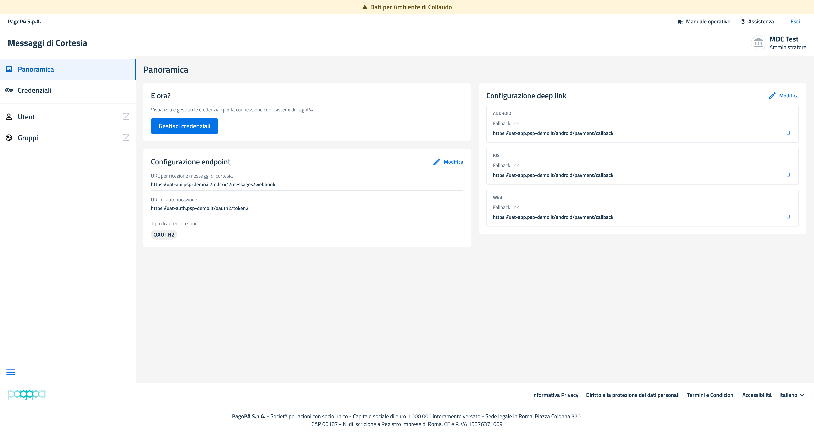
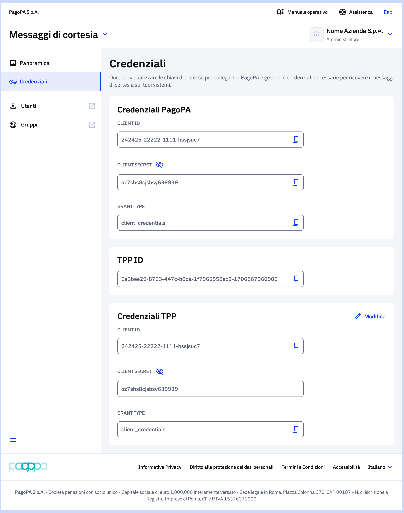

# Navigazione del servizio su Prod e Collaudo

## Home page BackOffice

Questa schermata rappresenta la vista completa del BackOffice per un PSP già registrato.

Dopo aver effettuato l'accesso, l'utente atterrerà nella sezione **Panoramica**. La struttura è identica tra l'ambiente di Collaudo e quello di Produzione, ad eccezione del banner di avviso presente esclusivamente in Collaudo.

La navigazione avviene tramite il menu laterale sinistro, suddiviso nelle seguenti sezioni: **Panoramica, Credenziali, Utenti, Gruppi**.

Da questa schermata il PSP può verificare lo stato della configurazione, identificare l’ambiente selezionato (UAT o Produzione) e avviare la procedura di configurazione tramite il pulsante 'Configura il servizio'.


In ambiente di Collaudo (UAT) è sempre presente un banner in cima alla pagina con il messaggio 'Attenzione: i dati non devono essere reali'. Utilizzare esclusivamente dati di test.


### **Panoramica**

La sezione è composta dal box per:

**1. Configurazione servizio che r**iepiloga i valori attualmente impostati:

* URL per la ricezione dei messaggi di cortesia
* URL di autenticazione
* Tipo di autenticazione
* URL di redirect per le app mobile

Per modificare questi valori, cliccare sulla label **"Modifica"**: si aprirà la wizard di configurazione.

**2. E ora?** Contiene il pulsante **"Gestisci credenziali"**, che consente di accedere alla configurazione e alla gestione delle credenziali PagoPA e TPP (vedi sezione configurazione e modifica Credenziali)

&#x20;Da questa schermata il PSP può verificare lo stato della configurazione, identificare l’ambiente selezionato (UAT o Produzione) e avviare la procedura di configurazione tramite il pulsante 'Configura il servizio'.\
\
Il menu laterale consente l’accesso alle principali funzionalità: **Panoramica**, **Configurazione del Servizio** e **Credenziali**.


In ambiente di Collaudo (UAT) è sempre presente un banner in cima alla pagina con il messaggio 'Attenzione: i dati non devono essere reali'. Utilizzare esclusivamente dati di test.


***

#### Accesso alla panoramica del BackOffice

Dopo la selezione dell'ambiente, se il PSP risulta già censito, il sistema mostra la pagina Panoramica del BackOffice.&#x20;

La pagina riepiloga la configurazione attualmente registrata e permette di accedere alle azioni di modifica disponibili.

Nel menu laterale sinistro sono disponibili le voci **Panoramica**, **Credenziali, Utenti e Gruppi**. In ambiente di Collaudo ed inoltre presente il banner informativo che segnala l'utilizzo di dati non reali.

<figure><figcaption></figcaption></figure>

<em><strong>Figura - Panoramica ambiente collaudo servizio già registrato</strong></em>

### **Credenziali**

**Cliccando sulla label "**&#x43;redenziali" dal menu di navigazione laterale sinistro, si visualizza la wizard divisa in due blocchi distinti:&#x20;

<figure><figcaption></figcaption></figure>

1. **Credenziali PagoPA**: (CLIENT ID, CLIENT SECRET, GRANT TYPE, TPP ID). I campi non sarano modificabili.
2. **Credenziali TPP**: (CLIENT ID, CLIENT SECRET, GRANT TYPE). Entrambi i blocchi hanno un pulsante 'Modifica'.

### Gestione e modifica della configurazione

La funzione di modifica consente al PSP gia registrato nell'ambiente selezionato di aggiornare la configurazione tecnica del servizio "Messaggi di Cortesia" senza ripetere il processo di onboarding. Il flusso e disponibile dalla pagina di panoramica del BackOffice, dopo l'accesso tramite Area Riservata e la selezione dell'ambiente di lavoro.

Le modifiche sono sempre riferite all'ambiente in cui si sta operando. Le informazioni aggiornate in Collaudo/UAT non vengono propagate automaticamente in Produzione e, allo stesso modo, le modifiche effettuate in Produzione non aggiornano l'ambiente di Collaudo.

#### Modifica della configurazione endpoint e deep link

Dalla pagina Panoramica e possibile aggiornare la configurazione tecnica selezionando l'azione Modifica presente nel riquadro dedicato alla configurazione endpoint oppure nel riquadro dedicato alla configurazione deep link.

La maschera di modifica espone i valori gia configurati e consente all'utente di aggiornarli. I campi contrassegnati con asterisco sono obbligatori e devono essere valorizzati prima del salvataggio.

Nella sezione Configurazione endpoint devono essere verificati e, se necessario, modificati i seguenti elementi:

URL per ricezione messaggi di cortesia, utilizzato da pagoPA per inoltrare al PSP i messaggi destinati agli utenti;

URL di autenticazione, utilizzato per il rilascio del token necessario alla comunicazione tra i sistemi;

tipo di autenticazione, valorizzato in base alla modalita tecnica prevista dalla configurazione.

Nella sezione Configurazione deep link app devono essere indicati i link necessari per reindirizzare il cittadino verso l'app o il canale web del PSP. Il sistema consente di configurare un deep link universale oppure deep link specifici per sistema operativo.

Nel caso di deep link specifici per sistema operativo, la maschera prevede sezioni distinte per Android, iOS e Web. Per ciascuna sezione possono essere gestite le versioni del fallback link e il relativo URL Redirect. Il comando Aggiungi versione consente di inserire ulteriori versioni, ove previste dalla configurazione del PSP.

<em>Figura - Maschera Modifica endpoint e deep link</em>

**Salvataggio della configurazione endpoint e deep link**

Al termine dell'aggiornamento, l'utente deve selezionare il pulsante Salva per confermare le modifiche. Il pulsante Annulla consente invece di uscire dalla maschera senza registrare le variazioni inserite.

Durante il salvataggio il sistema effettua i controlli formali sui dati compilati. In presenza di campi obbligatori non valorizzati, formati non ammessi o informazioni non coerenti, il sistema impedisce il salvataggio e richiede la correzione dei dati.

#### Accesso alla sezione Credenziali

La gestione delle credenziali e disponibile dal menu laterale selezionando la voce Credenziali oppure dal pulsante Gestisci credenziali presente nella pagina Panoramica. La sezione consente di visualizzare le chiavi di accesso e le credenziali necessarie per collegarsi ai sistemi pagoPA e per ricevere i messaggi di cortesia sui sistemi del PSP.

La pagina Credenziali presenta le informazioni organizzate in blocchi funzionali: Credenziali PagoPA, TPP ID, Credenziali TPP e Parametri aggiuntivi. I campi esposti possono prevedere funzioni di copia, visualizzazione del valore nascosto e accesso alla modifica, in base alla tipologia di informazione.

<em>Figura - Sezione Credenziali con funzioni di visualizzazione e modifica</em>

#### Modifica delle credenziali TPP

Per aggiornare le credenziali tecniche del PSP, l'utente seleziona l'azione Modifica presente nel riquadro Credenziali TPP. Il sistema apre la maschera Modifica credenziali, nella quale sono riportati i dati gia configurati.

La sezione Credenziali di accesso consente di aggiornare i seguenti campi:

Client ID, identificativo client utilizzato dal PSP per la comunicazione tecnica;

Client Secret, valore riservato necessario per l'autenticazione;

Grant type, modalita di grant configurata per il rilascio del token.

La maschera consente inoltre di gestire i parametri aggiuntivi da inviare in fase di autenticazione. I parametri possono essere distinti in Parametri aggiuntivi Body e Parametri aggiuntivi URL. Per ciascun parametro devono essere valorizzati nome e valore.

<em>Figura - Maschera Modifica credenziali</em>

**Gestione dei parametri aggiuntivi**

I parametri aggiuntivi devono essere compilati solo se richiesti dalla configurazione tecnica del PSP. Il comando Aggiungi parametro body consente di inserire nuovi parametri da trasmettere nel corpo della richiesta; il comando Aggiungi parametro URL consente di inserire parametri da accodare all'indirizzo web di autenticazione.

Per eliminare un parametro gia presente, l'utente puo utilizzare l'icona di eliminazione disponibile sulla riga corrispondente. Prima di procedere al salvataggio e necessario verificare che i valori residui siano corretti e coerenti con la configurazione tecnica dell'ambiente selezionato.

#### Conferma o annullamento della modifica

Al termine della compilazione, l'utente puo confermare l'operazione selezionando Salva. Il sistema registra i nuovi valori e aggiorna la configurazione associata al PSP per l'ambiente in uso.

Se l'utente seleziona Annulla, la maschera viene chiusa senza applicare le modifiche. In questo caso rimangono validi i valori precedentemente configurati.

#### Controlli e messaggi di errore

In fase di salvataggio il sistema verifica la presenza dei campi obbligatori e la correttezza formale delle informazioni inserite. Se uno o piu controlli non vengono superati, l'operazione non viene completata e l'utente deve correggere i campi segnalati prima di procedere nuovamente al salvataggio.

In caso di errore, l'utente deve verificare:

che tutti i campi obbligatori siano stati valorizzati;

che gli URL siano completi e coerenti con l'ambiente selezionato;

che le credenziali siano state inserite senza spazi o caratteri non previsti;

che i parametri aggiuntivi siano coerenti con quanto richiesto dai sistemi del PSP;

che non siano stati utilizzati dati reali in ambiente di Collaudo.

#### Esito della modifica

A seguito del salvataggio con esito positivo, il sistema aggiorna la configurazione e rende disponibili i nuovi valori nella pagina di riepilogo. L'utente puo tornare alla Panoramica o alla sezione Credenziali per verificare che i dati visualizzati corrispondano alla configurazione appena aggiornata.

La modifica e valida esclusivamente per l'ambiente in cui e stata effettuata. Qualora sia necessario aggiornare anche l'altro ambiente, l'utente deve accedere nuovamente al prodotto, selezionare l'ambiente di riferimento e ripetere il flusso di modifica.

#### Indicazioni operative per il PSP

Prima di modificare una configurazione gia attiva, il PSP deve verificare con i propri referenti tecnici la correttezza dei nuovi valori da inserire e l'eventuale impatto sui sistemi integrati. Le modifiche a endpoint, deeplink o credenziali possono incidere sulla capacita del servizio di ricevere, autenticare e instradare correttamente i messaggi verso l'app bancaria o il canale web.

Si raccomanda di eseguire preventivamente le verifiche in ambiente di Collaudo e di procedere all'aggiornamento in Produzione solo dopo aver validato la configurazione tecnica.
