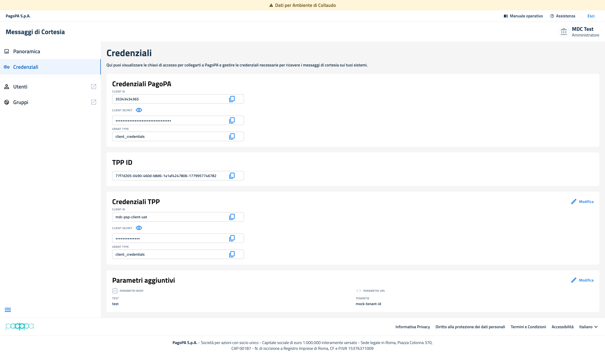
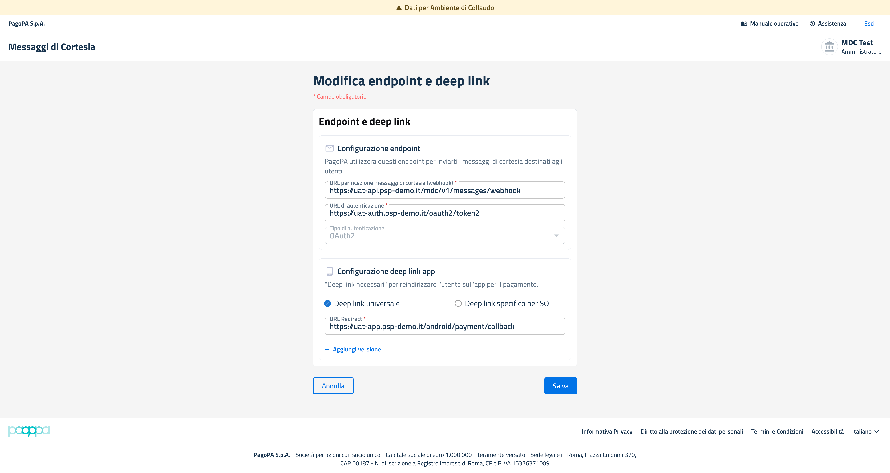

# Navigazione del servizio su Prod e Collaudo

## Panoramica

Dopo aver effettuato l'accesso e selezionato l'ambiente di lavoro, l'utente viene indirizzato alla sezione **Panoramica**, che rappresenta la pagina principale del BackOffice Messaggi di Cortesia.

La struttura della pagina è identica sia in ambiente di **Collaudo (UAT)** sia in ambiente di **Produzione**. L'unica differenza è rappresentata dalla presenza, nel solo ambiente di Collaudo, di un banner informativo che riporta "Dati per ambiente di collaudo"

Si raccomanda pertanto di utilizzare esclusivamente dati di test durante le attività svolte in ambiente UAT.

La navigazione all'interno del BackOffice avviene tramite il menu laterale sinistro, che consente l'accesso alle principali funzionalità del servizio:

* **Panoramica**
* **Credenziali**
* **Utenti**
* **Gruppi**

Se il PSP risulta già registrato al servizio, la pagina Panoramica mostra il riepilogo della configurazione attualmente censita e rende disponibili le operazioni di gestione e aggiornamento della configurazione.

Da questa schermata il PSP può:

* verificare l'ambiente attualmente selezionato (**UAT** o **Produzione**);
* consultare lo stato della configurazione del servizio;
* visualizzare i parametri configurati;
* accedere alle funzionalità di modifica della configurazione;
* gestire le credenziali utilizzate per l'integrazione con il servizio.

<figure><figcaption></figcaption></figure>

<figure><figcaption></figcaption></figure>

<em>Figura - Panoramica ambiente collaudo servizio già registrato</em>

#### Visualizzazione e modifica Endpoint e deep link

<figure><figcaption></figcaption></figure>

Dalla pagina Panoramica è possibile aggiornare la configurazione tecnica selezionando l'azione "**Modifica"** presente nel riquadro dedicato alla configurazione endpoint oppure nel riquadro dedicato alla configurazione deep link.

La maschera di modifica espone i valori già configurati e consente all'utente di aggiornarli. I campi contrassegnati con asterisco sono obbligatori e devono essere valorizzati prima del salvataggio

<figure><figcaption></figcaption></figure>

<em>Figura - Maschera Visualizzazione e Modifica endpoint e deeplink</em>

In caso di aggiornamento, dopo avere modificato i campi, per confermare le modifiche è necessario cliccare sul pulsante "**Salva**". Il pulsante Annulla consente invece di uscire dalla maschera senza registrare le variazioni inserite.

Durante il salvataggio il sistema effettua i controlli formali sui dati compilati. In presenza di campi obbligatori non valorizzati, formati non ammessi o informazioni non coerenti, il sistema impedisce il salvataggio e richiede la correzione dei dati.

#### Visualizzazione e Modifica e Credenziali

La gestione delle credenziali è disponibile dal menu laterale selezionando la voce Credenziali oppure dal pulsante Gestisci credenziali presente nella pagina Panoramica. La sezione consente di visualizzare le chiavi di accesso e le credenziali necessarie per collegarsi ai sistemi pagoPA e per ricevere i messaggi di cortesia sui sistemi del PSP.

La pagina Credenziali presenta le informazioni organizzate in blocchi funzionali:

* **Credenziali PagoPA**
* **TPP ID**
* **Credenziali TPP**
* **Parametri aggiuntivi.**&#x20;

I campi esposti possono prevedere funzioni di copia, visualizzazione del valore nascosto e accesso alla modifica, in base alla tipologia di informazione.

<figure><figcaption></figcaption></figure>

<em>Figura - Maschera Visualizzazione e Modifica credenziali</em>

#### Conferma o annullamento della modifica

Al termine della compilazione, l'utente puo confermare l'operazione selezionando Salva. Il sistema registra i nuovi valori e aggiorna la configurazione associata al PSP per l'ambiente in uso.

Se l'utente seleziona Annulla, la maschera viene chiusa senza applicare le modifiche. In questo caso rimangono validi i valori precedentemente configurati.

#### Controlli e messaggi di errore

In fase di salvataggio il sistema verifica la presenza dei campi obbligatori e la correttezza formale delle informazioni inserite. Se uno o più controlli non vengono superati, l'operazione non viene completata e l'utente deve correggere i campi segnalati prima di procedere nuovamente al salvataggio.

#### Esito della modifica

A seguito del salvataggio con esito positivo, il sistema aggiorna la configurazione e rende disponibili i nuovi valori nella pagina di riepilogo. L'utente può tornare alla alla sezione **Credenziali** per verificare che i dati visualizzati corrispondano alla configurazione appena aggiornata.

La modifica e valida esclusivamente per l'ambiente in cui è stata effettuata. Qualora sia necessario aggiornare anche l'altro ambiente, l'utente deve accedere nuovamente al prodotto, selezionare l'ambiente di riferimento e ripetere il flusso di modifica.

