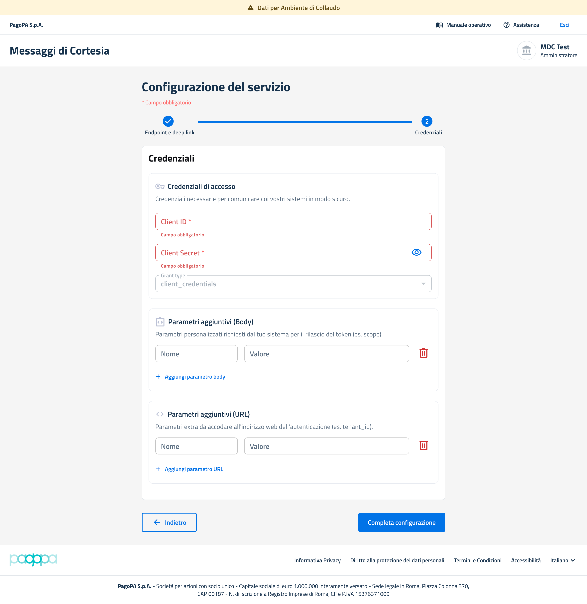

# Credenziali

La sezione **“Credenziali”** rappresenta il secondo step della configurazione del servizio "**Messaggi di Cortesia**" e consente al PSP di configurare i parametri necessari all’autenticazione delle chiamate verso i propri sistemi applicativi. La schermata permette di definire:

* credenziali OAuth2;
* grant type utilizzato;
* parametri aggiuntivi nel body della richiesta;
* parametri aggiuntivi nell’URL di autenticazione.

### Credenziali di accesso



**Descrizione**

Campo obbligatorio che identifica il client applicativo utilizzato durante il processo di autenticazione OAuth2.

**Formato atteso**

* stringa alfanumerica;
* valore univoco associato al PSP;
* case sensitive.

**Esempio**

```
mdc-psp-client-uat
```

#### Controlli effettuati

* presenza del valore;
* validazione formato stringa.

#### Possibili errori

* “Campo obbligatorio”
* Formato non valido



**Descrizione**

Campo obbligatorio contenente il secret associato al `Client ID`, utilizzato per autenticare le richieste verso l’endpoint OAuth2 del PSP.

**Formato atteso**

* stringa alfanumerica;
* lunghezza conforme alle policy del PSP;
* valore riservato/confidenziale.

#### Esempio

```
X7f9!kLmP2#Qa8
```

#### Comportamento applicativo

* il valore viene mascherato in fase di inserimento;
* l’icona “occhio” consente di mostrare/nascondere il valore inserito.

#### Possibili errori

* “Campo obbligatorio”
*



**Descrizione**

Campo informativo che identifica il flusso OAuth2 utilizzato per l’autenticazione.

**Valore previsto**

```
client_credentials
```

Note

Il valore risulta preconfigurato e non modificabile dall’utente.



<figure><figcaption></figcaption></figure>


### **Parametri aggiuntivi (Body)**

La sezione consente di configurare eventuali parametri personalizzati richiesti dal sistema del PSP durante la richiesta di rilascio del token OAuth2.

I parametri vengono inviati nel body della richiesta HTTP verso l’endpoint di autenticazione.



**Descrizione**

Nome del parametro custom richiesto dal provider OAuth2.

**Esempi**

```
scope, audience
```



**Descrizione**

Valore associato al parametro custom.

**Esempi**

```
messages.write, mdc-api
```



#### Aggiungi parametro URL

Ad ogni selezione viene aggiunta una nuova riga configurabile.

### **Parametri aggiuntivi (URL)**

La sezione consente di configurare parametri extra da aggiungere all’URL dell’endpoint di autenticazione.

I parametri vengono inviati come query parameter della chiamata HTTP.



**Descrizione**

Nome del parametro custom richiesto dal provider OAuth2.

**Esempi**

```
tenant_id
```



**Descrizione**

Valore associato al parametro URL.

**Esempi**

```
tenant-mdc-uat
```



#### Aggiungi parametro URL

Ad ogni selezione viene aggiunta una nuova riga configurabile.

#### Bottone “Completa configurazione”

Il pulsante **“Completa configurazione”** consente di:

* validare i dati inseriti;
* salvare la configurazione credenziali;
* completare il wizard di configurazione del servizio.

In caso di validazione corretta:

* la configurazione viene salvata;
* il servizio risulta configurato;
* il sistema rende disponibili le funzionalità operative del servizio Messaggi di Cortesia.

Possibili errori in fase di compilazione

| Anomalia                          | Descrizione                                         |
| --------------------------------- | --------------------------------------------------- |
| Campi obbligatori mancanti        | Uno o più campi richiesti non risultano valorizzati |
| Credenziali non valide            | Client ID / Secret non accettati dal sistema OAuth2 |
| Endpoint OAuth non raggiungibile  | Timeout o errore connessione                        |
| Parametri OAuth errati            | Scope o parametri custom non validi                 |
| Errore salvataggio configurazione | Problema applicativo/runtime                        |

***

#### **Bottone “Indietro”**

Il pulsante **“Indietro”** consente di:

* ritornare allo step precedente “Endpoint e deep link”;
* modificare la configurazione precedentemente inserita;
* mantenere i dati già valorizzati nella sessione corrente.

#### Valori di esempio validi – Configurazione Credenziali

Di seguito vengono riportati alcuni esempi di valori validi utilizzabili in ambiente di collaudo/UAT per completare la configurazione delle credenziali del servizio Messaggi di Cortesia.


[i valori riportati sono esclusivamente esempi documentali e non devono essere utilizzati in ambiente di produzione.](#user-content-fn-1)[^1]


**Credenziali di accesso**

| Campo         | Valore di esempio    |
| ------------- | -------------------- |
| Client ID     | `mdc-psp-client-uat` |
| Client Secret | `X7f9!kLmP2#Qa8`     |
| Grant type    | `client_credentials` |

**Parametri aggiuntivi (Body)**

**Esempio 1**

| Nome  | Valore           |
| ----- | ---------------- |
| scope | `messages.write` |

**Esempio 2**

| Nome     | Valore    |
| -------- | --------- |
| audience | `mdc-api` |

**Esempio 3**

| Nome        | Valore |
| ----------- | ------ |
| environment | `uat`  |

**Parametri aggiuntivi (URL)**

**Esempio 1 - Tenant identificativo**

| Nome       | Valore           |
| ---------- | ---------------- |
| tenant\_id | `tenant-mdc-uat` |

**Esempio 2 - Realm OAuth**

| Nome  | Valore       |
| ----- | ------------ |
| realm | `pagopa-uat` |

**Esempio 3 - Versione API**

| Nome        | Valore |
| ----------- | ------ |
| api-version | `v1`   |

**Esempio  - Body HTTP**

```
{"grant_type": "client_credentials", 
 "client_id": "mdc-psp-client-uat",  
 "client_secret": "X7f9!kLmP2#Qa8", 
 "scope": "messages.write", 
"audience": "mdc-api", 
"environment": "uat"}
```

[^1]: 
