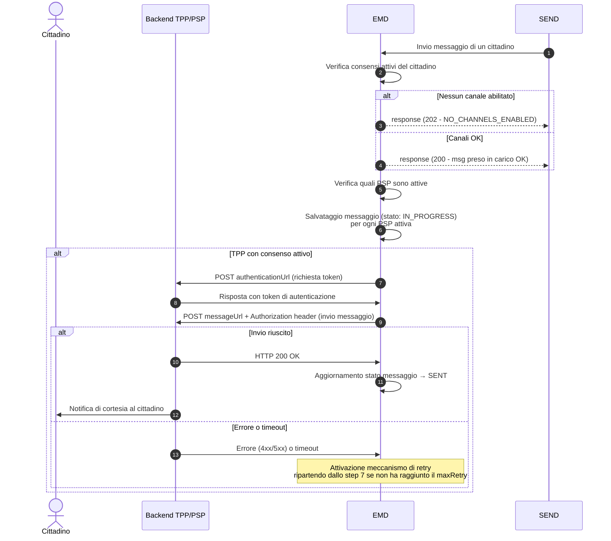

---
metaLinks:
  alternates:
    - >-
      https://app.gitbook.com/s/UdBZLK0IXWx2yqcEv6ks/casi-duso/ciclo-vita-messaggio
---

# Ciclo di vita di un messaggio

Ciclo di vita della notifica SEND su App PSP: dall'invio del messaggio da parte di SEND alla ricezione della notifica push sul dispositivo dell'utente, inclusi i meccanismi di retry in caso di errore.

***

## Panoramica del flusso

Quando un Ente pubblica una notifica tramite SEND, viene avviata una catena di eventi che — se il cittadino destinatario ha attivato il servizio sulla propria app PSP — si conclude con una notifica push sul suo dispositivo mobile.

Il diagramma seguente illustra l'intero ciclo di vita del messaggio:



Il flusso si articola in **tre macro-fasi**:

1. **Ricezione da SEND** — EMD riceve il messaggio e verifica se il cittadino ha canali abilitati.
2. **Consegna alla PSP** — EMD autentica la PSP e le invia il messaggio.
3. **Notifica al cittadino** — La PSP notifica il cittadino sulla propria app, che può aprire la notifica originale su SEND.

***

## Fase 1 — Ricezione del messaggio da SEND

Un Ente pubblica una comunicazione ufficiale tramite la piattaforma SEND. SEND si occupa di inoltrarla alla piattaforma EMD, che funge da hub di distribuzione verso le PSP.

### Cosa fa EMD alla ricezione

Prima di prendere in carico il messaggio, EMD esegue due controlli in sequenza:

1. **Il cittadino è censito in EMD?** — Viene verificata la presenza del codice fiscale del destinatario nel sistema.
2. **Ha almeno un consenso attivo verso una PSP attiva?** — Vengono recuperati i consensi del cittadino. Solo quelli verso PSP attive e in stato "attivo" vengono considerati.

| Esito del controllo        | Risposta a SEND           | Cosa succede dopo                             |
| -------------------------- | ------------------------- | --------------------------------------------- |
| Almeno un canale abilitato | `200 OK`                  | Il messaggio viene accodato per la consegna   |
| Nessun canale abilitato    | `202 NO_CHANNELS_ENABLED` | Il messaggio viene scartato, SEND non ritenta |


Se il cittadino ha disattivato il servizio sulla propria app PSP, il messaggio viene silenziosamente scartato in questa fase. Il cittadino non riceverà alcuna notifica di cortesia, ma potrà comunque accedere alla notifica direttamente su SEND.


***

## Fase 2 — Consegna del messaggio alla PSP

Per ogni PSP che ha ricevuto il consenso attivo dal cittadino, EMD esegue i seguenti passi:

### Step 1 — Autenticazione

EMD effettua una chiamata POST all'`authenticationUrl` configurato dalla PSP in fase di onboarding, per ottenere un token di accesso da usare nella chiamata successiva.

### Step 2 — Invio del messaggio

EMD invia il messaggio al `messageUrl` della PSP, allegando il token ottenuto come Bearer Token nell'header `Authorization`.

**Esempio di payload ricevuto dalla PSP:**

```json
{
  "messageId": "8a32fa8a-5036-4b39-8f2e-47d3a6d23f9e",
  "recipientId": "RSSMRA85T10A562S",
  "triggerDateTime": "2024-06-21T12:34:56",
  "triggerDateTimeUTC": "2024-06-21T12:34:56.000Z",
  "senderDescription": "Comune di Pontecagnano",
  "messageUrl": "https://cittadini.notifichedigitali.it",
  "originId": "XRUZ-GZAJ-ZUEJ-202407-W-1",
  "title": "Nuovo messaggio!",
  "content": "Ciao, hai ricevuto una notifica SEND...",
  "analogSchedulingDate": "2024-06-26T12:34:56.000Z",
  "workflowType": "ANALOG",
  "associatedPayment": true
}
```

### Step 3 — Risposta attesa dalla PSP

La PSP deve rispondere con **HTTP 200 OK** per confermare la ricezione del messaggio. Qualsiasi altro esito (4xx, 5xx, timeout) viene trattato come un errore e attiva il meccanismo di retry (vedi [Gestione errori e retry](ciclo-vita-messaggio.md#gestione-errori-e-retry)).

***

## Fase 3 — Notifica al cittadino sull'app PSP

Una volta ricevuto il messaggio, la PSP è responsabile di notificare tempestivamente il cittadino tramite una **notifica push** sul suo dispositivo mobile.

### Cosa vede il cittadino

Il cittadino riceve una notifica push standard sul proprio smartphone. Aprendo la notifica, l'app PSP mostra il messaggio di cortesia ricevuto da EMD.


Il messaggio dovrà essere visualizzato nell'app della PSP includendo obbligatoriamente:

* **Mittente** — il nome dell'Ente che ha pubblicato la notifica (campo `senderDescription`)
* **Titolo** — il titolo del messaggio (campo `title`)
* **Contenuto** — il corpo del messaggio in formato Markdown (campo `content`)
* **Link** — un collegamento diretto alla notifica su SEND (campo `messageUrl`)
* **Scadenza** _(solo per ANALOG)_ — la data entro cui leggere la notifica per evitare la raccomandata cartacea persente anche nel contenuto del messaggio che drova essere in chiaro (campo `analogSchedulingDate`)



Importante per le PSP Il contenuto del messaggio (`title` e `content`) **deve essere mostrato al cittadino esattamente come ricevuto**, senza alcuna modifica. Il campo `content` è in formato Markdown e deve essere renderizzato come tale.


### Il cittadino apre la notifica su SEND

Toccando il link presente nel messaggio, il cittadino viene reindirizzato alla piattaforma SEND, dove dopo aver cliccato "Accedi ai documenti" dovrà loggarsi tramite CIE o SPID per visualizzare la notifica completa.


***

## Tipi di messaggio: ANALOG vs DIGITAL

Il campo `workflowType` determina la tipologia di notifica e il contenuto del messaggio che la PSP riceve.

### ANALOG — Notifica con scadenza

Le notifiche di tipo `ANALOG` riguardano comunicazioni che, se non visualizzate entro una scadenza, verranno consegnate anche tramite raccomandata cartacea. È il caso più urgente per il cittadino.

**Caratteristiche:**

* Il campo `analogSchedulingDate` è sempre presente e indica la scadenza (tipicamente 5 giorni dalla pubblicazione)
* Il `content` avvisa il cittadino della scadenza e dei costi evitabili

**Esempio di contenuto:**

```
Ciao,
hai ricevuto una notifica SEND, cioè una comunicazione a valore legale emessa da un'amministrazione.

Per leggerla e conoscere tutti i dettagli, accedi al sito web di SEND direttamente da questo messaggio
**entro il 27/05/24 alle 23:59**: eviterai una raccomandata cartacea e i relativi costi.
```

### DIGITAL — Notifica digitale standard

Le notifiche di tipo `DIGITAL` riguardano cittadini che hanno attivato un domicilio digitale. Non prevedono raccomandata cartacea.

**Caratteristiche:**

* Il campo `analogSchedulingDate` non è presente
* Il `content` informa il cittadino sulla natura della consegna legale digitale

**Esempio di contenuto:**

```
Ciao,
hai ricevuto una notifica SEND, cioè una comunicazione a valore legale emessa da un'amministrazione.

Per leggerla e conoscere tutti i dettagli, accedi al sito web di SEND direttamente da questo messaggio.

La notifica risulterà legalmente consegnata a te dopo 7 giorni dalla ricezione sul tuo domicilio digitale,
anche se non la apri o non la leggi.
```

***

## Gestione errori e retry

Se la consegna del messaggio alla PSP fallisce, EMD attiva automaticamente un meccanismo di retry con **backoff esponenziale**.

### Meccanismo di retry

```
Tentativo 1 ──► FALLITO
     │
     └─► attesa (backoff) ──► Tentativo 2 ──► FALLITO
                                    │
                                    └─► attesa (backoff × 2) ──► Tentativo N
                                                                       │
                                                              [limite massimo raggiunto]
                                                                       │
                                                              Messaggio marcato NON CONSEGNATO
```

Ad ogni tentativo fallito il sistema incrementa un contatore interno. L'intervallo di attesa cresce in modo esponenziale tra un tentativo e il successivo.

### Cosa succede dopo l'esaurimento dei retry

Se tutti i tentativi configurati falliscono:

1. Il messaggio viene marcato come **non consegnato**
2. Viene aperto un **incident interno** per il team tecnico di EMD
3. La PSP viene **notificata** attraverso i canali di comunicazione stabiliti
4. Il team di EMD collabora con la PSP per identificare e risolvere il problema


Il meccanismo di retry è completamente automatico e trasparente per la PSP. La PSP non deve implementare alcuna logica di retry lato suo — è sufficiente esporre un endpoint stabile e rispondere con `200 OK` alla ricezione.


***

## Riepilogo degli stati del messaggio

| Stato         | Significato                                                          |
| ------------- | -------------------------------------------------------------------- |
| `IN_PROGRESS` | Il messaggio è stato preso in carico da EMD ed è in fase di consegna |
| `SENT`        | Il messaggio è stato consegnato con successo alla PSP                |
| `ERROR`       | Tutti i tentativi di consegna sono falliti                           |
