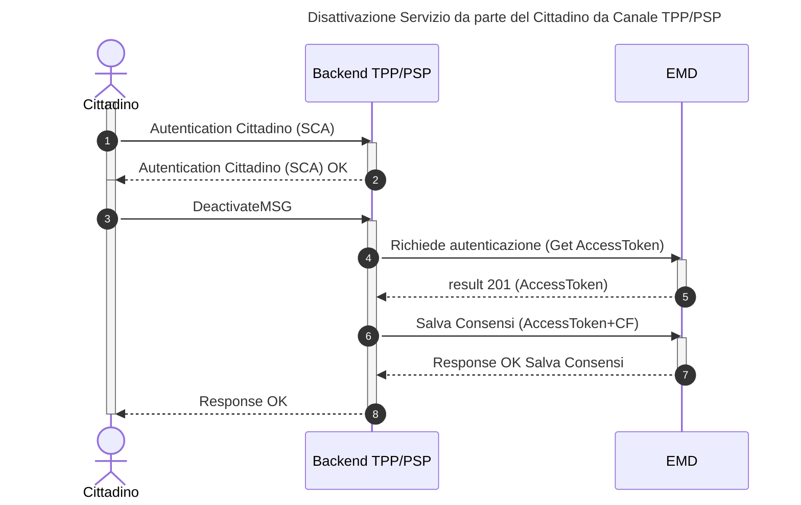

---
metaLinks:
  alternates:
    - >-
      https://app.gitbook.com/s/UdBZLK0IXWx2yqcEv6ks/tutorial-per-i-psp/03-ext-processo-citizen-deactivation
---

# Come disattivare un utente al servizio

Questo tutorial guida attraverso il processo tecnico di Disattivazione di un utente. Questa operazione è fondamentale per consentire all'utente di modificare le proprie preferenze. In questa fase, l'utente ha la possibilità di disattivare il servizio di messaggi di cortesia in qualsiasi momento. La disattivazione del servizio, così come l'attivazione, sarà possibile solo attraverso l'App del PSP.

### **Pre-condizioni**

* L'utente deve aver precedentemente attivato il servizio di messaggi di cortesia.

### **Requisiti Utente**

Se l'utente desidera interrompere la ricezione dei messaggi di cortesia dopo aver attivato il servizio, può farlo attraverso l'App del PSP.

L'App del PSP deve chiamare l'EMD per recuperare le abilitazioni e consentire all'utente effettuare la disattivazione.



## Step 1: Ottenere l'AccessToken (Autenticazione)

Come per tutte le operazioni verso la piattaforma, il primo passo consiste nell'ottenere un token di autenticazione valido.

1. Effettuare una chiamata al server di autenticazione PagoPA utilizzando lo schema **OAuth 2.0 Client Credentials flow**.
2. Includere nella richiesta il _client\_id e il client\_secret_, che hai ricevuto durante il processo di adesione.
3. Il server risponderà con un AccessToken da utilizzare nel passo successivo.

## Step 2: Preparare il corpo della richiesta

Per disattivare un utente bisognerà richiamare la API PUT: `/emd/citizen/{fiscalCode}/{tppId}` fornendo il token di autorizzazione recuperato dal sistema autorizzativo. Verranno fornite alla nostra API due informazioni:

* `fiscalCode`: codice fiscale del cittadino
* `tppId`: identificativo univoco del Prestatore di Servizi di Pagamento (PSP)

## Step 3: Invocare l'API di Disattivazione

Una volta ottenuto l'AccessToken e preparato il payload, sarà possibile procedere con la richiesta di modifica del consenso.

**Endpoint**

```http
PUT /emd/citizen/{fiscalCode}/{tppId}
```

Occorrerà includere l'AccessToken nell'header Authorization come Bearer Token.

## Step 4: Gestire la risposta del servizio

L'esito della chiamata informa se l'attivazione è andata a buon fine.

* Caso di Successo (200 Created) La risposta indica che l'utente è stato modificato con successo.
* Caso di Richiesta errata (400 Bad Request)
* Caso di Richiesta errata (404 Not Found) La risposta indica che l'utente non è stato trovato.

In caso di esito positivo la risposta sarà la seguente:

```json
{
    "fiscalCode": "VTLVNL63E26X000U",
    "consents": {
        "be46399d-23e4-43d9-b2b8-41c8fd5f5e40-1732202076421": {
            "tppState": false,
            "tcDate": "2026-02-12T15:05:06.069011413"
        }
    }
}
```

Ossia l'indicazione sul Codice fiscale dell'utente che ha modificato il consenso e un oggetto consents con all'interno:

* `tppState`: booleano che indica lo stato del consenso fornito (true-> aderente e false -> non aderente)
* `tcDate`: indica la data di accettazione/non accettazione dei consensi
