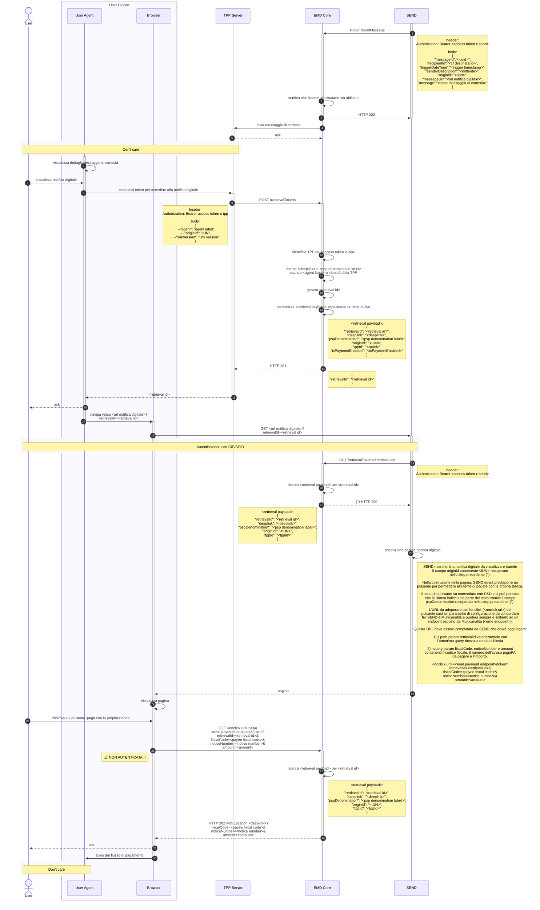

---
metaLinks:
  alternates:
    - >-
      https://app.gitbook.com/s/UdBZLK0IXWx2yqcEv6ks/tutorial-per-i-psp/05-ext-processo-payment-psp
---

# Come avviene il pagamento associato ad un messaggio

Dopo aver effettuato l’accesso al portale SEND tramite SPID o CIE e aver perfezionato la notifica, il Cittadino ove presente potrà procedere al pagamento


\[**Vincolo di Integrazione tra PSP e SEND**]

* È possibile accedere a SEND esclusivamente tramite l'apertura di un browser, sia all'interno di un'app che direttamente sul sistema operativo.
* Non è consentito l'utilizzo di WebView o iFrame, a causa delle restrizioni imposte dalla nostra Content Security Policy (CSP).


### **Pre-condizioni**

* L’utente deve essersi autenticato tramite SPID o CIE alla piattaforma SEND
* L’utente deve aver perfezionato la notifica sul portale SEND
* La notifica deve avere un pagamento associato di tipo pagoPa

### **Requisiti**

*   L'utente deve poter accedere alla notifica. A tal fine, il sistema **SEND** interroga **EMD** per eseguire le verifiche necessarie e determinare se l’utente ha l’autorizzazione per visualizzare e pagare la notifica.

    Quando **EMD** prende in carico la richiesta, controlla che l'utente stia accedendo attraverso il canale del **PSP** corretto (App bancaria corretta). Se il canale è quello previsto, l’utente potrà visualizzare e pagare la notifica; in caso contrario, verrà generato un errore.
* **Scelta del Metodo di Pagamento**: L’utente deve poter selezionare il metodo di pagamento desiderato tra quelli disponibili ("Paga con la tua Banca" utilizzando **pagoPA** o **CBILL**) oppure tramite **Checkout**.
* Non sarà consentito effettuare il pagamento di eventuali F24 associati alla notifica ma solo di avvisi di pagamento di tipo pagoPA.
* **Consapevolezza delle Alternative**: L’interfaccia deve informare l’utente della possibilità di utilizzare metodi di pagamento alternativi a quello suggerito relativo all'App del PSP.
* **Canale Preferenziale Visualizzato**: Il metodo di pagamento del canale (App Bancaria) da cui l’utente è giunto sul portale SEND sarà visualizzato come opzione predefinita. Se l’utente clicca sul bottone "Paga con la tua Banca" verrà richiamato il servizio EMD che indirizzerà il cittadino all’APP del PSP per concludere il pagamento.
* Il timer di cinque giorni partirà dal momento in cui SEND invia il messaggio e l'EMD darà risposta positiva.



## Step 1: Ottenere l'AccessToken (Autenticazione)

Come per tutte le operazioni verso la piattaforma, il primo passo consiste nell'ottenere un token di autenticazione valido.

1. Effettuare una chiamata al server di autenticazione PagoPA utilizzando lo schema **OAuth 2.0 Client Credentials flow**.
2. Includere nella richiesta il _client\_id e il client\_secret_, che hai ricevuto durante il processo di adesione.
3. Il server risponderà con un AccessToken da utilizzare nel passo successivo.

## Step 2: Preparare il corpo della richiesta

Per generare il retrieval necessario ad accedere alla notifica digitale bisognerà richiamare l'API POST `/emd/payment/retrievalTokens` fornendo il token di autorizzazione recuperato dal sistema autorizzativo. Bisognerà fornire alla nostra API le seguenti informazioni:

* `agent`: Sistema operativo relativo all'app del PSP (Es: iOS, Android) e definito durante la fase di onboarding
* `originId`: identificativo della notifica (IUN)
* `linkVersion`: versione del link da recuperare Es. v1\_1 (Se si vuole utilizzare una versione specifica è necessario utilizzare l'underscore `_` al posto del punto). Questo è un campo opzionale, se non viene definito nel corpo della chiamata sarà utilizzato il link di default del PSP.

## Step 3: Invocare l'API di Generazione

Una volta ottenuto l'AccessToken e preparato il payload, sarà possibile procedere con la richiesta di generazione.

**Endpoint**

```http
POST /emd/payment/retrievalTokens
```

Occorrerà includere l'AccessToken nell'header Authorization come Bearer Token.

Il sistema EMD recupererà le informazioni del PSP presenti sul database utilizzandole per creare un retrieval payload.

## Step 4: Gestire la risposta del servizio

L'esito della chiamata informa se la generazione del token è andata a buon fine.

* Caso di Successo (200 Created) La risposta indica che il token è stato generato con successo.
* Caso di Richiesta errata (400 Bad Request)

In caso di esito positivo la risposta sarà la seguente:

```json
{
"retrievalId": "c934c5c2-0b20-4921-b399-1581e0777988-1770911864847"
}
```

Ossia l'identificativo del token appena generato.

## Step 5: Recupero delle informazioni del token

Ottenuto il retrievalId l'utente potrà procedere al click per accedere alla notifica digitale dove l'url di redirect verso il portael SEND sarà ottenuto concatenando il valore dell'attributo "messageUrl" del messaggio ricevuto ed il retrivalId in questo modo: `<<valore messageUrl>>?retrievalId<<valore ottenuto dallo step precedente>>`. Esempio per creare l'URL di redirect:

* "messageUrl": "https://cittadini.notifichedigitali.it/nuova-notifica-send"
* "retrievalId": "c934c5c2-0b20-4921-b399-1581e0777988-1770911864847"

Risultato della CTA da cliccare: https://cittadini.notifichedigitali.it/nuova-notifica-send?retrievalId=c934c5c2-0b20-4921-b399-1581e0777988-1770911864847

In seguito al processo di autenticazione dell'utente, SEND si occuperà di recuperare le informazioni del retrieval token e verificare se il PSP sia abilitato al pagamento.

SEND potrà accedere alle informazioni del retrieval token utilizzando la seguente API GET passando come path variable il retrievalId.

**Endpoint**

```http
GET /emd/payment/retrievalTokens/{retrievalId}
```

Occorrerà includere l'AccessToken nell'header Authorization come Bearer Token.

## Step 6: Gestire la risposta del servizio

L'esito della chiamata informa se il recupero del token è andata a buon fine.

* Caso di Successo (200 Created) La risposta indica che il token è stato recuperato con successo.
* Caso di Richiesta errata (400 Bad Request)
* Caso di Richiesta errata (404 Not Found) La risposta indica che il token con l'identificativo specificato non è stato trovato.

```json
{
    "retrievalId": "5f89047f-c1fa-4ecc-87f4-7355d8f1fe2f-1770914315806",
    "deeplink": "https://mil.weu.internal.uat.cstar.pagopa.it/emdpaymentcore/stub/emd/payment/payment",
    "pspDenomination": "Nome PSP",
    "originId": "XRUZ-GZAJ-ZUEJ-202407-W-1",
    "tppId": "62c33e91-0584-4038-9e66-9d1ff8114368-1744118376085",
    "isPaymentEnabled": false
}
```

Ossia le informazioni del token e del PSP:

* `retrievalId`: Identificativo del token
* `deeplink`: Link dell'app del PSP
* `pspDenomination`: Denominazione del PSP
* `originId`: Identificativo della notifica (IUN)
* `tppId`: Identificativo del PSP
* `isPaymentEnabled`: Booleano che indica se il PSP è abilitato al pagamento

Con queste informazioni SEND ricercherà la notifica da visualizzare tramite il campo `originId` in modo da visualizzarla nella pagina del PSP.

## Step 7: Generazione del deeplink

**Endpoint**

Una volta ottenute le informazioni dalla notifica, sarà possibile generare il deeplink per avviare il flusso di pagamento tramite la seguente API GET `/emd/payment/token`, specificando questi parametri:

* `retrievalId`: Identificativo del retrieval token
* `fiscalCode`: Codice fiscale
* `noticeNumber`: Numero avviso PagoPA da pagare
* `amount`: Importo del pagamento da gestire in eurocent (l'importo inviato dovrà essere diviso sempre per cento per ottenere il valore in euro e centesimi Es. Un valore di 1000 corrisponde a 10 euro)

**Endpoint**

```http
GET /emd/payment/token
```
