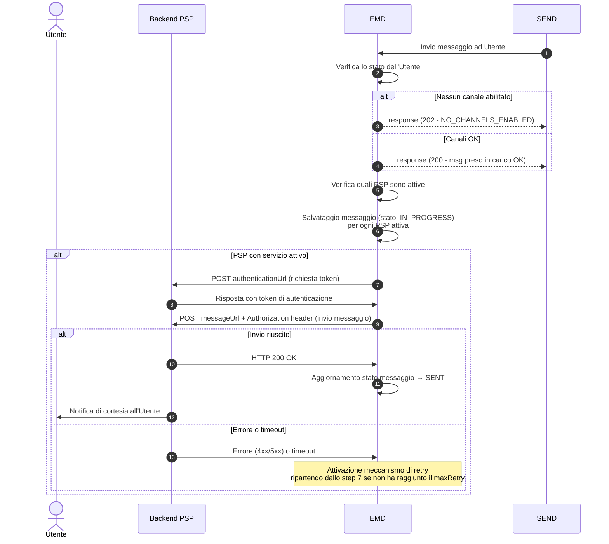
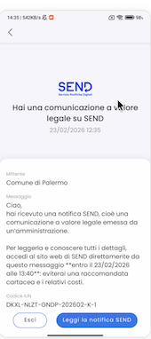
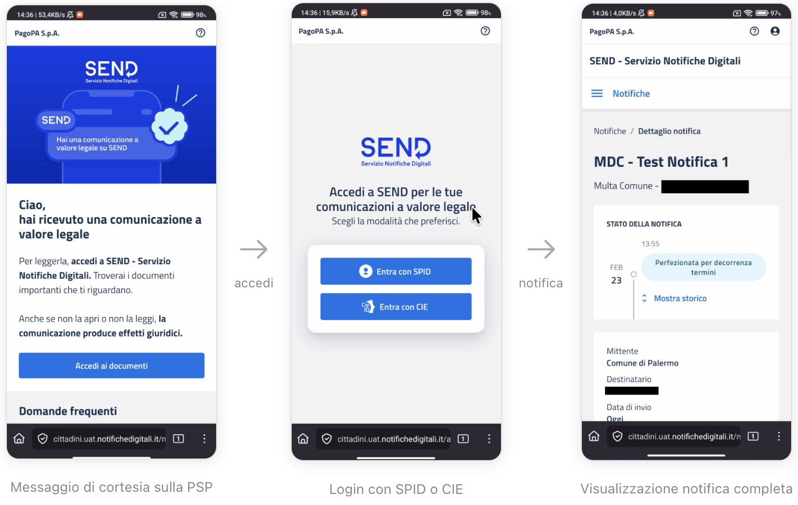

# Ciclo di vita di un messaggio

Ciclo di vita della notifica SEND sull'app bancaria del PSP: dall'invio del messaggio da parte di SEND alla ricezione della notifica push sul dispositivo dell'Utente, inclusi i meccanismi di retry in caso di errore.

***

## Panoramica del flusso

Quando un'amministrazione mittente invia una notifica tramite SEND, viene avviato un processo che — se il destinatario ha attivato il Servizio sull'app bancaria del proprio PSP — determina l'invio di una notifica push del PSP sul suo dispositivo mobile dell'Utente.

Il diagramma seguente illustra l'intero ciclo di vita del messaggio:



Il flusso si articola in **tre macro-fasi**:

1. **Ricezione da SEND** — EMD riceve il messaggio e verifica se il destinatario ha attivo il Servizio.
2. **Consegna al PSP** — EMD si autentica sul backend del PSP e gli invia il messaggio.
3. **Notifica all'Utente** — Il PSP, tramite notifica push sull'app bancaria dell’Utente, comunica allo stesso che può visualizzare la notifica a valore legale direttamente sulla piattaforma SEND.&#x20;

***

## Fase 1 — Ricezione del messaggio da SEND

Un'amministrazione mittente deposita l'atto sulla piattaforma SEND che si occupa di inoltrarla al layer EMD, che funge da hub di distribuzione verso i PSP.

### Cosa fa EMD alla ricezione

Prima di prendere in carico il messaggio, EMD esegue due controlli in sequenza:

1. **Il destinatario è censito in EMD?** — Viene verificata la sua attivazione.
2. **Ha almeno un attivazione verso una PSP?** — Vengono recuperati le attivazioni effettuate dall'Utente. Solo quelli verso PSP attivi vengono considerati.

| Esito del controllo | Risposta a SEND           | Cosa succede dopo                             |
| ------------------- | ------------------------- | --------------------------------------------- |
| Utente attivo       | `200 OK`                  | Il messaggio viene accodato per la consegna   |
| Utente non attivo   | `202 NO_CHANNELS_ENABLED` | Il messaggio viene scartato, SEND non ritenta |


Se l'Utente ha disattivato il servizio sull'app bancaria del PSP, il messaggio viene scartato in questa fase. L'Utente non riceverà alcuna notifica di cortesia, ma potrà comunque accedere alla notifica direttamente su SEND.


***

## Fase 2 — Consegna del messaggio al PSP

Per ogni attivazione dell'Utente, EMD esegue i seguenti passi:

### Step 1 — Autenticazione

EMD effettua una chiamata POST all'`authenticationUrl` configurato dal PSP in fase di onboarding, per ottenere un token di accesso da usare nella chiamata successiva.

### Step 2 — Invio del messaggio

EMD invia il messaggio al `messageUrl` del PSP, allegando il token ottenuto come Bearer Token nell'header `Authorization`.

**Esempio di payload ricevuto dal PSP:**

```json
{
  "messageId": "8a32fa8a-5036-4b39-8f2e-47d3a6d23f9e",
  "recipientId": "RSSMRA85T10A562S",
  "triggerDateTime": "2024-06-21T12:34:56",
  "triggerDateTimeUTC": "2024-06-21T12:34:56.000Z",
  "senderDescription": "Comune di Pontecagnano",
  "messageUrl": "https://cittadini.notifichedigitali.it",
  "originId": "XRUZ-GZAJ-ZUEJ-202407-W-1",
  "title": "Nuovo messaggio!",
  "content": "Ciao, hai ricevuto una notifica SEND...",
  "analogSchedulingDate": "2024-06-26T12:34:56.000Z",
  "workflowType": "ANALOG",
  "associatedPayment": true
}
```

### Step 3 — Risposta attesa dalla PSP

Il PSP deve rispondere con **HTTP 200 OK** per confermare la ricezione del messaggio. Qualsiasi altro esito (4xx, 5xx, timeout) viene trattato come un errore e attiva il meccanismo di retry (vedi [Gestione errori e retry](ciclo-vita-messaggio.md#gestione-errori-e-retry)).

***

## Fase 3 — Comunicazione all'Utente sull'app bancaria del PSP

Una volta ricevuto il messaggio, il PSP è responsabile di segnalare tempestivamente all'Utente della presenza di una notifica a valore legale su SEND tramite una **notifica push** sul suo dispositivo mobile.

### Cosa vede l'Utente

L'Utente riceve una notifica push standard sul proprio smartphone. Aprendo la notifica, l'app bancaria del PSP mostra il messaggio di cortesia ricevuto da EMD.


Il contenuto dovrà essere visualizzato nell'app bancaria del PSP includendo obbligatoriamente:

* **Mittente** — il nome dell'amministrazione mittente che ha depositato su SEND la notifica (campo `senderDescription`)
* **Titolo** — il titolo del messaggio (campo `title`)
* **Contenuto** — il corpo del messaggio in formato Markdown (campo `content`)
* **Link** — un collegamento diretto alla notifica su SEND (campo `messageUrl`)
* **Scadenza** _(solo per ANALOG)_ — la data entro cui leggere la notifica per evitare la raccomandata cartacea presente anche nel contenuto del messaggio che dovrà essere in chiaro (campo `analogSchedulingDate`)




Importante per il PSP: il contenuto del messaggio (`title` e `content`) **deve essere mostrato all'Utente esattamente come ricevuto**, senza alcuna modifica. Il campo `content` è in formato Markdown e deve essere renderizzato come tale.


### L'Utente apre la notifica su SEND

Al click sulla CTA presente nell'app bancaria, l'Utente viene reindirizzato alla piattaforma SEND dove, dopo aver cliccato "Accedi ai documenti" dovrà loggarsi tramite CIE o SPID per visualizzare la notifica completa.



***

## Tipi di messaggio: ANALOG vs DIGITAL

Il campo `workflowType` determina la tipologia di notifica e il contenuto del messaggio che il PSP riceve.

### ANALOG — Notifica con scadenza

Le notifiche di tipo `ANALOG` riguardano comunicazioni che, se non visualizzate entro le 120 ore, verranno trasmesse anche tramite raccomandata cartacea.

**Caratteristiche:**

* Il campo `analogSchedulingDate` è sempre presente e indica la scadenza (tipicamente 120 ore dall'invio del messaggio di cortesia da SEND)
* Il campo `content` contiene informazioni sulla scadenza e dei costi evitabili

**Esempio di contenuto:**

```
Ciao,
hai ricevuto una notifica SEND, cioè una comunicazione a valore legale emessa da un'amministrazione.

Per leggerla e conoscere tutti i dettagli, accedi al sito web di SEND direttamente da questo messaggio
**entro il 27/05/24 alle 23:59**: eviterai una raccomandata cartacea e i relativi costi.
```

### DIGITAL — Notifica digitale standard

Le notifiche di tipo `DIGITAL` riguardano Utenti che hanno attivato un domicilio digitale. Non prevedono raccomandata cartacea.

**Caratteristiche:**

* Il campo `analogSchedulingDate` non è presente
* Il campo `content` contiene informazioni sulla natura della consegna legale della notifica

**Esempio di contenuto:**

```
Ciao,
hai ricevuto una notifica SEND, cioè una comunicazione a valore legale emessa da un'amministrazione mittente.

Per leggerla e conoscere tutti i dettagli, accedi al sito web di SEND direttamente da questo messaggio.

La notifica risulterà legalmente consegnata a te dopo 7 giorni dalla ricezione sul tuo domicilio digitale,
anche se non la apri o non la leggi.
```

***

## Gestione errori e retry

Se la consegna del messaggio al PSP fallisce, EMD attiva automaticamente un meccanismo di retry con **backoff esponenziale**.

### Meccanismo di retry

```
Tentativo 1 ──► FALLITO
     │
     └─► attesa (backoff) ──► Tentativo 2 ──► FALLITO
                                    │
                                    └─► attesa (backoff × 2) ──► Tentativo N
                                                                       │
                                                              [limite massimo raggiunto]
                                                                       │
                                                              Messaggio marcato NON CONSEGNATO
```

Ad ogni tentativo fallito il sistema incrementa un contatore interno. L'intervallo di attesa cresce in modo esponenziale tra un tentativo e il successivo.

### Cosa succede dopo l'esaurimento dei retry

Se tutti i tentativi configurati falliscono:

1. Il messaggio viene marcato come **non consegnato**


Il meccanismo di retry è completamente automatico e trasparente per il PSP ed è sufficiente esporre un endpoint stabile e rispondere con `200 OK` alla ricezione/presa in carico.


***

## Riepilogo degli stati del messaggio

| Stato         | Significato                                                          |
| ------------- | -------------------------------------------------------------------- |
| `IN_PROGRESS` | Il messaggio è stato preso in carico da EMD ed è in fase di consegna |
| `SENT`        | Il messaggio è stato consegnato con successo al PSP                  |
| `ERROR`       | Tutti i tentativi di consegna sono falliti                           |
