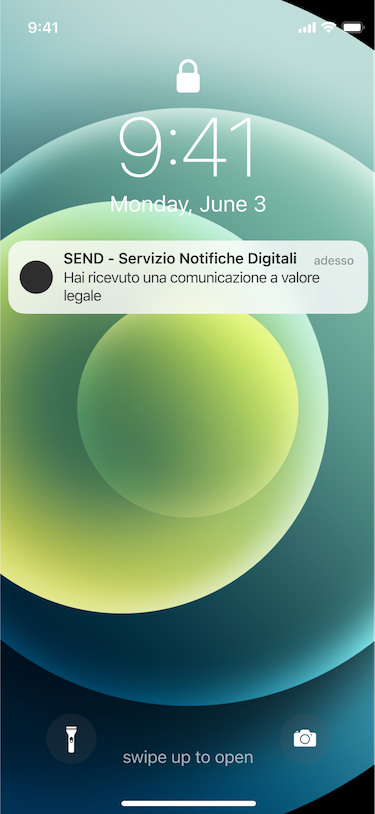
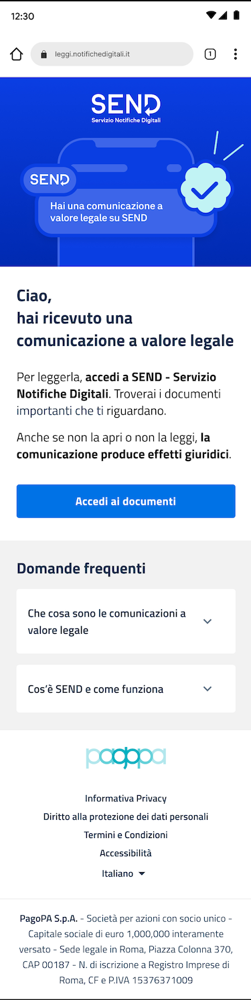
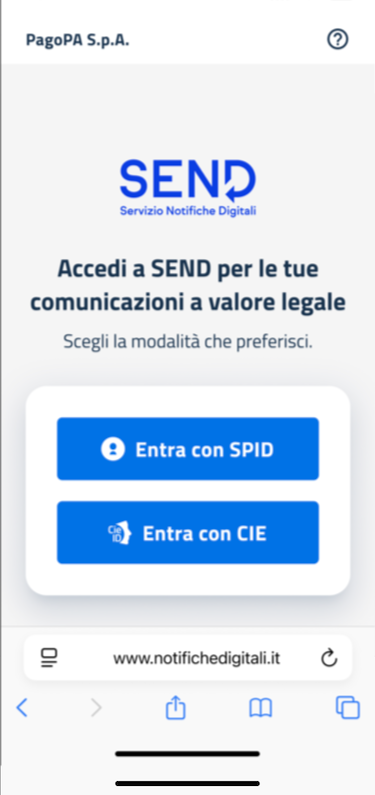
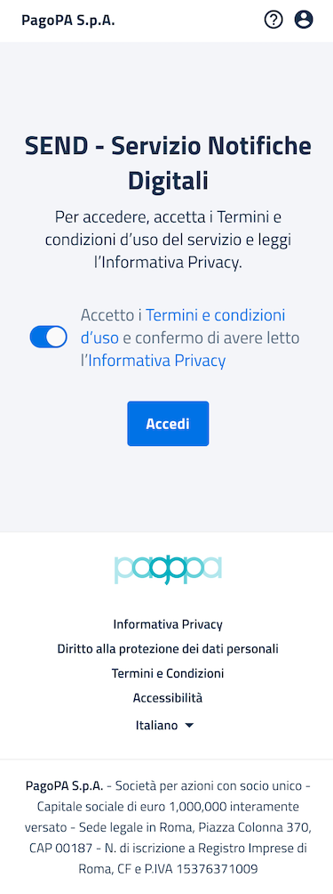
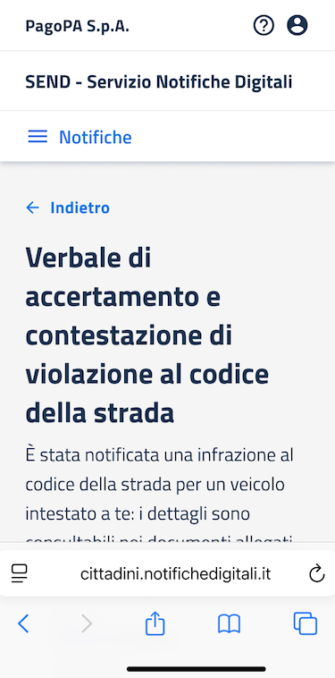
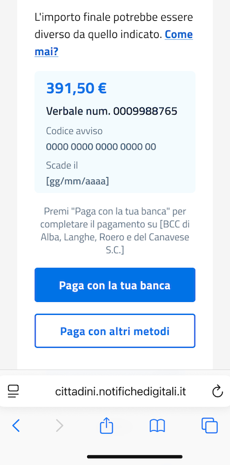
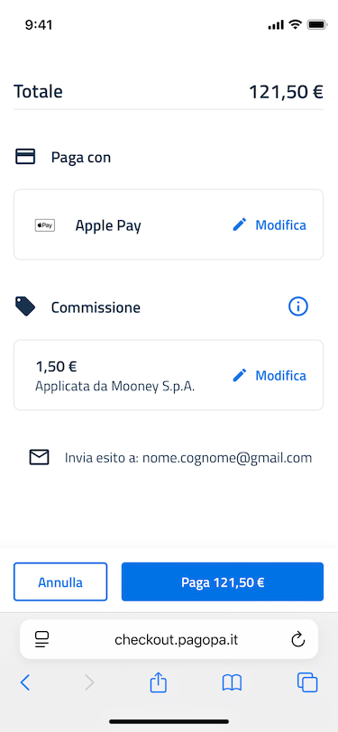
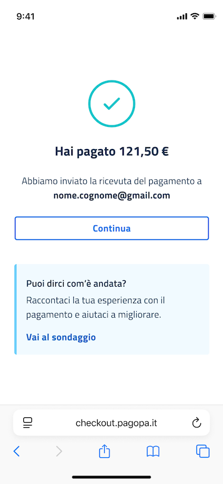

# Flusso di un pagamento

Flusso di pagamento completo tramite il servizio Messaggio di Cortesia: scenario completo che descrive l'autenticazione su SEND, la verifica del canale tramite EMD, il perfezionamento della notifica e pagamento dell'avviso pagoPA.

## Step 1 - Ricezione notifica push

Se un Utente ha attivato il Servizio, nel caso in cui un'amministrazione mittente gli invii una notifica, riceverà una notifica push sul proprio smartphone

## Step 2 - Dettaglio notifica push

L'Utente cliccando sulla notifica push accede al dettaglio del messaggio di cortesia

.png>)

## Step 3 - Landing Page SEND

Al click "Leggi la Comunicazione" tramite un URL di redirect si atterra sulla landing page della piattaforma SEND

## Step 4 - Accesso al portale SEND tramite SPID o CIE

Dopo aver letto le informazioni di dettaglio relative a SEND si può procedere con l'accesso alla piattaforma utilizzando uno dei metodi di autenticazione tra SPID o CIE

## Step 5 - Accettazione TOS SEND primo accesso

L'Utente al primo accesso al portale SEND dovrà accettare i ToS e l'informativa Privacy

## Step 6 - Dettaglio Notifica

In occasione del primo accesso alla piattaforma SEND, una volta accettati i ToS e l'informativa privacy, si potrà accedere al dettaglio della notifica oggetto del messaggio di cortesia

## Step 7 - Dettaglio Pagamento

Se la notifica ha un pagamento associato potrà procedere al pagamento utilizzando i metodi proposti ed essere redirezionato verso l'app bancaria e visualizzare il dettaglio del pagamento

## Step 8 - CTA Paga

A quel punto l'Utente potrà decidere di effettuare il pagamento o meno tramite pagamento con la propria app bancaria

## Step 9 - Pagato

Una volta eseguito il pagamento gli verrà mostrato il risultato del pagamento effettuato.

