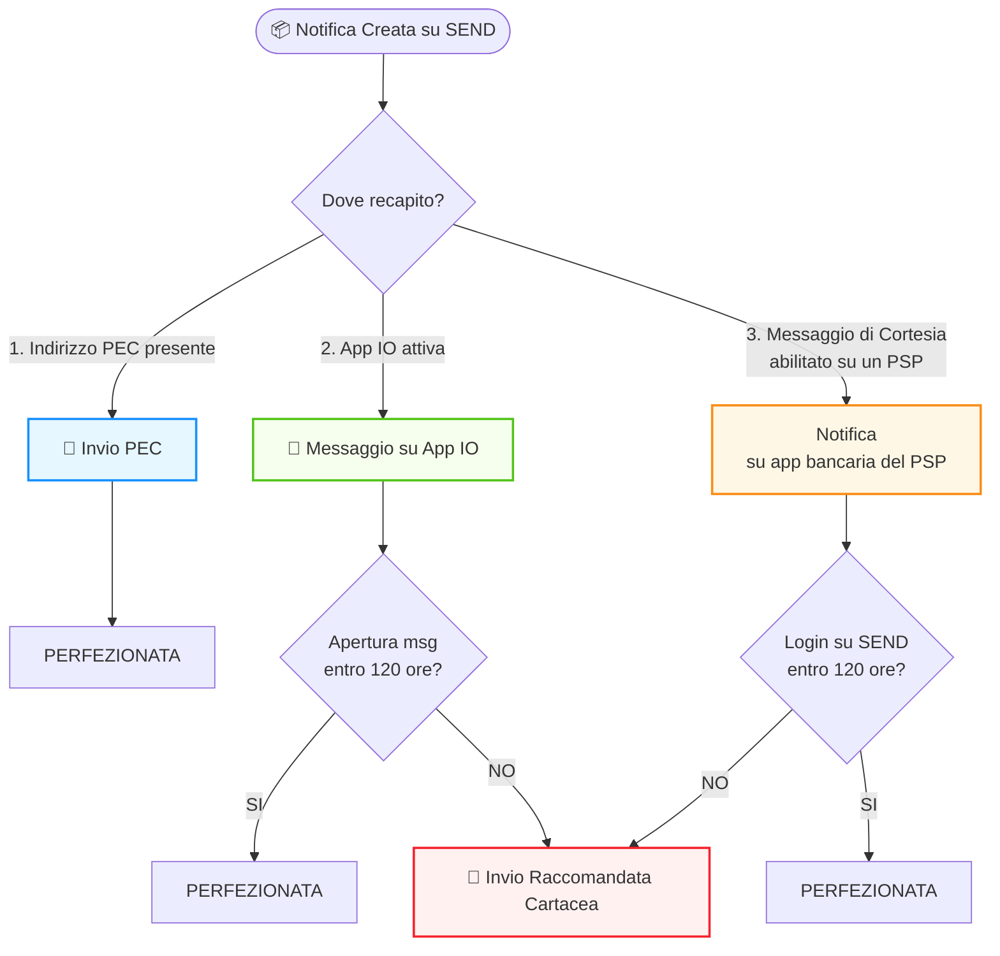

# Valore legale delle notifiche

## Valore legale delle notifiche

## Approfondimento sulla distinzione tra la notifica legale depositata su SEND e il Messaggio di Cortesia informativo.


#### Cos'è SEND?

SEND è la piattaforma che si occupa dell’invio ai destinatari, per via digitale o analogica, delle notifiche a valore legale, gestendo l’intero processo di notificazione al posto dell’amministrazione mittente, che deposita su SEND l'atto da notificare.

#### Processo di notificazione mediante SEND

1. **L’amministrazione mittente crea la richiesta di notifica** conformemente alle regole stabilite e carica gli allegati, fornendo le informazioni di base del destinatario, tra cui il codice fiscale, il domicilio digitale speciale se eletto e l'indirizzo fisico. Se questa richiesta supera i controlli di validazione, _**la notifica viene depositata correttamente sulla piattaforma**_ e l'amministrazione mittente è esonerato legalmente dalla notificazione degli atti.
2.  Questa **notifica a valore legale** può essere recapitata in due modi:

    -Digitalmente, tramite Posta Elettronica Certificata (PEC) o su domicilio digitale (c.d. serc-q) SEND: la piattaforma ricerca un domicilio digitale riconducibile al destinatario della notifica nei suoi archivi e/o nei registri pubblici.\
    -analogicamente, tramite raccomandata cartacea inviata all'indirizzo fornito dal mittente o individuato tramite le indagini degli addetti al recapito che operano su SEND e/o sui pubblici registri (ANPR per destinatari persone fisiche titolari di codice fiscale alfanumerico, Registro imprese per destinatari persone giuridiche titolari di codice fiscale numerico).

    Al momento del deposito della notifica su SEND, se il destinatario ha attivato i canali di cortesia supportati da SEND, vengono inviati su tali canali i _**messaggi di cortesia**_ per avvisare il destinatario stesso dell'esistenza di una notifica a valore legale per lui su SEND. Tuttavia, affinché il destinatario riceva tali messaggi, deve averli attivati. Attualmente, i recapiti digitali sui quali l'Utente può ricevere un avviso di cortesia sono **l'app IO, l'email e l'SMS e/o l'app della Terza Parte ove sia stato abilitato il Servizio**.

    Se la piattaforma non riesce a recuperare il **domicilio digitale** e il destinatario o suo delegato non visualizza la notifica entro le 120 ore dall'invio da parte di SEND dell'avviso di cortesia, verrà inviato al destinatario **un avviso di avvenuta ricezione tramite raccomandata cartacea**.

    **NB:** nel caso di messaggio di cortesia in AppIO, se **l'Utente apre un messaggio su IO entro 120 ore** dal suo invio, la notifica si _**Perfeziona**_ e non riceverà la notifica tramite raccomandata cartacea.

    Tramite l'app IO, l'Utente riceverà un messaggio informativo che gli consente, tramite un'apposita azione (CTA), di accedere **ai dettagli della notifica** per completarne la procedura (perfezionamento notifica).

    _Inoltre l’utente potrà visualizzare i documenti notificati e pagare eventuali spese direttamente in IO, senza dover accedere a SEND con SPID o CIE_

    Per la mail e l’SMS e con i messaggi push l'Utente riceve un messaggio di cortesia che lo informa della presenza di una notifica per lui e un link con il quale accedere alla piattaforma. Se l'Utente accede **a SEND entro** 120 ore dall'invio dell'SMS/mail/messaggio PUSH, non riceverà la notifica tramite raccomandata cartacea.
3. L'Utente **accede alla piattaforma SEND**, dove può **scaricare** i documenti notificati e eventualmente se previsto un pagamento può **pagare** grazie all’integrazione con la piattaforma pagoPA od in caso di messaggi di cortesia di tipo PUSH potrà pagare sull'app bancaria del PSP.


### Diagramma di Flusso Notifiche

