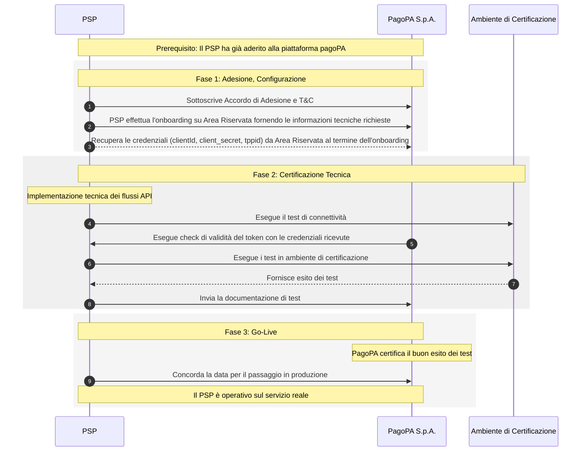

# Come aderire al Servizio

## Premessa

Questo _tutorial_ descrive il processo di Onboarding, ovvero i passaggi che un PSP deve seguire per aderire al servizio **M**essaggi **D**i **C**ortesia, ottenere le credenziali necessarie per l'integrazione tecnica e diventare pienamente operativo.



## Step 1: Sottoscrizione dell'Accordo di Adesione e T\&C

Prima di avviare il processo di onboarding con la Società PagoPA S.p.A., il PSP deve aver sottoscritto il contratto di adesione, aver accettato i relativi Termini e Condizioni.

## Step 2-3: Fornire le Informazioni Tecniche

Il PSP dovrà fornire tutte le informazioni tecniche necessarie alla configurazione del Servizio sul back office della piattaforma **"Area Riservata Enti"** al seguente link: https://selfcare.pagopa.it sia per l'ambiente di UAT che per quello di Produzione. All'interno di **Area Riservata Enti** sarà visibile la CARD del Servizio "Messaggi di Cortesia" per l'accesso al back office dove sarà possibile procedere alla sua configurazione.

### Specifiche per la Registrazione dei PSP

Ogni PSP deve fornire all'amministratore nominato sul portale **Area Riservata Enti** per il servizio MDC le informazioni necessarie per la configurazione del sistema.

***

### Informazioni Richieste

### 1. Configurazione Autenticazione e Endpoint

* **`authenticationType`**: Tipologia di autenticazione (attualmente supportato solo `OAUTH2`).
* **`authenticationUrl`**: URL per ricevere il token di autenticazione necessario per invocare l'API definita nel campo `messageUrl`.
* **`messageUrl`**: URL messo a disposizione dal PSP per l'invio delle notifiche push.
*   **`agentDeepLinks`**: `Map<String, String>` contenente l'agent di provenienza (key) e il deeplink di riferimento (value).

    > Esempio: `ios: https://deeplink.it`

### 2. Sezione Token (`tokenSection`)

* **`contentType`**: Media Type originale della risorsa prima della codifica del contenuto.
* **`bodyAdditionalProperties`**: `Map<String, String>` per proprietà aggiuntive nel corpo della request per la generazione del token.
  * _Esempio:_ `client_id`, `client_secret`, `grant_type`.
  * **N.B.** La Key identifica il campo reale della richiesta; i Value vengono criptati/decriptati lato Backend.
* **`pathAdditionalProperties`**: `Map<String, String>` per proprietà aggiuntive nell'URL path (es. dati sensibili come il `tenantId`).
  * _Esempio:_ Se l'URL è `https://login.microsoftonline.com/123424222/oauth2/token`, si può usare il placeholder `tenantId` nell'URL e mappare:
    * **Key**: `tenantId`
    * **Value**: `123424222`
  * **N.B.** Questi dati vengono criptati/decriptati lato Backend.


Maggiori dettagli sulle informazioni tecniche ed il manuale operativo di back office sarà possibile consultarlo al seguente link: [Manuale BackOffice](https://developer.pagopa.it/it/mdc/guides/manuale-bo-mdc)


***

### Processo di Registrazione

Una volta completato l'onboarding del PSP, Il PSP riceverà:

| Campo               | Descrizione                                                         |
| ------------------- | ------------------------------------------------------------------- |
| **`tppId`**         | Identificativo univoco della terza parte sui sistemi PagoPA S.p.A.  |
| **`tokenUrl`**      | URL per autenticare le chiamate verso i sistemi EMD.                |
| **`client_id`**     | Generato sul sistema di autenticazione da PagoPA S.p.A. per il PSP. |
| **`client_secret`** | Generato sul sistema di autenticazione da PagoPA S.p.A. per il PSP. |
| **`grant_type`**    | `client_credentials`.                                               |

***

## Step 4: Test di connettività PSP verso PagoPA S.p.A.

In ambiente **UAT/PROD** sarà possibile effettuare un test di connettività tra il PSP ed EMD. Per maggiori dettagli ved. la pagina "Come effettuare un test di connettività"

### Procedura test ambiente di UAT

1. Generare il token di Collaudo/UAT usando la `tokenUrl` e le credenziali ricevute durante la fase di registrazione nel back office.
2. Inserire il token nell'header di `Authorization`.
3. Effettuare una chiamata **GET** al seguente endpoint:

```http
GET https://api-emd.uat.cstar.pagopa.it/emd/mil/tpp/network/connection/{tppName}
```

## Step 5: Test di connettività PagoPA S.p.A. verso PSP

In ambiente **UAT/PROD** sarà possibile effettuare un test di connettività tra l'EMD ed il PSP con i parametri di configurazione ricevuti.

## Step 6,7,8: Eseguire i test in ambiente di certificazione (Collaudo/UAT)

Una volta ottenute le credenziali, dovrai procedere con l'integrazione tecnica e la certificazione in ambiente di test (UAT). Questa fase prevede l'implementazione dei flussi API e l'esecuzione di una serie di prove per verificare il corretto funzionamento della tua integrazione, che andranno documentate secondo le modalità fornite.

**Test 1** Attivazione e Disattivazione Utente\
Testare l'attivazione e la disattivazione utilizzando l'API CITIZEN. Come "Utente di Test" utilizzare in ambiente di UAT uno dei seguenti disponibili:

* BRLRNT80T25F205S - Renato Birolli
* MRNGRG80T25F205Q - Giorgio Morandi
* GRBGPP87L04L741X - Giuseppe Maria Garibaldi

**Test 2** Richiedere tramite la seguente email _messaggidicortesia@assistenza.pagopa.it_ l'invio di qualche messaggio (Analogico, Digitale, con e senza pagamento associato) verso qualcuno dei codici fiscali censiti al punto precedente e verificare che tali messaggi generati siano arrivati sul sistema del PSP ed i riferimenti per accedere alla piattaforma di SEND in UAT

**Test 3** Verificare che sia stato inviato il messaggio push verso l'app bancaria per un codice fiscale utilizzato precedentemente

**Test 4** Eseguire il pagamento associato alla notifica come descritto nel tutorial del pagamento utilizzando i riferimenti di accesso alla piattaforma SEND ricevuti via email nel **Test 2**

Al termine positivo di tali test produrre un video ed inoltrarlo a _messaggidicortesia@assistenza.pagopa.it_ oppure tramite condivisione di file sharing in cui viene registrata la sessione dalla ricezione del messaggio push sul dispositivo fino alla conclusione del pagamento.

## Step 9: Pianificare il Passaggio in Produzione

Dopo aver completato con successo la fase di test e ottenuto la certificazione, il PSP potrà concordare con PagoPA S.p.A.la data per il passaggio in produzione ed avviare l'operatività in ambiente di Produzione.
