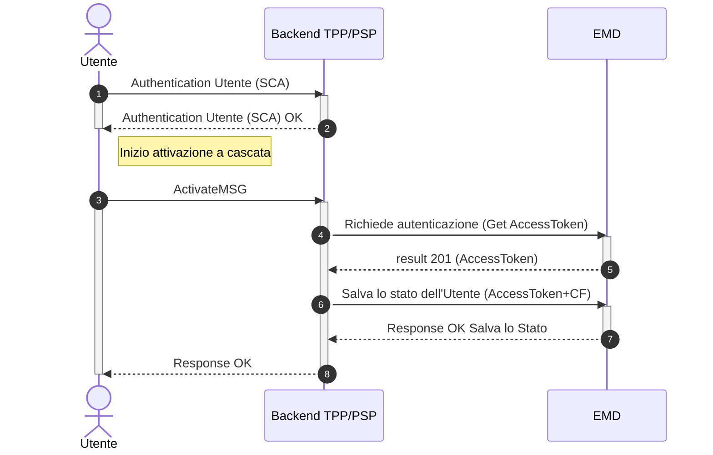

# Come attivare un utente al Servizio

Questo tutorial guida attraverso il processo tecnico di attivazione di un utente. Questa operazione è fondamentale per ricevere i messaggi di cortesia di SEND.

L'Utente, tramite l'app bancaria del PSP, può richiedere l’attivazione del Servizio di "Messaggi di Cortesia", accettando i Termini di Servizio (ToS) e prendendo visione dell'Informativa Privacy del PSP. Si precisa sin d'ora che i ToS predisposti dal PSP dovranno contenere una descrizione della piattaforma SEND conforme a quella che verrà fornita da PagoPA S.p.A., nonchè la previsione che con l'attivazione del servizio, l'Utente accetti di censire l'app bancaria come recapito di cortesia. Una volta accettato i Tos e l'Informativa Privacy, viene invocata l’API dedicata messa a disposizione da PagoPA S.p.A. per attivare il Servizio.

L’attivazione ad oggi avviene direttamente attraverso il canale del PSP.

L'Utente deve avere la possibilità di modificare in qualsiasi momento le proprie preferenze di comunicazione, compresa la **disattivazione** stessa del Servizio.

### **Pre-condizioni**

* L’Utente effettua l’autenticazione sull'app bancaria del PSP e richiede l’attivazione del servizio di messaggi di cortesia.

### **Requisiti Utente**

* L’Utente che ha attivato il Servizio deve poter ricevere i messaggi di cortesia sull'app bancaria del PSP.
* Attivando il Servizio, l’Utente riceverà tutti i messaggi relativi a nuove notifiche presenti su SEND.
* All’Utente devono essere inviati i messaggi di cortesia se ha attivato il Servizio sull'app bancaria del PSP anche se non ha ancora effettuato il primo accesso a SEND.
* L’utente deve poter accettare i Termini di Servizio.
* All'utente deve essere fornita spiegazione chiara sul funzionamento del Servizio
* L’Utente deve poter recuperare i Termini di Servizio e l'Informativa sulla Privacy direttamente dall'app bancaria del PSP.
* L’utente deve poter attivare o disattivare il Servizio in qualsiasi momento sull'app bancaria del PSP.

### **Post-condizioni**

* Se l’Utente dopo aver ricevuto un messaggio di cortesia vuole disattivare il Servizio, può farlo tramite l'app bancaria del PSP.



## Step 1: Ottenere l'AccessToken (Autenticazione)

Il primo step per l'integrazione del Servizio da parte del PSP è ottenere un token di autenticazione valido.

1. Effettuare una chiamata al server di autenticazione PagoPA S.p.A. utilizzando lo schema **OAuth 2.0 Client Credentials flow**.
2. Includere nella richiesta il _client\_id e il client\_secret_, che hai ricevuto durante il processo di adesione.
3. Il server risponderà con un AccessToken da utilizzare nel passo successivo.

## Step 2: Preparare il corpo della richiesta

Per attivare un Utente bisognerà richiamare la API POST: `/emd/citizen/{fiscalCode}/{tppId}` fornendo il token di autorizzazione recuperato dal sistema autorizzativo. L'Utente nel momento in cui accetterà i ToS, prenderà visione dell'Informativa Privacy, attiverà il Servizio fornendo all'API di PagoPA S.p.A. due informazioni:

* `fiscalCode`: codice fiscale dell'Utente
* `tppId`: identificativo univoco del PSP

## Step 3: Invocare l'API di attivazione

Una volta ottenuto l'AccessToken e preparato il payload, sarà possibile procedere con la richiesta di attivazione.

**Endpoint**

```http
POST /emd/citizen/{fiscalCode}/{tppId}
```

Occorrerà includere l'AccessToken nell'header Authorization come Bearer Token.

## Step 4: Gestire la risposta del Servizio

L'esito della chiamata informa se l'attivazione è andata a buon fine o se l'Utente era già attivo.

* Caso di Successo (200 Created) la risposta indica che l'utente è stato attivato con successo.
* Caso di Richiesta errata (400 Bad Request)

In caso di esito positivo la risposta sarà la seguente:

```json
{
  "fiscalCode": "RSSMRO92S18L048H",
  "consents": {
    "0e3bee29-8753-447c-b0da-1f7965558ec2-1706867960900": {
      "tppState": true,
      "tcDate": "2024-11-01T11:25:40.695Z"
    }
  }
}
```

Ossia l'indicazione sul codice fiscale dell'Utente che ha attivato il Servizio:

* `tppState`: booleano che indica lo stato di **attivazione/disattivazione del Servizio** (true-> attivato e false -> disattivato)
* `tcDate`: indica la data di **attivazione/disattivazione del Servizio**
