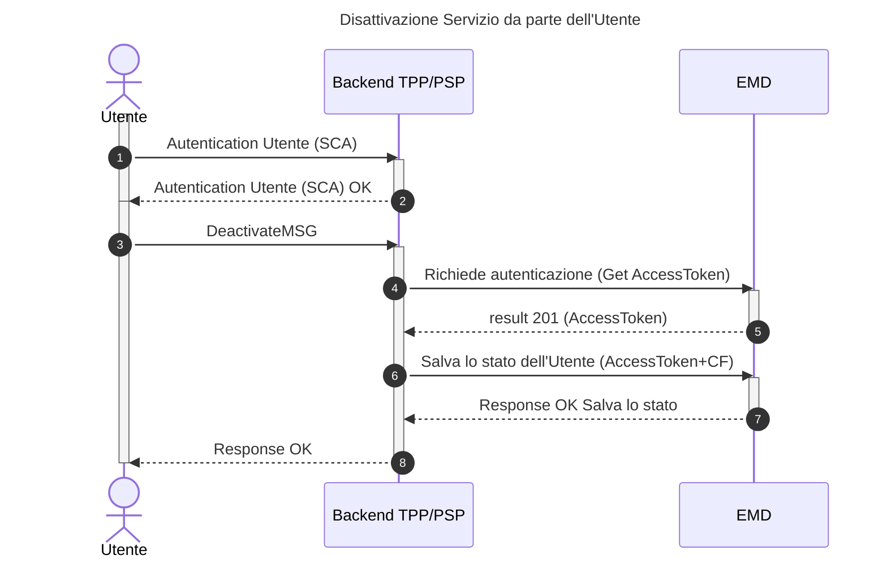

# Come disattivare un utente al Servizio

Questo tutorial guida attraverso il processo tecnico di disattivazione del Servizio da parte di un Utente. Questa operazione è fondamentale per consentire all'Utente di modificare le proprie scelte. In questa fase, l'Utente ha la possibilità di disattivare il Servizio di "Messaggi di Cortesia" in qualsiasi momento. Ad oggi, la disattivazione del Servizio, così come l'attivazione, è possibile solo attraverso l'app bancaria del PSP.

### **Pre-condizioni**

* L'Utente deve aver precedentemente attivato il servizio di messaggi di cortesia.

### **Requisiti Utente**

* Se l'Utente desidera disattivare il Servizio, può farlo attraverso l'app bancaria del PSP.
* L'app bancaria del PSP deve chiamare l'EMD per recuperare le abilitazioni e consentire all'Utente di effettuare la disattivazione.



## Step 1: Ottenere l'AccessToken (Autenticazione)

Il primo step per l'integrazione del Servizio da parte del PSP è ottenere un token di autenticazione valido.

1. Effettuare una chiamata al server di autenticazione PagoPA S.p.A. utilizzando lo schema **OAuth 2.0 Client Credentials flow**.
2. Includere nella richiesta il _client\_id e il client\_secret_, che hai ricevuto durante il processo di adesione.
3. Il server risponderà con un AccessToken da utilizzare nel passo successivo.

## Step 2: Preparare il corpo della richiesta

Per disattivare un utente bisognerà richiamare la API PUT: `/emd/citizen/{fiscalCode}/{tppId}` fornendo il token di autorizzazione recuperato dal sistema autorizzativo. Verranno fornite all'API di PagoPA S.p.A. due informazioni:

* `fiscalCode`: codice fiscale dell'Utente
* `tppId`: identificativo univoco del PSP

## Step 3: Invocare l'API di disattivazione

Una volta ottenuto l'AccessToken e preparato il payload, sarà possibile procedere con la richiesta di disattivazione del Servizio.

**Endpoint**

```http
PUT /emd/citizen/{fiscalCode}/{tppId}
```

Occorrerà includere l'AccessToken nell'header Authorization come Bearer Token.

## Step 4: Gestire la risposta del Servizio

L'esito della chiamata informa se la disattivazione è andata a buon fine.

* Caso di Successo (200 Created) La risposta indica che l'Utente è stato modificato con successo.
* Caso di Richiesta errata (400 Bad Request)
* Caso di Richiesta errata (404 Not Found) La risposta indica che l'utente non è stato trovato.

In caso di esito positivo la risposta sarà la seguente:

```json
{
    "fiscalCode": "VTLVNL63E26X000U",
    "consents": {
        "be46399d-23e4-43d9-b2b8-41c8fd5f5e40-1732202076421": {
            "tppState": false,
            "tcDate": "2026-02-12T15:05:06.069011413"
        }
    }
}
```

Ossia l'indicazione dell'Utente che ha modificato lo stato di attivazione/disattivazione:

* `tppState`: booleano che indica lo stato di **attivazione/disattivazione del Servizio** fornito (true-> attivato e false -> disattivato)
* `tcDate`: indica la data di **attivazione/disattivazione del Servizio**
