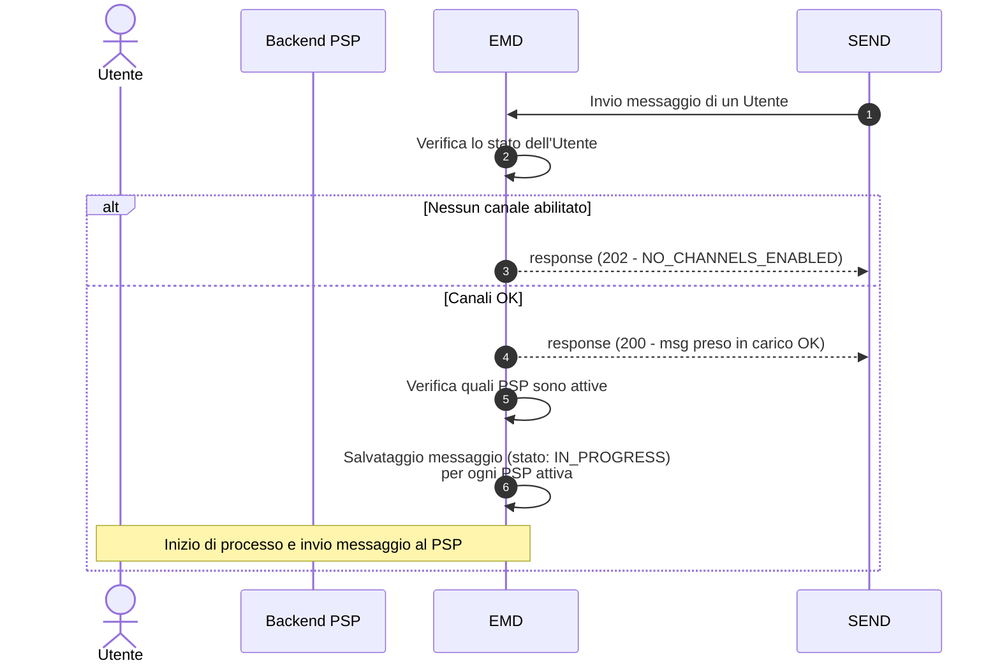

# Come viene gestito un messaggio

Questo documento descrive il processo con cui il layer EMD riceve i messaggi di cortesia inviati dalla piattaforma SEND e li indirizza verso le app bancarie dei PSP che a loro volta hanno l'obbligo di inviare tempestivamente una notifica push agli Utenti per comunicare la presenza sulla piattaforma SEND di una notifica a loro indirizzata.

SEND, in presenza di una notifica per un destinatario, invia il messaggio all'EMD. L'EMD si occupa di verificare che l'Utente abbia il Servizio attivo. Solo in questo caso il messaggio viene preso in carico e inoltrato alla coda; in caso contrario viene scartato.

### **Requisiti EMD**

* EMD deve rispondere a SEND con **200 OK** se il messaggio viene preso in carico
* EMD deve rispondere a SEND con **202 Accepted** - NO\_CHANNELS\_ENABLED se l'Utente non ha canali abilitati

### **Post-condizioni**

* Se l'Utente ha disattivato il Servizio non riceverà il Messaggio di cortesia
* Se il messaggio viene preso in carico (200 OK), EMD avvia il processo di inoltro verso il PSP
* Se il messaggio viene scartato (202 - NO\_CHANNELS\_ENABLED), SEND non ritenta l'invio



***

## Step 1: Ottenere l'AccessToken (Autenticazione)

Il primo step per l'integrazione del Servizio da parte del PSP è ottenere un token di autenticazione valido.

1. Effettuare una chiamata al server di autenticazione PagoPA S.p.A. utilizzando lo schema **OAuth 2.0 Client Credentials flow**.
2. Includere nella richiesta il _client\_id e il client\_secret_, che hai ricevuto durante il processo di adesione.
3. Il server risponderà con un AccessToken da utilizzare nel passo successivo.

## Step 2: Preparare il corpo della richiesta

SEND dovrà preparare il messaggio da passare seguendo questa struttura :

| Campo                  | Tipo    | Obbligatorio       | Validazione                                     | Descrizione                                                                                                                                                                |
| ---------------------- | ------- | ------------------ | ----------------------------------------------- | -------------------------------------------------------------------------------------------------------------------------------------------------------------------------- |
| `messageId`            | string  | Sì                 | Lunghezza: 1-100 caratteri                      | ID univoco del messaggio                                                                                                                                                   |
| `recipientId`          | string  | Sì                 | Lunghezza: 1-100 caratteri                      | Codice fiscale del destinatario                                                                                                                                            |
| `triggerDateTime`      | string  | Sì                 | Formato: ISO 8601 date-time                     | Data e ora in cui l'amministrazione mittente ha richiesto l'invio                                                                                                          |
| `senderDescription`    | string  | Sì                 | Lunghezza: 1-250 caratteri, supporta UTF-8      | Nome dell'amministrazione mittente (es. "Comune di Roma")                                                                                                                  |
| `messageUrl`           | string  | Sì                 | Lunghezza: 1-2048 caratteri, formato URI valido | URL per visualizzare il messaggio originale                                                                                                                                |
| `originId`             | string  | Sì                 | Lunghezza: 1-100 caratteri                      | IUN - Identificativo Univoco Notifica                                                                                                                                      |
| `title`                | string  | Sì                 | Lunghezza: 1-250 caratteri, supporta UTF-8      | Titolo del messaggio                                                                                                                                                       |
| `content`              | string  | Sì                 | Lunghezza: 1-100000 caratteri, formato Markdown | Corpo del messaggio (dinamico in base a `workflowType`: `ANALOG` include scadenza per evitare raccomandata cartacea; `DIGITAL` include informazioni sulla consegna legale) |
| `workflowType`         | string  | Sì                 | Valori ammessi: `ANALOG` o `DIGITAL`            | Tipo di notifica                                                                                                                                                           |
| `associatedPayment`    | boolean | No                 | —                                               | Indica se è presente un pagamento pagoPA associato                                                                                                                         |
| `analogSchedulingDate` | string  | **Condizionale**\* | Formato: ISO 8601 date-time                     | Scadenza di 120 ore (obbligatorio solo se `workflowType` è `ANALOG`)                                                                                                       |
| `channel`              | string  | No                 | Valori ammessi: `SEND`                          | Canale sorgente                                                                                                                                                            |

\*_Il campo `analogSchedulingDate` è obbligatorio solo quando `workflowType` ha valore `ANALOG`_

Questo è un esempio di un messaggio con contenuto analogico inviato da SEND:

```json
{
  "messageId": "XXXX-XXXX-XXXX-202603-V-1_2d269359-cff4-47d1-b6c5-4f1b95fc08d8",
  "recipientId": "GRBGPP87L04L741X",
  "triggerDateTime": "2026-03-25T16:27:18.572832125Z",
  "senderDescription": "Regione Lombardia",
  "messageUrl": "https://cittadini.notifichedigitali.it/nuova-notifica-send",
  "originId": "XXXX-XXXX-XXXX-202603-V-1",
  "title": "Hai una comunicazione a valore legale su SEND",
  "content": "Ciao, hai ricevuto una notifica SEND, cioè una comunicazione a valore legale emessa da un’amministrazione mittente.\n\nPer leggerla e conoscere tutti i dettagli, accedi al sito web di SEND direttamente da questo messaggio **entro il 30/03/2026 alle 18:27**: eviterai una raccomandata cartacea e i relativi costi.",
  "associatedPayment": false,
  "analogSchedulingDate": "2026-03-30T16:27:18.319Z",
  "workflowType": "ANALOG",
  "associatedPayment": true,
  "channel": "SEND"
}
```

## Step 3: Ricezione del Messaggio da SEND

La piattaforma SEND invia il messaggio a EMD tramite una chiamata POST all'endpoint dedicato.

**Endpoint**

```http
POST /emd/message-core/sendMessage
```

L'autenticazione avviene tramite OAuth2.0: occorre includere l'AccessToken nell'header Authorization come Bearer Token.

Il body della richiesta corrisponde al payload descritto nello step precedente e contiene tutte le informazioni necessarie per identificare il destinatario e la notifica SEND associata.

## Step 4: Verifica destinatario

Alla ricezione del messaggio, EMD verifica se il destinatario ha attivato il Servizio su almeno un'app bancaria. Il controllo avviene a cascata:

1. **Verifica presenza CF**: viene controllato se il destinatario è censito in EMD. In caso negativo, il messaggio viene scartato.
2. **Verifica stato Servizio**: viene verificato su se (i) il PSP ha aderito al servizio e se (ii) il destinatario ha attivato il Servizio.

Se il destinatario ha almeno un canale abilitato, EMD prende in carico il messaggio. In caso contrario, il messaggio viene scartato.

## Step 5: Risposta a SEND

In base all'esito del controllo precedente, EMD risponde a SEND con uno dei seguenti esiti:

**Messaggio Preso in Carico (200 OK)**

Il destinatario ha attivato il Servizio su almeno un'app bancaria e il PSP è attivo. Il messaggio viene preso in carico e sarà inoltrato alla coda per la consegna al/ai PSP.

```http
HTTP/1.1 200 OK

{
  "status": "OK"
}
```

**Nessun Canale Abilitato (202 NO\_CHANNELS\_ENABLED)**

Il messaggio viene scartato e non sarà inoltrato se l'Utente non ha attivato il Servizio.

```http
HTTP/1.1 202 Accepted

{
  "status": "NO_CHANNELS_ENABLED"
}
```

**Errore 400 nella validazione dei campi**

Il messaggio inviato da SEND contiene dei campi che non superano le regole di validazione definite.

```http
HTTP/1.1 400

{
  "code": "INVALID_REQUEST",
  "message": "[error_field_1]: motivation_error_1; [error_field_2]: motivation_error_2"
}
```

## Step 6: Inoltro verso il PSP

Una volta superato il controllo, EMD accoda il messaggio per l'inoltro verso il/i PSP. Questo processo è descritto in dettaglio nella sezione [Come viene inviato un messaggio](06-ext-processo-msg-to-tpp.md).

***
