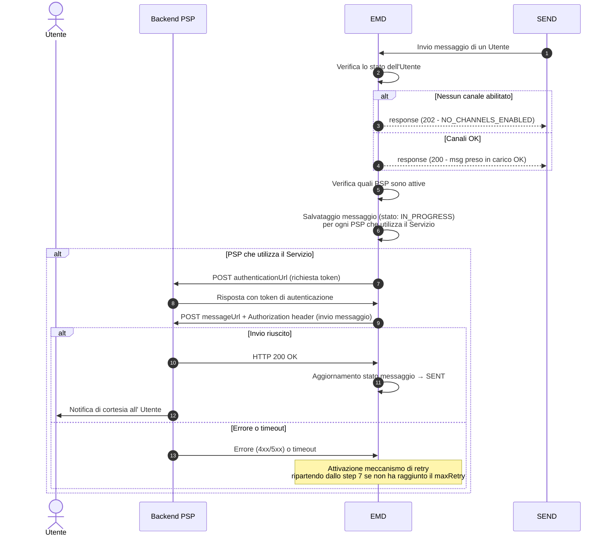

# Come viene inviato un messaggio

Questo documento guida i **PSP** attraverso il processo tecnico di ricezione dei **Messaggi di Cortesia**. Tale processo è fondamentale per garantire che i destinatari che hanno attivato il Servizio ricevano tempestivamente la comunicazione della presenza di notifiche a valore legale agli stessi destinatari e presenti sulla piattaforma SEND..

Quando un'amministrazione mittente invia un messaggio tramite **SEND** e il destinatario ha attivato il Servizio di "Messaggi di Cortesia" sull'app bancaria del PSP, il layer EMD provvede automaticamente a inoltrare il messaggio agli endpoint configurati dal PSP durante la fase di onboarding.

Il ruolo del PSP è quello di ricevere i messaggi e comunicare tempestivamente all'Utente tramite la propria app bancaria, la presenza di una notifica a valore legale, consentendogli di accedere alla piattaforma SEND per visualizzarla e perfezionarla.

### **Pre-condizioni**

* L'Utente ha attivato, tramite l'app bancaria del PSP, il servizio di Messaggi di Cortesia.
* Il PSP ha completato l'onboarding ed ha configurato correttamente gli endpoint di autenticazione e di ricezione messaggi

### **Requisiti PSP**

* Il PSP deve esporre un endpoint HTTPS per l'autenticazione (`authenticationUrl`)
* Il PSP deve esporre un endpoint HTTPS per la ricezione dei messaggi (`messageUrl`)
* Dopo aver ricevuto il messaggio, il PSP deve inviare una notifica push all'Utente tramite la propria app bancaria per comunicare la presenza di una comunicazione a valore legale sulla piattaforma SEND.
* Il PSP deve mostrare all'Utente il contenuto del messaggio senza apportare modifiche
* Il PSP deve rispettare le indicazioni presenti nell'ultima versione della documentazione [Linee Guida di Design](https://app.gitbook.com/o/KXYtsf32WSKm6ga638R3/s/gCHOYTnMNSuUjwLmQkud/)

### **Post-condizioni**

* il messaggio viene consegnato con successo al PSP, mappando lo stato SENT internamente all'EMD
* L'Utente riceve la comunicazione della presenza di notifiche a valore legale sull'app bancaria del proprio PSP.
* In caso di fallimento della consegna, il sistema attiva automaticamente il meccanismo di retry.



## Step 1: Origine del Messaggio da SEND

Un'amministrazione mittente deposita l'atto sulla piattaforma SEND. In seguito al deposito dell'atto da parte di un'amministrazione mittente, SEND - se la notifica supera le verifiche di conformità e viene, quindi, presa in carico da SEND - invia un messaggio a EMD contenente tutte le informazioni necessarie per l'invio del messaggio all'Utente, tra cui:

* Identificativo del messaggio
* Codice fiscale dell'Utente
* Tipo di workflow (ANALOG o DIGITAL)
* Se ha pagamenti associati

Questo è un esempio di un messaggio con contenuto analogico inviato da SEND:

```json
{
  "messageId": "XXXX-XXXX-XXXX-202603-V-1_2d269359-cff4-47d1-b6c5-4f1b95fc08d8",
  "recipientId": "GRBGPP87L04L741X",
  "triggerDateTime": "2026-03-25T16:27:18.572832125Z",
  "senderDescription": "Regione Lombardia",
  "messageUrl": "https://cittadini.notifichedigitali.it/nuova-notifica-send",
  "originId": "XXXX-XXXX-XXXX-202603-V-1",
  "title": "Hai una comunicazione a valore legale su SEND",
  "content": "Ciao,  \nhai ricevuto una notifica SEND, cioè una comunicazione a valore legale emessa da un’amministrazione.\n\nPer leggerla e conoscere tutti i dettagli, accedi al sito web di SEND direttamente da questo messaggio **entro il 30/03/2026 alle 18:27**: eviterai una raccomandata cartacea e i relativi costi.",
  "associatedPayment": false,
  "analogSchedulingDate": "2026-03-30T16:27:18.319Z",
  "workflowType": "ANALOG",
  "associatedPayment": true,
  "channel": "SEND"
}
```

## Step 2: Verifica Attivazione Servizio per un Utente

Il sistema EMD verifica quali PSP hanno ricevuto l'attivazione del Servizio dall'Utente (identificato tramite codice fiscale). Solo gli Utenti che hanno attivato il Servizio riceveranno il messaggio.

## Step 3: Autenticazione presso il PSP

Per ciascun PSP che ha aderito al Servizio, il sistema EMD effettua una chiamata POST all'`authenticationUrl` configurato in fase di onboarding al fine di recuperare il token da utilizzare per l'invio del messaggio all'URL fornito nel `messageUrl` in fase di onboarding.

## Step 4: Invio del messaggio al PSP

Il layer EMD effettua una chiamata POST al `messageUrl` configurato dal PSP per l'invio del messaggio

**Endpoint**

```http
POST {messageUrl}
```

Verrà utilizzato nell'header `Authorization` il token ottenuto nello Step 3.

**Esempio di richiesta da EMD:**

```http
POST https://api.psp-example.com/messages/receive
Authorization: Bearer ey...
Content-Type: application/json

{
  "messageId": "8a32fa8a-5036-4b39-8f2e-47d3a6d23f9e",
  "recipientId": "RSSMRA85T10A562S",
  "triggerDateTime": "2024-06-21T12:34:56",
  "triggerDateTimeUTC": "2024-06-21T12:34:56.000Z",
  "senderDescription": "Comune di Pontecagnano",
  "messageUrl": "https://cittadini.dev.notifichedigitali.it",
  "originId": "XRUZ-GZAJ-ZUEJ-202407-W-1",
  "title": "Nuovo messaggio!",
  "content": "Ciao, hai ricevuto una notifica SEND...",
  "analogSchedulingDate": "2024-06-26T12:34:56.000Z",
  "workflowType": "ANALOG",
  "associatedPayment": true
}
```

Per maggiori dettagli sul formato del payload, consultare le specifiche dell'API - [openapi-emd-ext-message](https://github.com/pagopa/emd-docs/blob/main/docs/developerportal/tutorial/developerportal/riferimenti-tecnici/openapi-emd-ext-message.md).

## Step 5: Gestire la risposta del Servizio

L'esito della chiamata all'endpoint `messageUrl` dei PSP determina se il messaggio viene considerato consegnato o se si attiva il meccanismo di retry.

**Caso di Successo (200 OK)**

La risposta HTTP 200 OK indica che il PSP ha ricevuto correttamente il messaggio da trasmettere all'Utente.

Il sistema EMD aggiorna lo stato del messaggio a `SENT` e considera la consegna completata con successo.

**Caso di Errore (4xx/5xx o Timeout)**

In caso di errore o timeout, il sistema EMD attiva il meccanismo di retry automatico.

* **4xx (Client Error):** indicano un problema nella configurazione o nell'implementazione del PSP
* **5xx (Server Error):** indicano un problema temporaneo nei sistemi del PSP
* **Timeout:** Mancata risposta entro il tempo configurato (60 secondi) Il messaggio ricevuto dai PSP contiene i seguenti campi con le relative validazioni:

| Campo                  | Tipo    | Obbligatorio       | Validazione                                     | Descrizione                                                                    |
| ---------------------- | ------- | ------------------ | ----------------------------------------------- | ------------------------------------------------------------------------------ |
| `messageId`            | string  | Sì                 | Lunghezza: 1-100 caratteri                      | ID univoco del messaggio assegnato da SEND                                     |
| `recipientId`          | string  | Sì                 | Lunghezza: 1-100 caratteri                      | Codice fiscale del destinatario                                                |
| `triggerDateTime`      | string  | Sì                 | Formato: ISO 8601 date-time                     | Data e ora locale in cui l'amministrazione mittente ha richiesto l'invio       |
| `triggerDateTimeUTC`   | string  | Sì                 | Formato: ISO 8601 date-time                     | Data e ora in UTC in cui l'amministrazione mittente ha richiesto l'invio       |
| `senderDescription`    | string  | Sì                 | Lunghezza: 1-250 caratteri, supporta UTF-8      | Nome o descrizione dell'amministrazione mittente (es. "Comune di Roma")        |
| `messageUrl`           | string  | Sì                 | Lunghezza: 1-2048 caratteri, formato URI valido | URL per visualizzare il messaggio completo su SEND                             |
| `originId`             | string  | Sì                 | Lunghezza: 1-100 caratteri                      | Identificativo del messaggio originale dell'amministrazione mittente (es. IUN) |
| `title`                | string  | Sì                 | Lunghezza: 1-250 caratteri, supporta UTF-8      | Titolo del messaggio                                                           |
| `content`              | string  | Sì                 | Lunghezza: 1-100000 caratteri, formato Markdown | Corpo del messaggio (varia in base al workflowType)                            |
| `workflowType`         | string  | Sì                 | Valori ammessi: `ANALOG` o `DIGITAL`            | Tipo di notifica                                                               |
| `associatedPayment`    | boolean | No                 | -                                               | Indica se è presente un pagamento pagoPA associato                             |
| `analogSchedulingDate` | string  | **Condizionale**\* | Formato: ISO 8601 date-time                     | Data di scadenza (obbligatorio solo se workflowType è `ANALOG`)                |

\*_Il campo `analogSchedulingDate` è obbligatorio quando `workflowType` ha valore `ANALOG`_

**Validazione del Payload:** Il PSP **deve** implementare la validazione del payload JSON ricevuto secondo lo schema fornito. In particolare:

* Verificare la presenza di tutti i campi obbligatori
* Validare i formati (date ISO 8601, lunghezze stringhe, etc.)
* Gestire correttamente il campo condizionale `analogSchedulingDate` in base al `workflowType`

## WorkflowType: ANALOG vs DIGITAL

Il campo `workflowType` indica la tipologia di notifica. Il PSP deve inviare all'Utente un messaggio diverso, in base alla tipologia di notifica (analog o digital).

### Tipo messaggio ANALOG

Notifiche che, se non visualizzate entro le 120 ore, verranno consegnate anche tramite posta cartacea.

**Caratteristiche:**

* Include sempre il campo `analogSchedulingDate` che indica la scadenza di 120 ore per evitare la spedizione postale e relativi costi
* Il `content` informa l'Utente della scadenza delle 120 ore per evitare la spedizione postale e relativi costi

**Esempio di content ANALOG:**

```
Ciao,
hai ricevuto una notifica SEND, cioè una comunicazione a valore legale emessa da un'amministrazione mittente.

Per leggerla e conoscere tutti i dettagli, accedi al sito web di SEND direttamente da questo messaggio **entro il 27/05/24 alle 23:59**: eviterai una raccomandata cartacea e i relativi costi.
```

### Tipo messaggio DIGITAL

Notifiche standard che vengono consegnate solo digitalmente (l'Utente ha attivato un domicilio digitale).

**Caratteristiche:**

* Non include `analogSchedulingDate`
* Il `content` contiene informazioni sulla consegna legale digitale

**Esempio di content DIGITAL:**

```
Ciao,
hai ricevuto una notifica SEND, cioè una comunicazione a valore legale emessa da un'amministrazione.

Per leggerla e conoscere tutti i dettagli, accedi al sito web di SEND direttamente da questo messaggio.

La notifica risulterà legalmente consegnata a te dopo 7 giorni dalla ricezione sul tuo domicilio digitale, anche se non la apri o non la leggi.
```


Il contenuto del messaggio (`title` e `content`) deve essere mostrato all'Utente esattamente come ricevuto, senza modifiche e utilizzando il Markdown presente nel content.


## Gestione Errori e Meccanismo di Retry

In caso di fallimento della consegna del messaggio all'endpoint dei PSP, il sistema implementa un meccanismo automatico di retry.

### Casistiche di Fallimento

Il sistema considera fallita la consegna nei seguenti casi:

* Errore HTTP (codici 4xx o 5xx) restituito dall'endpoint della PSP
* Timeout nella risposta dell'endpoint
* Errore di connessione all'endpoint
* Errore durante l'autenticazione

### Meccanismo di Retry Automatico

Quando si verifica un fallimento:

1. **Primo tentativo fallito**: il messaggio viene automaticamente re-inviato dopo un intervallo di tempo configurato
2. **Retry successivi**: il sistema continua a tentare l'invio incrementando il contatore dei tentativi con backoff esponenziale
3. **Limite massimo**: esiste un numero massimo di tentativi configurato nel sistema
4. **Incremento del contatore**: Ad ogni retry, viene incrementato un contatore interno che traccia il numero di tentativi effettuati
