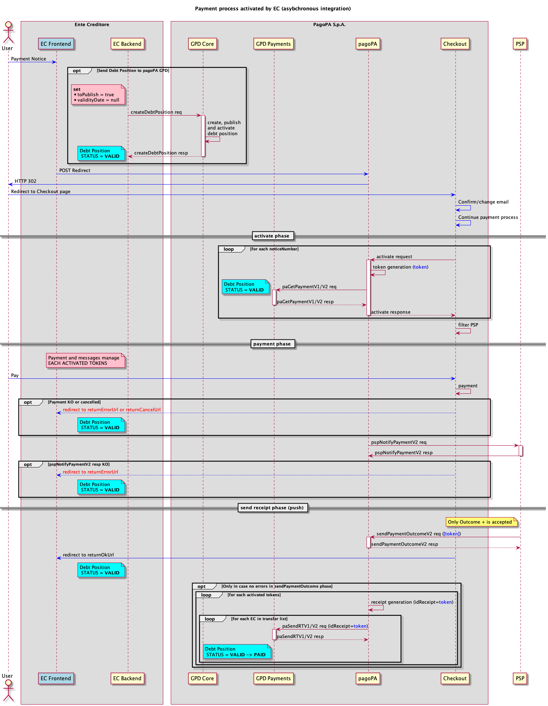

# Pagamenti presso frontend dell'EC in modalità asincrona

In questa pagina viene fornito un possibile flusso di integrazione relativo ad un pagamento iniziato dal frontend dell'EC, nel caso in cui questo sia in produzione sulla piattaforma pagoPA in modalità asincrona.


Il flusso descritto in questa sezione è a scopo prettamente esemplificativo e non deve dunque essere considerato come una specifica di implementazione mandatoria.


I _pagamenti presso frontend dell'EC in modalità asincrona_ hanno l'obiettivo di fare in modo che, in tutti i casi in cui la posizione debitoria non possa essere caricata preventivamente, questa risulti presente sul servizio posizioni debitorie PagoPA prima della fase di attivazione del pagamento.

<figure><figcaption></figcaption></figure>

* Quando il front end dell'EC riceve la richiesta di pagamento di uno o più avvisi, prima di inoltrare la richiesta a Checkout mediante una [redirect](../../ente-creditore/modalita-dintegrazione/integrazione-touch-point-dellec-con-checkout.md), procede al caricamento della/e relative posizioni debitorie mediante l'invocazione dell'api [`createDebtPosition`](operazioni-disponibili.md)esposta dalla componente _GPD-Core_;
* al fine di creare, pubblicare e porre le posizioni debitorie nello stato `VALID` con una sola invocazione verso la componente _GPD-Core_, si suggerisce di valorizzare il query parameter `toPublish=true` e il campo della posizione debitoria `validityDate=null;`
* a questo punto la/e posizioni debitorie sono presenti all'interno del servizio **posizioni debitorie** PagoPA e si trovano nello stato corretto per poter essere pagate;
* Checkout, in base al numero di avvisi che ha ricevuto, chiede al Nodo di attivare gli _n_ pagamenti, a sua volta il Nodo dei Pagamenti girerà le richieste alla componente _GPD-Payments_ che risponderà alla primitiva [paGetPaymentV2](../primitive.md#pagetpayment-versione-2) per conto dell'EC;
* il processo di pagamento procede invariato come descritto nella pagina [Pagamento presso frontend dell'EC](../../casi-duso/pagamento-presso-frontend-dellec.md) fino al momento dell'invocazione della primitiva [paSendRTV2](../primitive.md#pasendrt-versione-2), che nel caso di integrazione asincrona viene inoltrata alla componente _GPD-Payments_ ed eventualmente alle stazioni di broadcast configurate;
* l'EC diretto o l'intermediario devono rendere disponibile un endpoint aderente alle specifiche riportate nella sezione [Connettività](../connettivita.md#nodo-dei-pagamenti-client), dove dovrà essere esposto il servizio [paSendRTV2](../primitive.md#pasendrt-versione-2). Ciò consentirà a PagoPA S.p.A. di configurare una **stazione di broadcast** sulla quale inviare le _receipt_ in tempo reale man mano che i pagamenti si concludono con esito positivo. Questa configurazione agevola l'EC nella ricezione delle ricevute in **modalità push,** senza dover mettere a terra meccanismi di polling verso le [API ](operazioni-disponibili.md#ricevute-di-pagamento)esposte dalla componente `GPD-Core`. Le [API](operazioni-disponibili.md#ricevute-di-pagamento) per il recupero delle _receipt_ potranno essere utilizzate in casi particolari come ad esempio un problema tecnico durante la ricezione di una o più _receipt_ tramite stazione di broadcast;&#x20;
* quando la componente `GPD-Payments` riceve la _receipt_ provvede alla chiusura della posizione debitoria.
