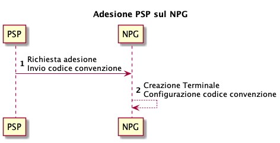
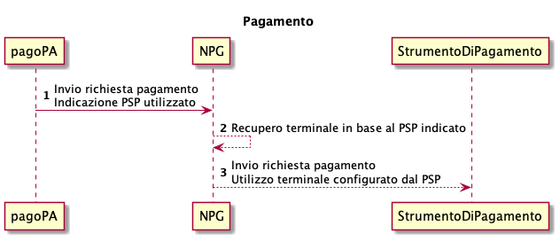
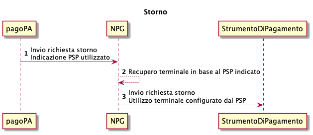

# Integrazione standard per gli strumenti di pagamento

Il contenuto del presente capitolo è valido per gli strumenti di pagamento:

* ApplePay®
* BancomatPay®
* GooglePay®
* MyBank®

Si sottolinea che PagoPA S.p.A. non sottoscrive accordi con&#x20;

* ApplePay®
* BancomatPay®
* GooglePay®
* MyBank®

quindi è onere del PSP aderente contattarli se vuole offrire i loro strumenti di pagamento su _NPG._

## Adesione 

Nel caso in cui un PSP aderente voglia attivarsi sul Payment Gateway (NPG) di PagoPA S.p.A. è necessario seguire i seguenti step:

1. Invio richiesta di adesione al Payment Gateway indicando
   * i metodi di pagamento da abilitare;
   * i codici convenzione per ogni metodo di pagamento;
2. Il Payment Gateway effettua la configurazione del terminale abilitando i metodi di pagamento con i codici convenzione indicati dal PSP aderente.

<figure><figcaption></figcaption></figure>

## Pagamento  

Durante il pagamento di un numero avviso viene utilizzato il terminale relativo al PSP aderente selezionato dal cittadino per la comunicazione tra  Payment Gateway e Strumento di Pagamento.

In base al codice convenzione indicato dal PSP aderente è possibile effettuare esclusivamente i pagamenti abilitati.

<figure><figcaption></figcaption></figure>

## Storno 

In fase di storno di un pagamento viene utilizzato lo stesso terminale relativo al PSP aderente selezionato in fase di pagamento.

<figure><figcaption></figcaption></figure>
