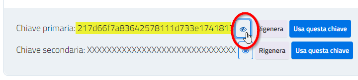

# 📜 Come inviare un Messaggio

Facendo riferimento al procedimento indicato nella [Guida Tecnica per l'integrazione ai servizi](https://docs.pagopa.it/io-guida-tecnica/funzionalita/inviare-un-messaggio), dove puoi trovare tutte le informazioni preliminari e di dettaglio, qui ti forniamo esempi pratici di invio di un Messaggio.

1. Componi la request per l'[API di invio](https://docs.pagopa.it/io-guida-tecnica/api-e-specifiche/api-messaggi/submit-a-message-passing-the-user-fiscal_code-in-the-request-body), della quale ti forniamo qui esempi a seconda dello scenario di utilizzo:

<details>

<summary>Se vuoi inviare un messaggio tradizionale</summary>


```json
{
    "feature_level_type": "STANDARD",
    "content": {
        "subject": "Partecipazione Evento",
        "markdown": "Gentile Mario Rossi,\n\r\n\rabbiamo accettato la tua richiesta di partecipazione all'\''evento e ti inviamo in allegato la ricevuta del pagamento della tua quota e la brochure con tutte le informazioni utili.\n\rA Ti aspettiamo!\n\rL'\''Amministrazione Comunale di Ipazia.",
        "due_date": "2023-03-30T23:59:59.000Z"
    },
    "fiscal_code": "AAAAAA00A00A000A"
}
```


* il campo subject è il titolo del messaggio e comparirà nell'elenco dei messaggi e in testa allo stesso aprendone il contenuto:

<table data-header-hidden><thead><tr><th></th><th width="40"></th><th></th></tr></thead><tbody><tr><td></td><td></td><td></td></tr></tbody></table>


</details>

<details>

<summary>​Se vuoi inviare un messaggio con contenuto remoto</summary>


```json
{
    "feature_level_type": "STANDARD",
    "content": {
        "subject": "Conferma prenotazione",
        "markdown": "",
            "id": "c89069c2-f049-401b-8e6d-d1f5d3ee8f73",
            "configuration_id": "0e9852ccb8a04128bd637c807b9d80d3",
            "has_remote_content": true,
        }
    },
    "fiscal_code": "AAAAAA00A00A000A"
}
```


</details>

* il campo `fiscal_code` è il codice fiscale del Cittadino destinatario del messaggio
* se richiesto, aggiungi anche il campo `due_date` per indicare la [data di scadenza](https://docs.pagopa.it/manuale-servizi/comunicare-un-servizio/i-casi-duso/scadenze-importanti); poni attenzione al formato richiesto dalle specifiche tecniche e alle considerazioni sui fusi orari riportate nella [Guida Tecnica](https://docs.pagopa.it/io-guida-tecnica/api-e-specifiche/api-messaggi/submit-a-message-passing-the-user-fiscal_code-in-the-request-body#due_date)!\
  Nell'esempio, la data di scadenza è impostata in modo che il Cittadino possa pagare entro il termine della giornata del 31 marzo 2023 (a marzo non è in vigore l'ora legale e dunque in Italia il fuso è UTC+1)


Se hai [sottoscritto l'Accordo Premium](https://docs.pagopa.it/area-riservata-enti-app-io/area-riservata-enti-app-io/processo-di-adesione-a-app-io/processo-di-adesione-a-app-io-premium), puoi abilitare il tuo messaggio a usufruire delle caratteristiche avanzate offerte dal programma aggiungendo alla request il campo `"`[`feature_level_type`](https://docs.pagopa.it/io-guida-tecnica/api-e-specifiche/api-messaggi/submit-a-message-passing-the-user-fiscal_code-in-the-request-body#feature_level_type)`"="ADVANCED"`: potrai, ad esempio, sapere se il messaggio è stato letto oppure potrai allegarvi documenti PDF.Per conoscere tutti i vantaggi del programma Premium fai riferimento alla [risposta specifica](https://docs.pagopa.it/kb-enti-messaggi/domande-frequenti/domande-e-risposte-sui-messaggi-io#che-vantaggi-avranno-i-miei-messaggi-se-aderisco-a-io-premium) sull'argomento.


2. Assicurati che il cittadino [possa ricevere il tuo messaggio](https://docs.pagopa.it/kb-enti-servizi/tutorial-e-casi-duso/indice-dei-tutorial-e-dei-casi-duso/come-sapere-se-un-cittadino-ha-abilitata-la-ricezione-dei-messaggi-per-un-servizio)
3.  Aggiungi l'header `Ocp-Apim-Subscription-Key` e valorizzalo con la chiave ([primaria o secondaria](https://docs.pagopa.it/kb-enti-servizi/domande-frequenti/domande-e-risposte-sui-servizi-io#a-cosa-servono-le-due-api-key-associate-al-servizio-sono-differenti)) del tuo Servizio IO: puoi recuperarla accedendo all'[Area Riservata](https://selfcare.pagopa.it/) e cercando la scheda del tuo Servizio nella pagina "Servizi"

    <figure><figcaption></figcaption></figure>
4. Invoca l'API di invio richiamando in `POST` l'endpoint `https://api.io.pagopa.it/api/v1/messages`
5. Prendi nota dell'identificativo del Messaggio che IO ti comunica in risposta: ti servirà per [conoscere il suo stato di processamento](https://docs.pagopa.it/kb-enti-messaggi/tutorial-e-casi-duso/indice-dei-tutorial-e-dei-casi-duso/come-sapere-se-un-messaggio-e-stato-recapitato) e, se sei cliente Premium, usufruire delle caratteristiche a valore aggiunto offerte dal Programma


```json
{
    "id": "01GS8744E24EZDG3XD5ECXB9RG"
}
```



Se l'API ti ritorna un errore 429 significa che hai raggiunto il limite di invocazioni nell'unità di tempo assegnato al tuo account: semplicemente, riprova e la richiesta sarà accettata.

Se vuoi ottenere maggiore capacità nell'utilizzo delle API di integrazione con IO, consulta le funzionalità offerte dal [Programma Premium](https://docs.pagopa.it/area-riservata-enti-app-io/area-riservata-enti-app-io/processo-di-adesione-a-app-io/processo-di-adesione-a-app-io-premium).


6.  Ecco cosa vedrà il Cittadino aprendo App IO quando riceverà il tuo messaggio:\


    <figure><figcaption></figcaption></figure>
