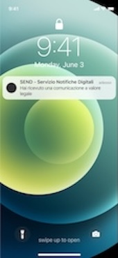
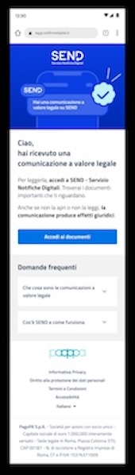
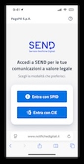
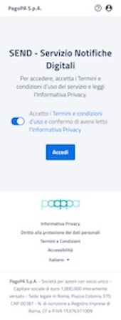
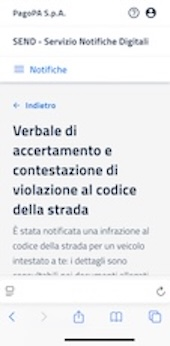
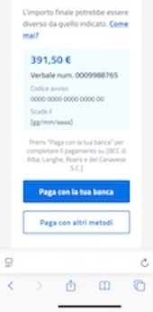
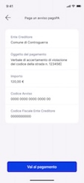
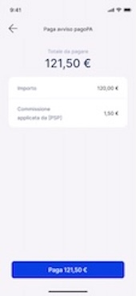

# Flusso di un pagamento

Flusso di pagamento completo tramite Messaggio di Cortesia: Scenario completo che descrive l'autenticazione su SEND, la verifica del canale tramite EMD e il perfezionamento del pagamento PagoPA.

## Step 1 - Ricezione messaggio Push

Il Cittadino dopo aver fornito il consenso alla ricezione dei Messaggi di Cortesia in caso un Ente notifica qualcosa per lui potrebbe ricevere un messaggio push

## Step 2 - Dettaglio messaggio Push

Il Cittadino cliccando sul messaggio push accede al dettaglio del Messaggio di Cortesia

## Step 3 - Landing Page SEND

Al click "Leggi la Comunicazione" tramite un URL di redirect si atterra sulla Landing page di SEND

## Step 4 - Accesso al portale SEND tramite SPID o CIE

Dopo aver letto informazioni di dettaglio relative a SEND si può procedere con l'accesso al portale utilizzando uno dei metodi di autenticazione tra SPID o CIE

## Step 5 - Accettazione TOS SEND primo accesso

## Step 5 - Dettaglio Notifica

## Step 6 - Dettaglio Pagamento

## Step 7 - CTA Paga

## Step 8 - Pagato

