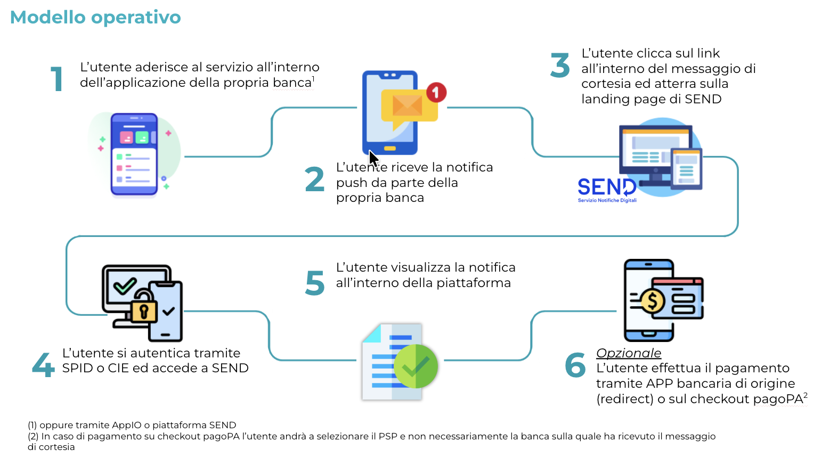

---
metaLinks:
  alternates:
    - https://app.gitbook.com/s/UdBZLK0IXWx2yqcEv6ks/per-iniziare/02-ext-intro
---

# Flusso Operativo Completo

Il Flusso Operativo Completo prevede:

* **Prestatori di Servizio di Pagamento (PSP)**: Per PSP si intende il soggetto che mette a disposizione dei propri utenti l'APP per il servizio “Messaggi di Cortesia”.
* **SEND**: SEND è la piattaforma che si occupa dell’invio ai Cittadini, per via digitale o analogica, delle notifiche a valore legale, gestendo l’intero processo di notificazione al posto dell’Ente, che si limitano a depositare l’atto da notificare.
* **EMD**: L'**E**nterprise **M**essage **D**ispatcher è il layer di gestione dei messaggi avente lo scopo di armonizzare sia le interfacce esposte dalle piattaforme erogatrici, che le logiche di canale.
* **Cittadino**: Il Cittadino è colui che dopo aver effettuato l’attivazione del servizio tramite canale del PSP riceve il messaggio di cortesia che lo informa che su SEND è presente una notifica a suo carico.


Si precisa che, nel contesto di questo documento, qualora venga menzionato l'Attore TPP (terza parte), si intende il Prestatore di Servizio di Pagamento o ulteriori soggetti che potrebbero aggiungersi in fasi successive.



Le specifiche di integrazione per la ricezione dei Messaggi di Cortesia saranno in futuro pubblicate sui portali pubblici della Società. Da tale momento (che la Società renderà noto tramite una opportuna comunicazione), le specifiche riportate nel presente documento saranno da considerarsi superate e farà fede soltanto quanto riportato nella versione online.


### Descrizione del Prodotto

Messaggi di Cortesia mira a creare un nuovo canale che permetta ai Cittadini di ricevere i messaggi di cortesia di SEND direttamente sulle App dei Prestatori di Servizi di Pagamento (PSP). Questa integrazione offre ai cittadini un'ulteriore opzione per **attivare e ricevere messaggi di cortesia SEND direttamente sulla propria APP Bancaria**.

Inoltre, per valorizzare la collaborazione con i partner e migliorare l’esperienza utente, il prodotto include la possibilità, in caso di perfezionamento di una notifica contenente un avviso di pagamento PagoPA, di **effettuare il pagamento direttamente nell'App del PSP**. Questo semplifica il processo di pagamento e favorisce un'esperienza più fluida per i Cittadini.\
Il prodotto permettte di migliorare la capillarità e l’efficacia della comunicazione con i Cittadini, facilitando l’accesso alle informazioni. Grazie all'integrazione con i canali dei PSP, i cittadini possono scegliere il canale preferito per ricevere gli avvisi di cortesia, **aumentando così la probabilità di ricezione e presa visione delle comunicazioni in tempi brevi**. Questo approccio migliora anche la qualità del servizio offerto dai PSP, che possono arricchire la loro offerta di servizi digitali verso i propri clienti. È importante precisare che i messaggi di cortesia inviati sono **di natura puramente informativa** e pertanto non hanno valore legale. Per perfezionare la notifica, il cittadino dovrà accedere alla piattaforma SEND e potrà farlo tramite il link contenuto nel messaggio di cortesia che lo indirizzerà direttamente in piattaforma.

Il prodotto "**Messaggi di Cortesia**" in questa fase si occuperà della gestione dei messaggi di cortesia relativi alle notifiche a valore legale per i Cittadini, offrendo la possibilità di visualizzare la comunicazione della presenza sulla piattaforma SEND di notifiche a valore legale agli stessi indirizzati da Enti Pubblici o altre Istituzioni, direttamente sull'App bancaria dei PSP. Attualmente SEND consente l'invio dei messaggi di cortesia attraverso tre canali di ricezione: l’app IO, l'email e l'SMS. Questi canali permettono ai cittadini di essere informati della presenza di comunicazioni a valore legale sulla piattaforma SEND, facilitando l’accesso alle informazioni e l’interazione con gli atti digitali. Tuttavia, per ampliare le modalità di comunicazione e permettere ai PSP di offrire un servizio aggiuntivo ai propri clienti, è stata identificata l’esigenza di integrare il servizio messaggi di cortesia di SEND direttamente sui canali dei PSP .


I messaggi di cortesia veicolati riguarderanno esclusivamente le persone fisiche maggiorenni e \*\*non le persone giuridiche.\*\*


## Prerequisito: Attivazione dell'Utente

L'intero processo può avvenire solo se l'utente finale ha preventivamente dato il proprio consenso a ricevere i messaggi di cortesia tramite il proprio PSP, come descritto nel processo di **Attivazione**.


È onere del \*\*PSP\*\* fornire all'utente finale informazioni chiare sulle modalità di adesione e revoca del consenso.


Nell'immagine in basso sono descritti tutti gli step dalla ricezione del messaggio sino al pagamento

<figure><figcaption></figcaption></figure>
