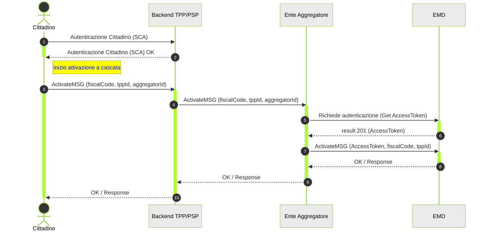

---
metaLinks:
  alternates:
    - >-
      https://app.gitbook.com/s/UdBZLK0IXWx2yqcEv6ks/tutorial-per-gli-enti-aggregatori/02-ext-processo-citizen-activation-ea
---

# Come attivare un utente al servizio


La documentazione per la gestione degli **Enti Aggregatori** è in fase di revisione. **NON UTILIZZARLA** per esportarla all'esterno


Il cittadino, tramite il canale del PSP (App Bancaria) , può richiedere l’attivazione del servizio di messaggi di cortesia, accettando i Termini di Servizio (ToS) e prendendo visione dell'informativa privacy . Si precisa sin da ora che i ToS predisposti dal PSP dovranno contenere una descrizione della piattaforma SEND conforme a quella che verrà fornita da PagoPA nonchè la previsione che con l'attivazione del servizio, il Cittadino accetta di eleggere domicilio ai fini dei messaggi di cortesia nell'app bancaria del PSP stesso. Una volta ottenuto il consenso, viene invocata l’API dedicata messa a disposizione da PagoPA per attivare il servizio.

L’attivazione può avvenire direttamente attraverso il canale del PSP , senza la necessità di passare per il portale SEND, poiché l'autenticazione (SCA) effettuata sui sistemi del PSP è considerata sufficiente ai fini dell’attivazione del servizio.

Il Cittadino deve avere la possibilità di modificare in qualsiasi momento le preferenze di comunicazione, compresa la **disattivazione** stessa del servizio, **che per la prima fase sarà possibile solo tramite l'App** **del PSP** **.**

**Pre-condizioni**

* L’utente effettua l’autenticazione sull'App del PSP e richiede l’attivazione del servizio di messaggi di cortesia.

**Requisiti** **Utente**

* L’utente che ha attivato il servizio deve poter ricevere i messaggi di cortesia sull'App del PSP.
* Attivando il servizio, l’utente riceverà tutti i messaggi con o senza pagamento associato.
* All’utente devono essere inviati i messaggi di cortesia se ha attivato il servizio sull'app del PSP anche se non ha ancora effettuato il primo accesso a SEND.
* L’utente deve poter accettare i Termini di Servizio (ToS).
* L’utente deve avere piena consapevolezza del consenso fornito e del servizio a cui sta aderendo.
* L’utente deve poter recuperare i Termini di Servizio e l'Informativa sulla Privacy direttamente dal PSP
* L’utente deve poter modificare o disattivare il servizio in qualsiasi momento sul canale del PSP (App)

**Post-condizioni**

* Se l’utente dopo aver ricevuto un messaggio di cortesia vuole disattivare la comunicazione del servizio, può farlo tramite il canale del PSP (App).

**ONBOARDING DI UN CITTADINO** L'APP del PSP permetterà al Cittadino di attivare il servizio dei messaggi di cortesia inviati da parte di SEND. Per poter richiamare la nostra API POST: `/emd/citizen/{fiscalCode}/{tppId}` sarà necessario fornire il token di autorizzazione recuperato dal sistema autorizzativo. Il cittadino nel momento in cui accetterà i ToS, prenderà visione dell'informativa privacy e attiverà il servizio lato App Terza, fornirà alla nostra API due informazioni:

* `fiscalCode`: codice fiscale del cittadino
* `tppId`: identificativo univoco del Prestatore di servizi di pagamento (PSP)

In caso di esito positivo la risposta sarà la seguente:

```json
{
  "fiscalCode": "RSSMRO92S18L048H",
  "consents": {
    "0e3bee29-8753-447c-b0da-1f7965558ec2-1706867960900": {
      "tppState": true,
      "tcDate": "2024-11-01T11:25:40.695Z"
    }
  }
}
```

Ossia l'indicazione sul Codice fiscale dell'utente che ha accettato i consensi e un oggetto consents con all'interno:

* `tppState`: booleano che indica lo stato del consenso fornito (true-> aderente e false -> non aderente)
* `tcDate`: indica la data di accettazione/non accettazione dei consensi


