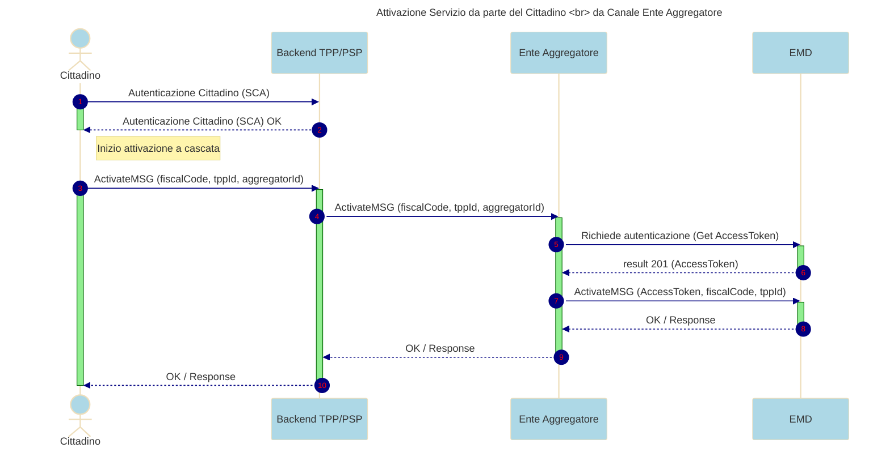

---
metaLinks:
  alternates:
    - >-
      https://app.gitbook.com/s/UdBZLK0IXWx2yqcEv6ks/tutorial-per-gli-enti-aggregatori/03-ext-processo-citizen-deactivation-ea
---

# Come disattivare un utente al servizio


La documentazione per la gestione degli **Enti Aggregatori** è in fase di revisione. **NON UTILIZZARLA** per esportarla all'esterno


In questo fase, l'utente ha la possibilità di disattivare il servizio di messaggi di cortesia in qualsiasi momento.

Per la prima fase, la disattivazione del servizio, così come l'attivazione, sarà possibile solo attraverso l'App del PSP . Se l'utente desidera interrompere la ricezione dei messaggi di cortesia dopo aver attivato il servizio, può farlo attraverso l'App del PSP.

L'App del PSP deve chiamare l'EMD per recuperare le abilitazioni e consentire all'utente effettuare la disattivazione .

