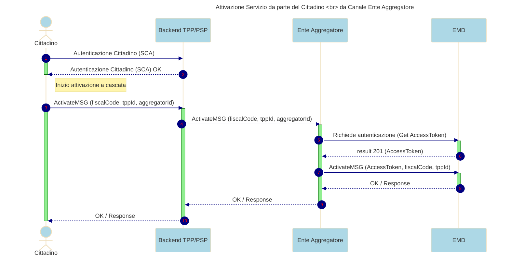

---
metaLinks:
  alternates:
    - >-
      https://app.gitbook.com/s/UdBZLK0IXWx2yqcEv6ks/tutorial-per-gli-enti-aggregatori/05-ext-processo-payment-ea
---

# Come avviene il pagamento associato ad un messaggio


La documentazione per la gestione degli **Enti Aggregatori** è in fase di revisione. **NON UTILIZZARLA** per esportarla all'esterno


Dopo aver effettuato l’accesso tramite SPID/CIE al portale SEND e aver perfezionato la notifica, il Cittadino ove presente potrà procedere al pagamento

:::warning\[**Vincolo di Integrazione tra PSP e SEND**]

* È possibile accedere a SEND esclusivamente tramite l'apertura di un browser, sia all'interno di un'app che direttamente sul sistema operativo.
* Non è consentito l'utilizzo di WebView o iFrame, a causa delle restrizioni imposte dalla nostra Content Security Policy (CSP). :::

**Pre-condizioni**

* L’utente deve essersi autenticato con SPID e CIE alla piattaforma SEND
* L’utente deve aver perfezionato la notifica sul portale SEND
* La notifica deve avere un pagamento associato di tipo pagoPa

**Requisiti**

*   L'utente deve poter accedere alla notifica. Il sistema **SEND** interroga **EMD** per eseguire le verifiche necessarie e determinare se l’utente ha l’autorizzazione per visualizzare e pagare la notifica.

    Quando **EMD** prende in carico la richiesta, controlla che l'utente stia accedendo attraverso il canale del **PSP** corretto( App bancaria corretta). Se il canale è quello previsto, l’utente potrà visualizzare e pagare la notifica; in caso contrario, verrà generato un errore.

    * **Scelta del Metodo di Pagamento**: L’utente deve poter selezionare il metodo di pagamento desiderato tra quelli disponibili.
* Il pagamento tramite app del PSP non sarà disponibile per quelle posizioni debitorie di tipologia F24
* **Consapevolezza delle Alternative**: L’interfaccia deve informare l’utente della possibilità di utilizzare metodi di pagamento alternativi a quello suggerito relativo all'App del PSP (Prestatori di servizio di pagamento).
* **Canale Preferenziale Visualizzato**: Il metodo di pagamento del canale (App Bancaria) da cui l’utente è giunto sul portale SEND sarà visualizzato come opzione predefinita. **SEND** dovrà infatti creare un pulsante per consentire all’utente di effettuare il pagamento tramite il **PSP**. Le informazioni necessarie al fine di creare tale bottone saranno fornite nella risposta alla chiamata effettuata a **EMD**, per la verifica del canale che includerà i seguenti dati **IUN; Deeplink; pspDenomination; OriginalID.** Se l’utente clicca sul bottone verrà richiamato il servizio EMD che indirizzerà il cittadino all’APP del PSP
* **Flag in onboarding**: durante la fase iniziale dovrà essere previsto un flag, denominato `isPaymentEnabled`, che consenta di identificare se una **TPP** è integrata o meno con il sistema di pagamento. Il valore di tale flag dovrà essere trasmesso a **SEND** all’interno del **body del retrieval**, al fine di garantire la corretta gestione del flusso anche per le TPP non abilitate ai pagamenti. L’utente che sceglie come metodo di pagamento l'app del PSP; deve essere reindirizzato tramite deeplink sull'App del PSP , garantendo un accesso rapido e sicuro .

