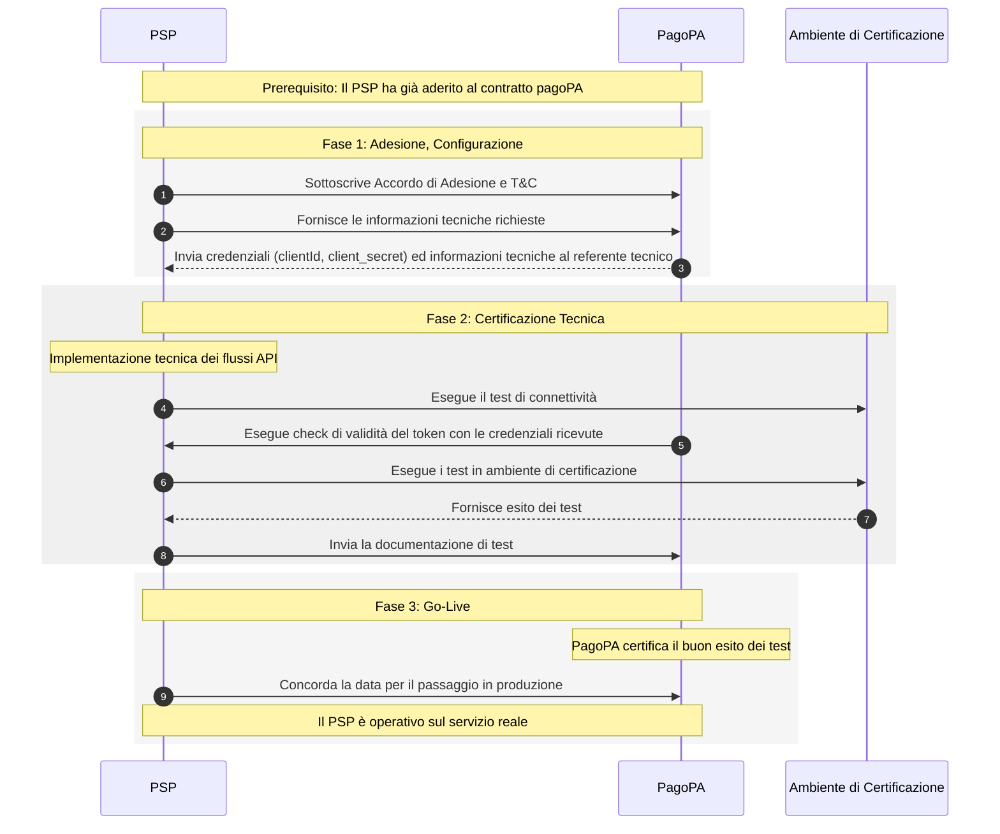

---
metaLinks:
  alternates:
    - >-
      https://app.gitbook.com/s/UdBZLK0IXWx2yqcEv6ks/tutorial-per-i-psp/01-ext-processo-onboarding
---

# Come aderire al servizio

## Premessa

Questo tutorial descrive il processo di Onboarding, ovvero i passi che un PSP deve seguire per aderire al servizio **M**esaggi **D**i **C**ortesia, ottenere le credenziali necessarie per l'integrazione tecnica e diventare pienamente operativo.



## Step 1: Sottoscrivere Accordo di Adesione e T\&C

Prima di avviare il processo di onboarding con PagoPA il PSP deve aver sottoscritto il **Contratto di Adesione** ed essere stato validato e accettato da PagoPA e aver formalizzato la propria adesione al servizio tramite la sottoscrizione della convenzione e dei Termini e Condizioni (T\&C) forniti da PagoPA.

## Step 2: Fornire le Informazioni Tecniche

Dopo aver avuto la validazione sulla corretta sottoscrizione del contratto occorrerà fornire le informazioni tecniche con tutte le informazioni necessarie alla configurazione del servizio sulla piattaforma.

[→ Scarica il documento relativo ai test da effettuare](https://developer.pagopa.it/mdc/tutorials/come-aderire-al-servizio)

I dati richiesti includono:

### Specifiche per la Registrazione dei PSP su PagoPA

Ogni **PSP (Payment Service Provider)** deve fornire a un amministratore PagoPA le informazioni necessarie per la configurazione del sistema.

***

### Informazioni Richieste

### 1. Dati Anagrafici e Identificativi

* **`entityId`**: Identificativo univoco (Partita IVA o C.F.) della terza parte.
* **`idPsp`**: Identificativo del Payment Service Provider.
* **`businessName`**: Ragione sociale della terza parte.
* **`legalAddress`**: Sede legale della terza parte.

### 2. Configurazione Autenticazione e Endpoint

* **`authenticationType`**: Tipologia di autenticazione (attualmente supportato solo `OAUTH2`).
* **`authenticationUrl`**: URL per ricevere il token di autenticazione necessario per invocare l'API definita nel campo `messageUrl`.
* **`messageUrl`**: URL messo a disposizione dalla TPP per l'invio delle notifiche Push.
* **`contact`**:
  * `name`: Nome del referente TPP.
  * `number`: Numero di contatto.
  * `email`: Email della TPP.
*   **`agentDeepLinks`**: `Map<String, String>` contenente l'agent di provenienza (key) e il deeplink di riferimento (value).

    > Esempio: `ios: https://deeplink.it`
* **`paymentButton`**: Label dell'etichetta del bottone da inserire sulla pagina di SEND per il pagamento con l'App della terza parte.

### 3. Sezione Token (`tokenSection`)

* **`contentType`**: Media Type originale della risorsa prima della codifica del contenuto.
* **`bodyAdditionalProperties`**: `Map<String, String>` per proprietà aggiuntive nel corpo della request per la generazione del token.
  * _Esempio:_ `client_id`, `client_secret`, `grant_type`.
  * **N.B.** La Key identifica il campo reale della richiesta; i Value vengono criptati/decriptati lato Backend.
* **`pathAdditionalProperties`**: `Map<String, String>` per proprietà aggiuntive nell'URL path (es. dati sensibili come il `tenantId`).
  * _Esempio:_ Se l'URL è `https://login.microsoftonline.com/123424222/oauth2/token`, si può usare il placeholder `tenantId` nell'URL e mappare:
    * **Key**: `tenantId`
    * **Value**: `123424222`
  * **N.B.** Questi dati vengono criptati/decriptati lato Backend.

***

### Processo di Registrazione

Una volta fornite le informazioni, l'amministratore PagoPA registrerà il PSP. Al termine, il TPP riceverà:

| Campo               | Descrizione                                                                  |
| ------------------- | ---------------------------------------------------------------------------- |
| **`tppId`**         | Identificativo univoco della terza parte sui sistemi PagoPA.                 |
| **`tokenUrl`**      | URL per autenticare le chiamate verso i sistemi EMD (milAuthToken - OAUTH2). |
| **`client_id`**     | Generato sul sistema di autenticazione da PagoPA per il PSP.                 |
| **`client_secret`** | Generato sul sistema di autenticazione da PagoPA per il PSP.                 |
| **`grant_type`**    | `client_credentials`.                                                        |

***

## Step 3: PagoPA fornirà le informazioni Tecniche

A seguito della sottoscrizione del contratto e della fornitura dei dati tecnici, il referente tecnico indicato riceverà via email le credenziali di accesso ai servizi. Nello specifico, verranno comunicati `clientId` e `client_secret`, indispensabili per l'autenticazione OAuth2 e per l'utilizzo delle API.

## Step 4: Test di Connettività

In ambiente **DEV/UAT** è possibile effettuare un test di connettività tra il sistema del PSP e EMD.

### Procedura

1. Generare il token di Collaudo/UAT usando la `tokenUrl` e le credenziali fornite.
2. Inserire il token nell'header di `Authorization`.
3. Effettuare una chiamata **GET** al seguente endpoint:

```http
GET https://api-emd.dev.cstar.pagopa.it/emd/mil/tpp/network/connection/{tppName}
```

## Step 5: Esegue check di validità del token con le credenziali ricevute

## Step 6,7,8: Eseguire i Test in Ambiente di Certificazione (Collaudo/UAT)

Una volta ottenute le credenziali, dovrai procedere con l'integrazione tecnica e la certificazione in ambiente di test (UAT). Questa fase prevede l'implementazione dei flussi API e l'esecuzione di una serie di prove per verificare il corretto funzionamento della tua integrazione, che andranno documentate secondo le modalità fornite.

## Step 9: Pianificare il Passaggio in Produzione

Dopo aver completato con successo la fase di test e ottenuto la certificazione, il PSP potrà concordare con PagoPA la data per il passaggio in produzione ed avviare ll'operatività in ambiente di Produzione.
