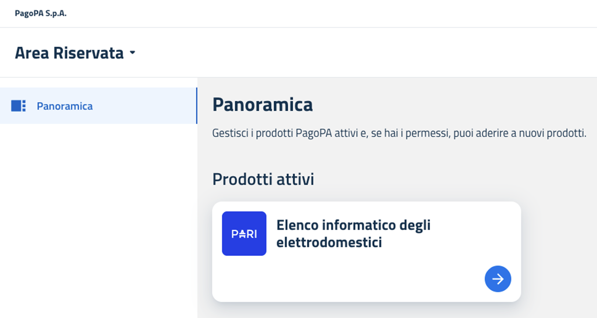

---
argomenti_correlati:
  - /tutorial/come-visualizzare-i-propri-dati-anagrafici
funzione: tutorial
livello: principiante
prodotto:
  nome: PARI - Bonus Elettrodomestici
  versione: v1.0.0
schema:
  '@context': https://schema.org
  '@type': HowTo
  author:
    '@type': Organization
    name: PagoPA S.p.A.
  description: >-
    Questa guida illustra la procedura che il Produttore deve seguire per
    effettuare il primo accesso all'Elenco informatico degli elettrodomestici.
    Al termine di questi passaggi, il Produttore sarà in grado di visualizzare
    la propria anagrafica e operare all'interno dell'area riservata.
  keywords: primo accesso, login, autenticazione, SPID, CIE, Bonus Elettrodomestici
  name: >-
    Come effettuare il primo accesso all'Elenco informatico degli
    elettrodomestici
  step:
    - '@type': HowToStep
      name: Accesso al portale
      text: >-
        Collegarsi all'indirizzo del portale presente nella comunicazione
        ricevuta in precedenza e selezionare la card relativa all'Elenco
        informatico degli elettrodomestici.
    - '@type': HowToStep
      name: Visione della documentazione
      text: >-
        Prendere visione dei Termini e condizioni d’uso e dell’informativa sul
        trattamento dei dati personali.
    - '@type': HowToStep
      name: Avvio dell'autenticazione
      text: >-
        Dalla data di avvio dell'iniziativa, al Produttore sarà consentito
        accedere all'Elenco informatico degli elettrodomestici facendo click sul
        pulsante Accedi. Il sistema reindirizzerà al servizio di autenticazione.
    - '@type': HowToStep
      name: Autenticazione
      text: >-
        Selezionare il proprio metodo di identità digitale, SPID o CIE (Carta
        d'Identità Elettronica) e completare l'autenticazione seguendo le
        istruzioni del proprio gestore.
    - '@type': HowToStep
      name: Primo accesso e visualizzazione Panoramica
      text: >-
        Una volta completata l'autenticazione con successo, il sistema
        reindirizzerà il Produttore all'interno dell'area riservata. La prima
        schermata visualizzata è la sezione 'Panoramica', che riepiloga i dati
        identificativi dell'azienda.
  tool:
    - '@type': HowToTool
      name: SPID
    - '@type': HowToTool
      name: CIE (Carta d'Identità Elettronica)
  totalTime: PT5M
status: pubblicato
tecnologia:
  - SPID
  - CIE
utente:
  ruolo: produttore
  tag:
    - primo accesso
    - login
    - autenticazione
    - SPID
    - CIE
  tipo_ente: partner_tecnologico
---

# Come effettuare il primo accesso

Questa guida illustra la procedura che il _Produttore_ deve seguire per effettuare il primo accesso all'_Elenco informatico degli elettrodomestici_. Al termine di questi passaggi, il _Produttore_ sarà in grado di visualizzare la propria anagrafica e operare all'interno dell'area riservata.

## Prerequisiti

Prima di poter accedere, è indispensabile che il _Produttore_ abbia completato il processo di adesione con Invitalia S.p.A. mediante la documentazione resa da quest'ultima disponibile.

A seguito delle verifiche effettuate da Invitalia S.p.A. stessa, il _Produttore_ (vale a dire i soggetti che sono inseriti all'interno del file .csv che Invitalia S.p.A. trasmette a PagoPA S.p.A.) riceve una comunicazione formale dall'indirizzo `noreply@bonuselettrodomestici.pagopa.it` che conferma l'avvenuta abilitazione all'accesso alla piattaforma PARI. Solo dopo aver ricevuto tale conferma, sarà possibile procedere con la login.

## Procedura di accesso

Per accedere alla _Piattaforma informatica_, seguire i seguenti passaggi.

### **Step 1 - Accesso al portale**

Collegarsi all'indirizzo del portale presente nella comunicazione ricevuta in precedenza e selezionare la card relativa all'_Elenco informatico degli elettrodomestici_.

<figure><figcaption></figcaption></figure>

***

### **Step 2 - Visione della documentazione**

Prendere visione dei **Termini e condizioni d’uso** e dell’**informativa sul trattamento dei dati personali**.

<figure><figcaption></figcaption></figure>

### **Step 3 - Avvio dell'autenticazione**

Dalla data di avvio dell'iniziativa, al _Produttore_ sarà consentito accedere all'_Elenco informatico degli elettrodomestici_ facendo click sul pulsante **Accedi**. Il sistema reindirizzerà al servizio di autenticazione.

***

### **Step 4 - Autenticazione**

Selezionare il proprio metodo di identità digitale, **SPID** o **CIE** (Carta d'Identità Elettronica) e completare l'autenticazione seguendo le istruzioni del proprio gestore.

***

### Step 5 - Primo accesso e visualizzazione Panoramica

Una volta completata l'autenticazione con successo, il sistema reindirizzerà il _Produttore_ all'interno dell'area riservata.

La prima schermata visualizzata è la sezione **"Panoramica"**, che riepiloga i dati identificativi dell'azienda (Ragione Sociale, Codice Fiscale, Partita IVA). Questa schermata serve a confermare che l'accesso è avvenuto correttamente e che l'utente è associato all'azienda corretta.

<figure><figcaption></figcaption></figure>

I dati presenti in questa sezione sono di sola lettura. Per eventuali richieste di modifica, è necessario seguire la procedura descritta nel tutorial [Come visualizzare i propri dati anagrafici](../tutorial/come-visualizzare-i-propri-dati-anagrafici.md).
