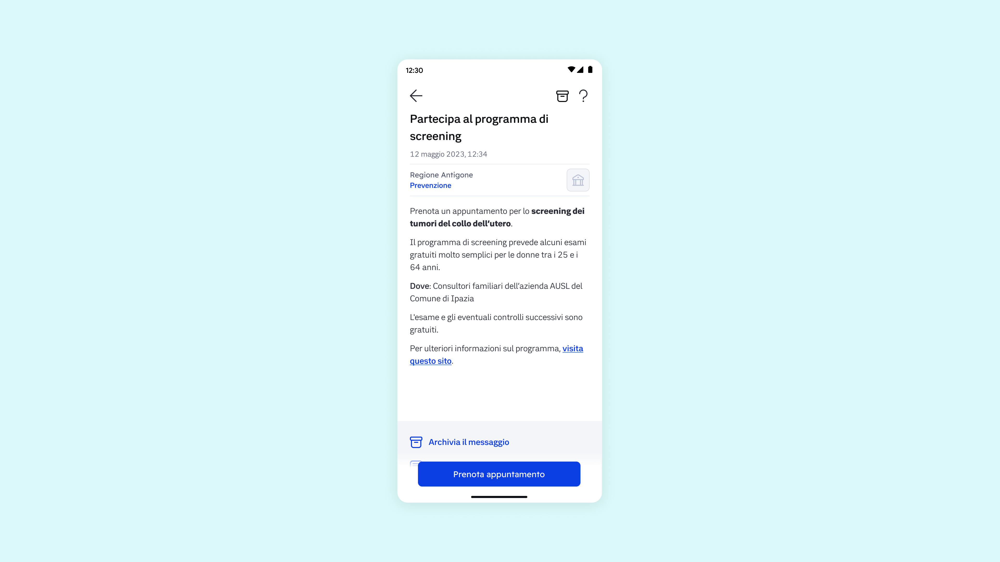

# 1️⃣ Avvio della campagna di prevenzione e screening

Per illustrare in modo chiaro la gestione del **servizio "Prevenzione"** e delle attività di comunicazione ad esso collegate, viene proposto uno scenario fittizio avente come protagonista un cittadino destinatario del servizio.

**Lucia, 50 anni, residente a Ipazia,** ha ricevuto un messaggio in app IO che la invitava a partecipare a una campagna di screening per i tumori del collo dell’utero. Grazie a questo messaggio, ha potuto comprendere l'importanza dell'iniziativa e ha deciso di aderire.

In questa fase iniziale, dunque, l'ente avvia la comunicazione verso i cittadini per invitarli a partecipare alla campagna di prevenzione.

<figure><figcaption></figcaption></figure>

## **Cosa fa l'ente**

* Redige e invia tramite App IO un messaggio personalizzato contenente le informazioni essenziali sulla campagna di screening (tipologia, periodo, obiettivi, destinatari).
* Può decidere se allegare al messaggio un appuntamento già fissato oppure lasciare al cittadino la possibilità di prenotare.

## **Cosa fa il cittadino**

* Riceve un messaggio in app IO, lo apre e ne consulta il contenuto informativo.

## **Migliora l'esperienza dall'inizio alla fine 💡**

* Redigi un messaggio chiaro, sintetico e personalizzato, spiegando l'importanza dello screening e i benefici per la salute.
* Inserisci riferimenti temporali precisi (durata campagna, scadenze).
* Inserisci un link ad una pagina di approfondimento se ritieni utile condividere ulteriori dettagli o spiegazioni sulla campagna di screening.

## Benefici per l'ente e per il cittadino ✅

* **Aumento dell’adesione**: Un messaggio chiaro e tempestivo può incentivare la partecipazione, contrastando il problema della bassa adesione alle campagne di screening.
* **Personalizzazione della comunicazione**: Permette di adattare i messaggi per target diversi (età, genere, rischio), migliorando la rilevanza percepita dal cittadino.
* **Riduzione delle barriere informative**: Il cittadino riceve tutte le informazioni essenziali in un unico punto (App IO), senza dover cercare attivamente.
* **Canale digitale sicuro ed efficace**: La notifica su app IO garantisce velocità e risparmio rispetto ai canali cartacei o telefonici.

## Scrivere i messaggi su IO

Nel [Manuale dei servizi dell'app IO,](https://developer.pagopa.it/app-io/guides/manuale-servizi) puoi trovare il modello [Prevenzione](https://developer.pagopa.it/app-io/guides/modelli-servizi/salute/in-arrivo) cioè un template da cui l'ente può partire per **configurare il servizio e i relativi messaggi al cittadino** su IO.&#x20;
