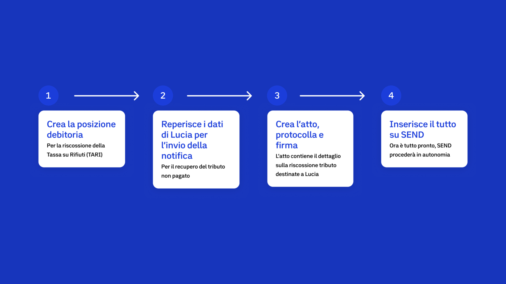

---
metaLinks:
  alternates:
    - >-
      https://app.gitbook.com/s/Y7k2HeXaC1tCaS4VWENZ/emissione-della-prescrizione-medica
---

# 1️⃣ Preparazione e invio della notifica

**Il Comune di Ipazia deve procedere alla riscossione di tributi TARI non pagati.** L'ente non deve preoccuparsi di stampare e imbustare migliaia di lettere: prepara i dati digitalmente e li affida a SEND, che si occuperà di raggiungere ogni cittadino nel modo più appropriato.

<figure><figcaption></figcaption></figure>

### Cosa fa l'Ente

* **Crea la posizione debitoria:** Genera la posizione debitoria sui sistemi pagoPA indicando chiaramente l'oggetto (es. Tassa Rifiuti) e le scadenze.
* **Reperisce i dati:** Raccoglie Nome, Cognome, Codice Fiscale e indirizzo di residenza del destinatario. Se il destinatario ha eletto un domicilio digitale speciale presso l'ente, è possibile usare il domicilio indicato.
* **Prepara l'atto:** Crea il documento in formato PDF/A con firma digitale PAdES per essere incluso nell'invio della notifica SEND
* **Carica su SEND:** Carica mediante API B2B la notifica su SEND per Lucia che contiene:
  * oggetto della notifica;
  * descrizione della notifica;
  * Codice Fiscale ente creditore;
  * Numero avviso e bollettino pagoPA in PDF;
  * eventuale indirizzo PEC (domicilio digitale speciale);
  * Indirizzo fisico
  * tipologia di prodotto postale (A/R, 890).
  * Codice tassonomico.

### Migliora l'esperienza dall'inizio alla fine 💡

* **Gestione della Rateizzazione:** Se l'ente prevede la possibilità di pagare a rate, è consigliato aggiungere un PDF contenente tutti gli avvisi e il piano di rateizzazione tra i documenti allegati, indicando l'applicazione dei costi di notifica sulla prima rata e la rata unica.
* **Cura del messaggio:** Un titolo efficace e una descrizione chiara nel campo abstract aiutano il cittadino a capire subito di cosa si tratta (es. indicare il periodo di riferimento della tassa).
* **Scelta della più efficace modalità di invio della notifica:** L’ente può gestire l’invio manuale di una notifica utilizzando la piattaforma di SEND, ma anche automatizzare e scalare il processo di invio e gestione delle notifiche, utilizzando l'integrazione della API B2B di SEND.
  &#x20;

### Benefici per l'ente e per il cittadino ✅

* **Efficienza operativa:** SEND automatizza l’invio delle notifiche, garantendo la consegna dal digitale al cartaceo, eliminando i carichi manuale dell’ente
* **Certezza legale:** Il processo di deposito e invio è tracciato e a valore legale.
* **Integrazione con IO e pagoPA:** SEND massimizza la certezza di consegna della notifica e degli incassi grazie all'integrazione con IO e pagoPA.

