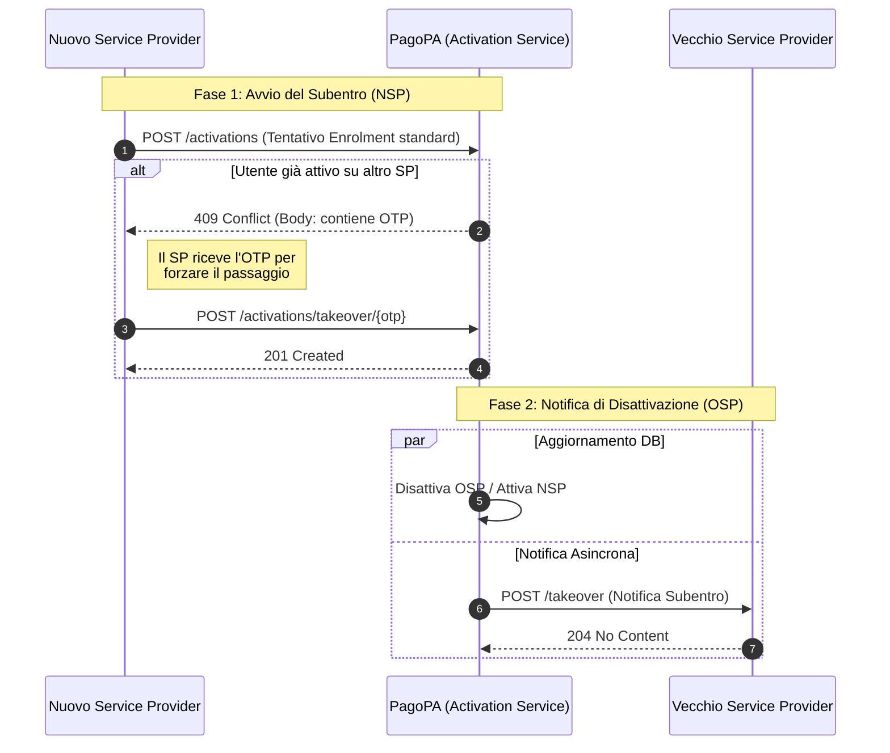

# Come gestire il subentro di un Debitore (Takeover)

Il Subentro (o Passaggio a diverso SRTP Service Provider) è il processo che consente a un Debitore di cambiare il fornitore del servizio SRTP, mantenendo la continuità operativa.

Poiché a ogni debitore può essere associato un solo Service Provider per volta, il passaggio comporta la disattivazione immediata del vecchio provider (OSP) e l'attivazione contestuale del nuovo provider (NSP).


Per maggiori informazioni sulle Linee Guida relative al Subentro, è possibile consultare il [documento del CPI Request to Pay in ambito PagoPA](https://www.bancaditalia.it/compiti/sispaga-mercati/comitato-pagamenti-italia/CPI-Tavolo-Incassi-Pagamenti-Pubblici-RTP-PagoPA-ver-1.2.pdf) al punto _**3.3.3 - Passaggio a diverso SRTPSP**_


Questo tutorial copre le azioni tecniche richieste a entrambi gli attori:

* **Al nuovo Service Provider (NSP)** per avviare e validare il subentro
* **Al vecchio Service Provider (OSP)** per ricevere la notifica di disattivazione

### Step 1: Tentativo di Attivazione e Ricezione OTP (Azione del Nuovo SP)

Il flusso inizia quando il Nuovo Service Provider (NSP) tenta di attivare un utente seguendo la procedura standard di Enrollment. 

1. Il NSP invoca l'API POST /activations.
2. Se il Debitore è già attivo presso un altro provider, PagoPA risponde con un errore 409 Conflict.
3. Nell'header di questa risposta di errore, PagoPA restituisce un OTP (One-Time Password) univoco.

Questo OTP rappresenta la "chiave" che il Nuovo SP deve utilizzare per confermare la volontà dell'utente di effettuare il passaggio.

### Step 2: Conferma del Subentro (Azione del Nuovo SP)

Una volta ottenuto l'OTP, il Nuovo Service Provider deve invocare l'endpoint specifico per il subentro per finalizzare l'operazione.

#### Endpoint

`POST /activations/takeover/{otp}`

* **Parametro Path:** `{otp}` è il codice ricevuto nello step precedente.
* **Azione:** Questa chiamata conferma a PagoPA che il Nuovo SP prende in carico il Debitore.

#### Risposta

* `201 Created` \
  Il subentro è avvenuto con successo. L'attivazione precedente è stata terminata e la nuova è ora in stato `ACTIVE`.


Nota per l'Utente Finale: Prima del completamento, l'utente visualizzerà sul proprio canale digitale un messaggio informativo (warning) standardizzato che lo avvisa della contestuale disattivazione del precedente provider.


### Step 3: Ricezione Notifica di Subentro (Azione del Vecchio SP)

Se sei il Service Provider che "perde" l'utente (OSP), devi essere in grado di ricevere la notifica di avvenuto subentro per aggiornare i tuoi sistemi e cessare l'invio di nuove richieste.

PagoPA invia una chiamata asincrona all'endpoint dedicato esposto dal tuo sistema.

#### Endpoint (da esporre)

`POST /takeover`

Il corpo della richiesta (Takeover Notification) contiene i dati necessari per riconciliare la disattivazione:

| Campo               | Tipo     | Descrizione                                                           |
| ------------------- | -------- | --------------------------------------------------------------------- |
| `oldActivationId`   | UUID     | L'identificativo univoco della tua vecchia attivazione ora terminata. |
| `fiscalCode`        | String   | Il Codice Fiscale del Pagatore (P009) oggetto del subentro.           |
| `takeoverTimestamp` | ISO 8601 | Data e ora (UTC) in cui il subentro è stato finalizzato.              |

#### Risposta Attesa

Il tuo server deve rispondere con:\
`204 No Content` \
Per confermare la corretta ricezione della notifica.

#### Gestione degli Errori e Retry

PagoPA utilizza un meccanismo di notifica resiliente. Se il tuo endpoint non risponde o restituisce errore (es. `500` o `400`), sono previsti fino a 3 tentativi di invio. In caso di fallimento totale, l'evento viene registrato per una gestione offline.


Gestione SRTP Pregresse: Le richieste di pagamento (SRTP) ricevute prima del subentro restano attive. PagoPA mantiene la rotta corretta per la messaggistica (es. cancellazioni) relativa a queste vecchie posizioni fino alla loro naturale conclusione.


