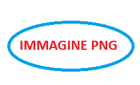
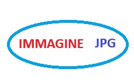
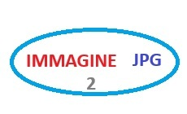

# Markdown di Test con lista di Prodotti

Ecco l'elenco dei prodotti visualizzati nel menù a tendina **"Prodotti"**:

- **App IO**
- **Firma con IO**
- **Piattaforma pagoPA**
- **SEND - Servizio Notifiche Digitali**
- **PDND - Piattaforma Digitale Nazionale Dati (Interoperabilità)**
- **SEPA Request To Pay (SRTP)**
- **PARI**

> Fonte: [developer.pagopa.it](https://developer.pagopa.it)

---

# Header 1

Header 1 alternativa
===================

# **Header 1 grassetto**


## Header 2

Header 2 alternativa
-------------------

## **Header 2 grassetto**


### Header 3

### **Header 3 grassetto**


#### Header 4

#### **Header 4 grassetto**

Paragrafo

---


*Questa riga è in corsivo*

**Questa riga è in grassetto**

<u>Questa riga è sottolineata</u>

~~Questa riga è barrata~~

> Questa è una citazione.

`Questa riga è codice`

_Questa riga è altro Italic_

<mark style="color:orange;">Questa riga è evidenziata</mark>

> « attività di riconciliazione del pagamento »

> altra citazione 

> su più righe


---

## Elenchi

### Elenco puntato esempio

- Primo elemento puntato
- Secondo elemento puntato
- Terzo elemento puntato

### Altro Elenco puntato

<ul><li>Item</li><li>Item2</li></ul>


### Elenco numerato esempio

1. Primo elemento numerato
2. Secondo elemento numerato
3. Terzo elemento numerato


### Altro Elenco Numerato

<ol><li>Item</li><li>Item2</li></ol>


### Lista di controllo

- [x] Completato il primo passo
- [ ] Passo successivo da fare
- [ ] Altro passo da completare


### Tabella esempio

| Nome      | Età | Città       |
|-----------|-----|-------------|
| Antonio   | 25  | Milano      |
| Giuseppe  | 44  | Treviso     |
| Maria     | 19  | Cosenza     |

---
## Link

### Link web esempio

Puoi visitare [Wikipedia](https://it.wikipedia.org/wiki/Markdown "Enciclopedia libera") per maggiori informazioni su Markdown.


### Link interno esempio

* [Page1](page1.md)
* [Page2](page2.md)
    * [Figlia](dir1/paginaFiglia.md)


### Immagine esempio


### Altre immagini da devportal









<figure></figure>


<figure><figcaption>Caption di prova</figcaption></figure>


---

# Componenti da Test DP

### Link

[Modello di Integrazione](https://docs.pagopa.it/modello-di-integrazione-di-piattaforma-notifiche/path/#fragment)

[Manuale onboarding: sezione Processo di adesione](https://app.gitbook.com/s/axttcUGV65V2IVRggmvR/area-riservata/come-aderire)'

'[Modello che non esiste](https://docs.pagopa.it/dont-exists/)'


Markdown che punta al file this-is-a-test.md [this-is-a-test](this-is-a-test.md)

Markdown che punta al file page1.md [Page1](page1.md)

Markdown che punta al file in cartella parse-this.md [this-is-a-test](parent/parse-this.md) 

Markdown che punta al file paginaFiglia.md in cartella dir1 [paginaFiglia](dir1/paginaFiglia.md) 

Markdown che punta al file in altra cartella [paginaFiglia2](dir2/paginaFiglia2.md)

Markdown che punta al file e ancoraggio [this-is-a-test](parent/this-will-be-parsed.md#ending)

Markdown che punta al file e ancoraggio [paginaFiglia2-ancorata](dir2/paginaFiglia2.md#titolo-sezione)

Esempio di contenuto incluso in altro file!
__tests__/fixtures/reusable-content.md


Esempio di contenuto incluso in altro file2!
__dir3__/subdir1/testo-incluso-1.md

Esempio di contenuto incluso in altro file3!
__./dir3__/subdir1/testo-incluso-1.md


---
### Custom

middle

This is a test\n \n \n test test\n\n test

Questo è testo incluso da 2\n \n \n test test\n\n test


	Testo di informazione hint






\nText\n

\n' + code + ''

\n' + code + '



\nCaption\n




\nCaption\n




 
 Tab 1 Testo del primo Tab
 

 
 Tab 2 Testo del secondo Tab
 



\n\n\nTEsto tab1 hint1\n\n\nTesto tab1 hint2\n\n\n\n\nTesto del Tab2 senza hint\n\n


      'This is a caption'
 


   
```xml
  <soapenv:Envelope>
    <soapenv:Header />
    <soapenv:Body>
      <nod:paVerifyPaymentNoticeReq>
        <idPA>77777777777</idPA>
        <idBrokerPA>77777777777</idBrokerPA>
        <idStation>77777777777_01</idStation>
        <qrCode>
          <fiscalCode>77777777777</fiscalCode>
          <noticeNumber>311111111112222222</noticeNumber>
        </qrCode>
      </nod:paVerifyPaymentNoticeReq>
    </soapenv:Body>
  </soapenv:Envelope>
```



  
```xml
  <soapenv:Envelope>
    <soapenv:Header />
    <soapenv:Body>
      <nod:paVerifyPaymentNoticeReq>
        <idPA>77777777777</idPA>
        <idBrokerPA>77777777777</idBrokerPA>
        <idStation>77777777777_01</idStation>
        <qrCode>
          <fiscalCode>77777777777</fiscalCode>
          <noticeNumber>311111111112222222</noticeNumber>
        </qrCode>
      </nod:paVerifyPaymentNoticeReq>
    </soapenv:Body>
  </soapenv:Envelope>
```




### Altre Tabelle
#### T1
| col A     | col B |
| --------- | --------- |
| 1 - A     | 1 - B     |
| 2 - A     | 2 - B     |


#### T2
| col A     | col B |
| --------- | --------- |
| <p>1 - A</p>| 1 - B     |
| 2 - A     | 2 - B     |

#### T3
<table data-header-hidden>
<thead>
<tr><th width="165">col A</th><th width="518">col B</th></tr></thead>
<tbody>
<tr><td>1 - A</td><td>1 - B</td></tr>
<tr><td>2 - A</td><td>2 - B</td></tr>
</tbody></table>


#### T4
<table data-card-size="large" data-view="cards">
<thead>
<tr>
<th></th>
<th data-hidden data-card-cover data-type="files"></th>
<th data-hidden data-card-target data-type="content-ref"></th>
</tr></thead>
<tbody>
<tr><td>0 - A</td><td><a href="img-0.jpg">0 - B</a></td><td><a href="ref-0.md">0 - C</a></td></tr>
<tr><td>1 - A</td><td><a href="img-1.jpg">1 - B</a></td><td><a href="ref-1.md">1 - C</a></td></tr></tbody></table>


### Varie da controllare ripulire

<td><strong>before space</strong> <a><strong>after space</strong></a></td>

<strong>Text strong</strong>

Hello<br>there


:sos:

:technologist:Ideare un servizio

<details>
 <summary>A Summary</summary>
 A Details
 
</details>

<details>\n\n<summary>A Summary2</summary>\n\nA Details\n\n\n</details>

[pagamenti@assistenza.pagopa.it](mailto:pagamenti@assistenza.pagopa.it)'

`DELETE`` `


--- 

Fine della pagina di test.
