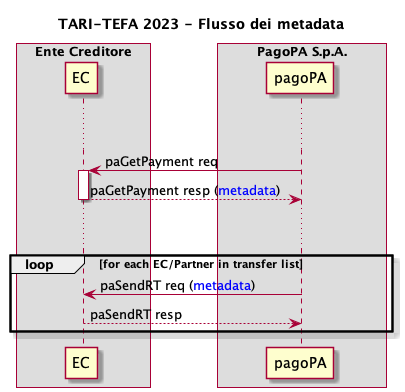

# TARI-TEFA ordinaria 2023

Per far transitare sulla piattaforma pagoPA le informazioni utili alla riconciliazione TARI-TEFA ordinaria per l'anno 2023 è necessario sfruttare la struttura dei _metadata_ disponibile nella primitiva _paGetPayment_, che sarà poi inoltrata a tutti i destinatari della receipt tramite la _paSendRT._

<figure><figcaption></figcaption></figure>

All'interno del tag _metadata_ dovrà essere inserita una struttura per ogni _transfer_ che compone il _payment_, così composta

```xml
<metadata>
  <mapEntry>
    <key>TARI-TEFA-[idTransfer]</key>
    <value>[codice catastale Ente]|[anno di riferimento]|[codice tributo]</value>
  </mapEntry>
</metadata>
```

Il tag _key_ dovrà contenere la concatenazione della costante _TARI-TEFA-_ e l'id del _transfer_ a cui si fa riferimento, mentre il tag _value_ sarà composto dalla concatenazione, con il separatore | (pipe), dei seguenti valori:

* _codice catastale Ente:_ corrisponde alla sezione _codice ente/codice comune_ presente nel modello F24
* _anno di riferimento:_ corrisponde alla sezione _anno di riferimento_ presente nel modello F24
* _codice tributo:_ corrisponde alla sezione _codice tributo_ presente nel modello F24

Esempio di _paGetPayment_ response

```xml
<soapenv:Envelope>
  <soapenv:Header />
  <soapenv:Body>
    <paf:paGetPaymentRes>
      <outcome>OK</outcome>
      <data>
        <creditorReferenceId>11111111112222222</creditorReferenceId>
        <paymentAmount>120.00</paymentAmount>
        <dueDate>2023-05-31</dueDate>
        <retentionDate>2023-03-31T23:59:59</retentionDate>
        <lastPayment>0</lastPayment>
        <description>test</description>
        <companyName>company EC</companyName>
        <officeName>office EC</officeName>
        <debtor>
          <uniqueIdentifier>
            <entityUniqueIdentifierType>F</entityUniqueIdentifierType>
            <entityUniqueIdentifierValue>JHNDOE00A01F205N</entityUniqueIdentifierValue>
          </uniqueIdentifier>
          <fullName>John Doe</fullName>
        </debtor>
        <transferList>
          <transfer>
            <idTransfer>1</idTransfer>
            <transferAmount>100.00</transferAmount>
            <fiscalCodePA>77777777777</fiscalCodePA>
            <IBAN>IT0000000000000000000000000</IBAN>
            <remittanceInformation>TARI</remittanceInformation>
            <transferCategory>0101101IM</transferCategory>
          </transfer>
          <transfer>
            <idTransfer>2</idTransfer>
            <transferAmount>20.00</transferAmount>
            <fiscalCodePA>77777777778</fiscalCodePA>
            <IBAN>IT0000000000000000000000001</IBAN>
            <remittanceInformation>TEFA</remittanceInformation>
            <transferCategory>0201102IM</transferCategory>
          </transfer>
        </transferList>
        <metadata>
          <mapEntry>
            <key>TARI-TEFA-1</key>
            <value>A000|2023|3944</value>
          </mapEntry>
          <mapEntry>
            <key>TARI-TEFA-2</key>
            <value>A000|2023|TEFA</value>
          </mapEntry>
        </metadata>
      </data>
    </paf:paGetPaymentRes>
  </soapenv:Body>
</soapenv:Envelope>
```
