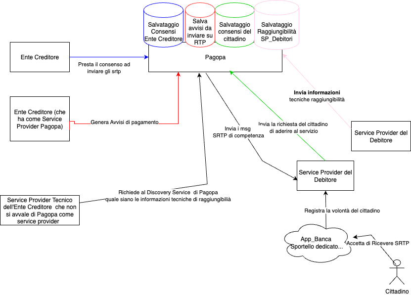

# Il modello implementato da PagoPA

PagoPA, su indicazione di Banca d'Italia, agisce come abilitatore dello schema SRTP per la Pubblica Amministrazione, ricoprendo due ruoli fondamentali:

1. **Gestore del Repository:** Centralizza la gestione dei consensi degli utenti e degli indirizzi tecnici dei Service Provider, garantendo l'interoperabilità dell'intero ecosistema.
2. **Service Provider** degli Enti Creditori: Offre un servizio pronto all'uso per gli Enti che scelgono di avvalersene per inviare le richieste di pagamento, ma l'ecosistema permette anche a Partner Tecnologici terzi di ricoprire questo ruolo.

<figure><figcaption></figcaption></figure>

## **Modalità di Attivazione**

Il consenso dell'utente a ricevere notifiche SRTP può essere gestito secondo due modelli.

* **Attivazione Generalizzata:** L'utente, tramite il proprio PSP, esprime il consenso a ricevere richieste di pagamento da tutti gli Enti Creditori che aderiscono al servizio. Questa modalità semplifica al massimo l'esperienza per l'utente finale. **È il modello adottato per la fase iniziale del servizio RTP di PagoPA.**
*   **Attivazione Selettiva:** L'utente ha la possibilità di specificare da quali

    singoli Enti Creditori o per quali specifiche tipologie di tributo/servizio (es. solo TARI, solo utenze idriche) desidera ricevere le richieste di pagamento. Questo modello offre un controllo più granulare all'utente e sarà reso disponibile in una fase successiva del servizio.

## **Principi Architetturali e di Servizio**

L'implementazione del servizio SRTP da parte di PagoPA si basa su alcuni principi chiave:

* **Semplicità di Integrazione tramite API RESTful:** L'integrazione con la piattaforma avviene tramite API REST che utilizzano payload JSON semplici e intuitivi. Questo approccio astrae la complessità dello standard sottostante ISO 20022, semplificando e accelerando notevolmente il lavoro di sviluppo per i partner.
* **Unico Modello di Funzionamento "Accept Later / Pay Later":** Per garantire uniformità, è stato adottato esclusivamente questo modello, in cui sia la data di accettazione che quella di pagamento coincidono con la scadenza dell'avviso.
* **Indipendenza tra Richiesta e Avviso:** Lo stato di una RTP (es. rifiutata) non influenza lo stato dell'avviso di pagamento pagoPA, che può essere comunque pagato tramite qualsiasi altro canale.
* **Pagamento sempre su pagoPA:** La SRTP è un canale di notifica. Il pagamento vero e proprio deve sempre avvenire nel rispetto delle regole del Nodo dei Pagamenti-SPC.
* **Utilizzo di un IBAN Fittizio:** L'IBAN presente nei messaggi ha solo finalità di identificazione e non deve mai essere usato per disporre il pagamento.
* **Identificazione dei Service Provider:** Ogni SP viene identificato in modo univoco tramite il proprio Bank Identifier Code (BIC) o, in sua assenza, tramite Codice Fiscale.
