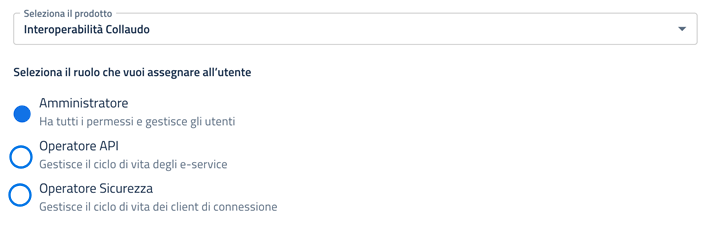

# Configurare l'accesso ad Interoperabilità

Per accedere alla piattaforma PDND Interoperablità in qualità di tecnico incaricato, è necessario seguire i seguenti passaggi (da eseguire su selfcare di **produzione** [https://selfcare.pagopa.it/](https://urldefense.com/v3/\_\_https:/selfcare.pagopa.it/\_\_;!!EJ3n55FBLexp1rhr!\_FsIroOd0kHtR7U6OVuZgB3Bpwp8zUWFauQWCl1uaUusbiib07erhRMlrsSoc9JhSCLdG1mVZSyXtYVckqbDFP5KMpqT4ObLPiw$) e **non** di **test** [https://uat.selfcare.pagopa.it/](https://uat.selfcare.pagopa.it/)):

**1)** Chiedere all'Ente di effettuare l'accesso su selfcare di **produzione**:  [https://selfcare.pagopa.it/](https://urldefense.com/v3/\_\_https:/selfcare.pagopa.it/\_\_;!!EJ3n55FBLexp1rhr!\_FsIroOd0kHtR7U6OVuZgB3Bpwp8zUWFauQWCl1uaUusbiib07erhRMlrsSoc9JhSCLdG1mVZSyXtYVckqbDFP5KMpqT4ObLPiw$) e creare l'utente del tecnico incaricato tramite la funzione "Crea Utente", associando ad esso il prodotto "**Interoperabilità Collaudo**" ed il ruolo "**Amministratore**" come in foto:

<figure><figcaption></figcaption></figure>

<mark style="color:red;">**NOTA:**</mark> <mark style="color:red;"></mark><mark style="color:red;">Si evidenzia che questa abilitazione come "</mark><mark style="color:red;">**Amministratore"**</mark> <mark style="color:red;"></mark><mark style="color:red;">viene fornita in ambiente</mark> <mark style="color:red;"></mark><mark style="color:red;">**Interoperabilità Collaudo**</mark> <mark style="color:red;"></mark><mark style="color:red;">pertanto non impatterà l'ambiente di</mark> <mark style="color:red;"></mark><mark style="color:red;">**Produzione.**</mark>\
Per la registrazione dell'utente incaricato sono necessari i dati nome, cognome, codice fiscale ed email.

**2)** L'utente del tecnico incaricato dovrà effettuare l'accesso su selfcare di produzione: [https://selfcare.pagopa.it/](https://urldefense.com/v3/\_\_https:/selfcare.pagopa.it/\_\_;!!EJ3n55FBLexp1rhr!\_FsIroOd0kHtR7U6OVuZgB3Bpwp8zUWFauQWCl1uaUusbiib07erhRMlrsSoc9JhSCLdG1mVZSyXtYVckqbDFP5KMpqT4ObLPiw$) utilizzando le proprie credenziali SPID associate dall'ente di riferimento al punto precedente.&#x20;

**3)** Una volta aver fatto il login con le proprie credenziali SPID, il tecnico incaricato dovrà selezionare l'Ente di riferimento, poi selezionare la card "**Interoperabilità**":\
.png>)

e selezionare "**Collaudo**"

.png>)

Una volta effettuato l'accesso sarà possibile creare una richiesta di fruizione per **SEND - UAT (Piattaforma Notifiche)** e completare la generazione del Voucher. Vedi pagina


[focus-su-creazione-richiesta-di-fruizione-generazione-voucher-per-send-uat-piattaforma-notifiche.md](focus-su-creazione-richiesta-di-fruizione-generazione-voucher-per-send-uat-piattaforma-notifiche.md)

