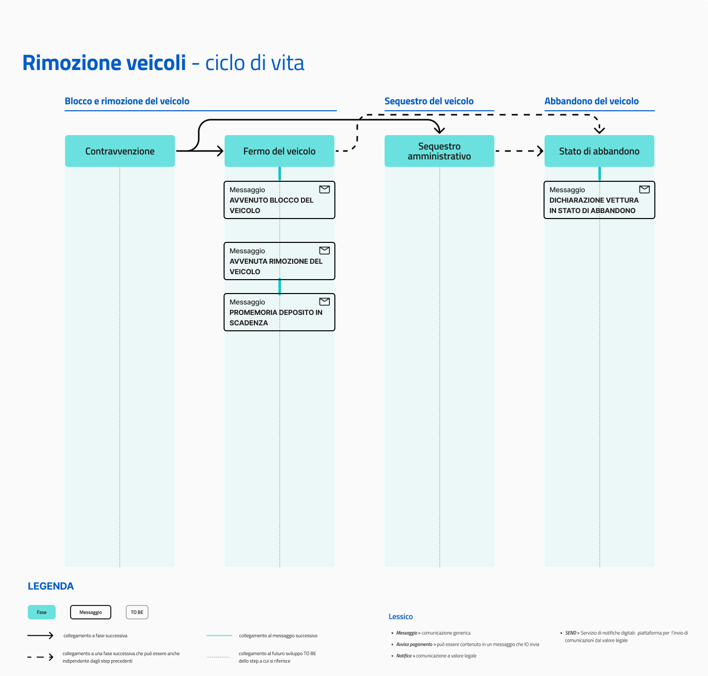

# Rimozione veicoli

Erogare il servizio "Rimozione veicoli" tramite IO permette agli enti di:

* **aggiornare in tempo reale** i cittadini e quindi consentirgli di agire con tempestività sul pagamento di rimozioni o blocchi dei loro veicoli;
* **ridurre i tempi** e i costi del processo di notifica e consegna della contravvenzione;
* **velocizzare i tempi** di recupero della vettura in caso di blocco o rimozione.

[**Scopri tutti i benefici di integrarsi con IO →**  ](../../cose-io-e-qual-e-il-suo-obiettivo.md#perche-integrarsi-con-io)

## Scheda servizio e attributi

| **Nome servizio**            | Rimozione veicoli                                                                                                                                                                                                                                                                                                                                                              |
| ---------------------------- | ------------------------------------------------------------------------------------------------------------------------------------------------------------------------------------------------------------------------------------------------------------------------------------------------------------------------------------------------------------------------------ |
| **Argomento**                | Mobilità e trasporti                                                                                                                                                                                                                                                                                                                                                           |
| **Descrizione del servizio** | 
Il servizio riguarda la rimozione e il blocco di veicoli intestati a te.

Tramite IO potrai:
<ul><li>ricevere un messaggio che ti informa che il tuo veicolo è stato bloccato, rimosso o segnalato come abbandonato;</li><li>ricevere un messaggio che ti informa che il deposito del veicolo è in scadenza;</li><li>ricevere altre comunicazioni.</li></ul> |

## **Ciclo di vita del servizio**

<figure><figcaption>
<strong>Ciclo di vita ed eventi del servizio rimozione veicoli</strong>
</figcaption></figure>

## Messaggio del servizio


**Il servizio ideale**

L'insieme di tutti i messaggi rappresenta il servizio ideale. L'ente che intende erogare questo servizio, può valutare quali e quanti messaggi inviare, in base alle proprie possibilità di integrazione. L'obiettivo finale rimane quello di inviarli tutti, rilasciando versioni del servizio sempre più complete.


Avvenuto blocco del veicolo

**🖋 Titolo del messaggio:** Il tuo veicolo è stato bloccato

🗒 **Testo del messaggio**:&#x20;

Il `<gg/mm/aaaa>` alle `<hh:mm>`, in `<indirizzo>`, il veicolo targato `<targa>` è stato bloccato con le ganasce per queste violazioni:&#x20;

**• `<tipologia di violazione>` - art. `<numero>`**

**Accertamento numero**: `<numero accertamento>`

\[Vedi accertamento]\(URL)

`<Inserire indicazioni su cosa deve fare il destinatario, per es. "Contatta la polizia locale al numero">`. Per maggiori informazioni visita \[questo sito]\(URL).

**🪄  Pulsante**: n/a

**---**

**Destinatari**: Il cittadino a cui è stato bloccato il veicolo in seguito a violazione

**Quando inviarlo**: Quando è commessa la violazione e il blocco è stato applicato

**User story**: <mark style="color:purple;">Come cittadino voglio ricevere notifica immediata della violazione commessa e del blocco apposto</mark>&#x20;

<mark style="color:purple;">ℹ️</mark> Questo messaggio arriva sempre insieme ad un [messaggio di preavviso di accertamento](multe-per-violazione-codice-della-strada.md#emissione-preavviso-di-accertamento), puoi decidere di mandare un messaggio unico. &#x20;

Avvenuta rimozione del veicolo

**🖋 Titolo del messaggio:** Il tuo veicolo è stato rimosso&#x20;

🗒 **Testo del messaggio**:  Il `<gg/mm/aaaa>` alle `<hh:mm>`, in `<indirizzo>`, il veicolo targato `<targa>` è stato rimosso per queste violazioni:

* **`<tipologia di violazione>` - art. `<numero>`**

**Accertamento numero**: `<numero accertamento>`

\[Vedi accertamento]\(URL)

Il tuo veicolo si trova presso il deposito in `<indirizzo>`.\
\
`<Inserire indicazioni su cosa deve fare il destinatario, per es. "Hai tempo fino al <gg/mm/aa> per ritirarlo>`. Per maggiori informazioni visita \[questo sito]\(URL) o contatta `<ente da contattare>``<modalità di contatto>`.

**🪄  Pulsante**: n/a

**---**

**Destinatari**: Il cittadino a cui è stato bloccato il veicolo in seguito a violazione

**Quando inviarlo**: Quando è commessa la violazione e la rimozione è stata effettuata

**User story**: <mark style="color:purple;">Come cittadino voglio ricevere notifica immediata della violazione commessa e della rimozione avvenuta</mark>&#x20;

<mark style="color:purple;">ℹ️</mark> Questo messaggio arriva sempre insieme ad un [messaggio di preavviso di accertamento](multe-per-violazione-codice-della-strada.md#emissione-preavviso-di-accertamento), puoi decidere di mandare un messaggio unico. &#x20;

Avviso di deposito in scadenza

**🖋 Titolo del messaggio:** Il deposito del tuo veicolo è in scadenza

🗒 **Testo del messaggio**:  Hai tempo fino al `<gg/mm/aaaa>` per ritirare il veicolo targato `<numero targa>` presso il deposito in `<indirizzo>`.&#x20;

Potrai ritirarlo solo dopo avere pagato i costi di servizio e deposito. Se non lo ritiri entro il termine stabilito, `<inserire cosa succede>`.&#x20;

Per maggiori informazioni visita \[questo sito]\(URL) o contatta `<ente da contattare>``<modalità di contatto>`.

**🪄 Pulsante**: n/a

**---**

**Destinatari**:  Il cittadino a cui è stato bloccato e rimosso il veicolo in seguito a violazione e non è andato a ritirarla&#x20;

**Quando inviarlo**: Quando la scadenza del deposito si avvicina

**User story**: <mark style="color:purple;">Come cittadino voglio ricevere notifica immediata delle prossime scadenze</mark>

Dichiarazione di vettura in stato di abbandono

**🖋 Titolo del messaggio:** Il tuo veicolo risulta abbandonato

🗒 **Testo del messaggio**: Il veicolo targato `<targa>` in `<indirizzo>` è considerato in stato in abbandono.&#x20;

`<Inserire indicazioni su cosa deve fare il destinatario, per es. "Hai tempo fino al <gg/mm/aa> per contattare <nome ente>...>`. Per maggiori informazioni visita \[questo sito]\(URL) o contatta `<ente da contattare>``<modalità di contatto>`.

**🪄 Pulsante**: n/a

**---**

**Destinatari**: Il cittadino che ha abbandonato un veicolo per strada o non lo ha mai ritirato dal deposito a fronte di una rimozione&#x20;

**Quando inviarlo**: Quando il mezzo è ritrovato oppure il termine del deposito è scaduto

**User story**: <mark style="color:purple;">Come cittadino voglio ricevere notifica immediata se il mio veicolo sta per essere considerato abbandonato</mark>&#x20;


**Lo sapevi?**\
IO è integrata con SEND - Servizio Notifiche Digitale, per l'invio di comunicazioni a valore legale.

[**Scopri di più su SEND**](https://www.pagopa.it/it/prodotti-e-servizi/piattaforma-notifiche-digitali) [**-->**](https://www.pagopa.it/it/prodotti-e-servizi/piattaforma-notifiche-digitali)



**Un modello da personalizzare**

Le procedure di questo servizio variano molto da ente a ente. Consigliamo di utilizzare i testi dei messaggi come un punto di partenza e di aggiungere ulteriori informazioni.&#x20;

Il modello è un esempio che non ha carattere vincolante per l’ente e sul quale la Società declina qualsiasi responsabilità, avendo valore esemplificativo.

Puoi copiare i testi dei messaggi da personalizzare da [questo documento](https://docs.google.com/spreadsheets/d/1xveBu0d5oxLGI2alfBJxg181uqNMIiPrX6RZZP67K5k/edit#gid=538647580).

