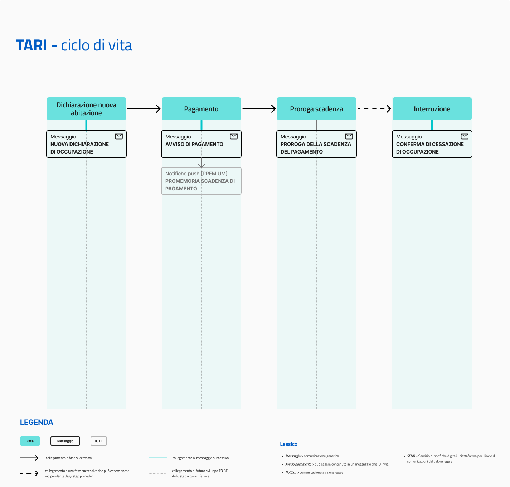

# Tassa sui rifiuti (TARI)

Erogare il servizio "Tassa sui rifiuti (TARI)" tramite IO permette agli enti di:

* fornire ai cittadini comunicazioni puntuali sullo stato della TARI, coprendo **l’intero ciclo di vita del servizio**.
* rappresentare per i cittadini un unico punto di riferimento per la ricezione delle comunicazioni riguardanti la TARI su **uno o più immobili, anche di diversi Comuni** e con differenti regolamentazioni, se presenti su IO.

[**Scopri tutti i benefici di integrarsi con IO →**](../../cose-io-e-qual-e-il-suo-obiettivo.md#perche-integrarsi-con-io)

## Scheda servizio e attributi

| **Nome servizio**            | Tassa sui rifiuti (TARI)                                                                                                                                                                                                                                                                                                                                                                                                                                                                                    |
| ---------------------------- | ----------------------------------------------------------------------------------------------------------------------------------------------------------------------------------------------------------------------------------------------------------------------------------------------------------------------------------------------------------------------------------------------------------------------------------------------------------------------------------------------------------- |
| **Argomento**                | Casa e utenze                                                                                                                                                                                                                                                                                                                                                                                                                                                                                               |
| **Descrizione del servizio** | 
Il servizio riguarda la Tassa sui rifiuti (TARI).

Tramite IO potrai:
<ul><li>ricevere conferma della dichiarazione di occupazione di un immobile domestico e non domestico al fine della TARI;</li><li>ricevere avvisi di pagamento relativi alla TARI e pagarli in app;</li><li>ricevere aggiornamenti su eventuali proroghe alla data di scadenza;</li><li>ricevere conferma della dichiarazione di cessazione di occupazione di un immobile;</li><li>ricevere altre comunicazioni.</li></ul> |

## **Ciclo di vita del servizio**

<figure><figcaption>
<strong>Ciclo di vita ed eventi del servizio TARI</strong>
</figcaption></figure>

## **Messaggi del servizio**


**Il servizio ideale**

L'insieme di tutti i messaggi rappresenta il servizio ideale. L'ente che intende erogare questo servizio, può valutare quali e quanti messaggi inviare, in base alle proprie possibilità di integrazione. L'obiettivo finale rimane quello di inviarli tutti, rilasciando versioni del servizio sempre più complete.


Dichiarazione di nuova occupazione immobile

**🖋 Titolo del messaggio:** Dichiarazione di nuova occupazione immobile

🗒 **Testo del messaggio**: Abbiamo ricevuto la tua dichiarazione di occupazione di un nuovo immobile. Ecco i dettagli:

**Indirizzo**: `<indirizzo>` - `<dati catastali>`\
**Occupato da**: `<nome cognome>`\
**A partire dal**: `<gg/mm/aa>`

\[A questo sito]\(URL) trovi maggiori informazioni su come funziona il calcolo TARI e sulle eventuali esenzioni di cui puoi beneficiare.

**🪄 Pulsante**: n/a

**---**

**Destinatari**: I cittadini che hanno concluso con successo la richiesta di occupazione di un immobile

**Quando inviarlo**: Alla conclusione della registrazione dell'immobile a nome del cittadino

**User story**: <mark style="color:purple;">Come cittadino voglio ricevere la conferma delle mie procedure di occupazione immobile</mark>

Avviso di pagamento

**🖋 Titolo del messaggio:** Nuovo avviso di pagamento

🗒 **Testo del messaggio**: C'è un avviso da pagare intestato a `<nome cognome>` e relativo a `<causale>`.

**Devi pagare**: <00,00> €

**Entro il**: `<gg/mm/aaaa>`

Puoi pagare direttamente in app premendo "Vedi Avviso", oppure tramite tutti i canali di pagamento della piattaforma pagoPA.

Per maggiori informazioni o per richiedere assistenza, contattaci tramite i canali che trovi nella scheda servizio.

**🪄 Pulsante**: Vedi Avviso

**---**

**Destinatari**: Cittadini che devono pagare la TARI

**Quando inviarlo**: Dopo che è stata aperta la posizione debitoria

**User story**: <mark style="color:purple;">Come cittadino voglio essere avvisato quando devo pagare la TARI</mark>

<mark style="color:purple;">ℹ️</mark> In caso di pagamenti su più rate, consultare [questa sezione del manuale dei servizi dedicata.](../../che-cosa-puo-fare-un-servizio-su-io/inviare-messaggi/messaggi-che-veicolano-un-pagamento/soluzioni-per-pagamenti-a-rate.md)

Proroga scadenza del pagamento

**🖋 Titolo del messaggio:** Proroga scadenza del pagamento

🗒 **Testo del messaggio**: È stata prorogata la data di scadenza dell'avviso intestato a `<nome cognome>` e relativo a `<casuale>`.

**Devi pagare**: <00,00> €

**Entro il**: `<gg/mm/aaaa>`

Puoi pagare direttamente in app premendo "Vedi Avviso", oppure tramite tutti i canali di pagamento della piattaforma pagoPA.

Per maggiori informazioni o per richiedere assistenza, contattaci tramite i canali che trovi nella scheda servizio.

**🪄 Pulsante**: Vedi Avviso

**---**

**Destinatari:** I cittadini che devono pagare la tassa

**Quando inviarlo:** Il giorno in cui il Comune decide di prorogare la scadenza del pagamento

**User story:** <mark style="color:purple;">Come cittadino voglio essere avvisato se la scadenza del pagamento è stata prorogata</mark>

Conferma di avvenuta cessazione di occupazione immobile

**🖋 Titolo del messaggio:** Conferma di avvenuta cessazione di occupazione immobile

🗒 **Testo del messaggio**: Abbiamo ricevuto la tua dichiarazione di cessazione occupazione immobile. Ecco i dettagli:

**Indirizzo**: `<indirizzo>`

**Occupato da**: `<nome cognome>`

**A partire dal**: `<gg/mm/aa>`

Per maggiori informazioni o per richiedere assistenza, contattaci tramite i canali che trovi nella scheda servizio.

**🪄 Pulsante**: n/a

**---**

**Destinatari:** I cittadini che dichiarano la cessazione di occupazione di un immobile

**Quando inviarlo:** Compilazione dichiarazione di cessazione

**User story:** <mark style="color:purple;">Come cittadino voglio sapere se la mia richiesta di cessazione occupazione immobile è andata a buon fine</mark>

## Qualche suggerimento

Al fine di arricchire le comunicazioni con informazioni che abbiano valore per il cittadino, consigliamo di:

* inserire nelle comunicazioni uno o più dati di **riferimento all’immobile** per permettere all’utente di identificare l’oggetto del messaggio e differenziarlo nel caso di più proprietà.
* inserire uno o più link che riportino alle **informazioni sulla gestione dello smaltimento rifiuti** e su come operare una corretta raccolta differenziata.


**Lo sapevi?**\
IO è integrata con SEND - Servizio Notifiche Digitale, per l'invio di comunicazioni a valore legale.

[**Scopri di più su SEND**](https://www.pagopa.it/it/prodotti-e-servizi/piattaforma-notifiche-digitali) [**-->**](https://www.pagopa.it/it/prodotti-e-servizi/piattaforma-notifiche-digitali)



**Un modello da personalizzare**

Le procedure di questo servizio variano molto da ente a ente. Consigliamo di utilizzare i testi dei messaggi come un punto di partenza e di aggiungere o modificare il contenuto a seconda delle esigenze.

Il modello è uno esempio che non ha carattere vincolante per l’ente e sul quale la Società declina qualsiasi responsabilità, avendo valore esemplificativo.

Puoi copiare i testi dei messaggi da personalizzare da [questo documento](https://docs.google.com/spreadsheets/d/18Zmo5px_P--N5MigMPf19P9znlcoOh-d-DOdXqH4v0Q/edit#gid=538647580).

