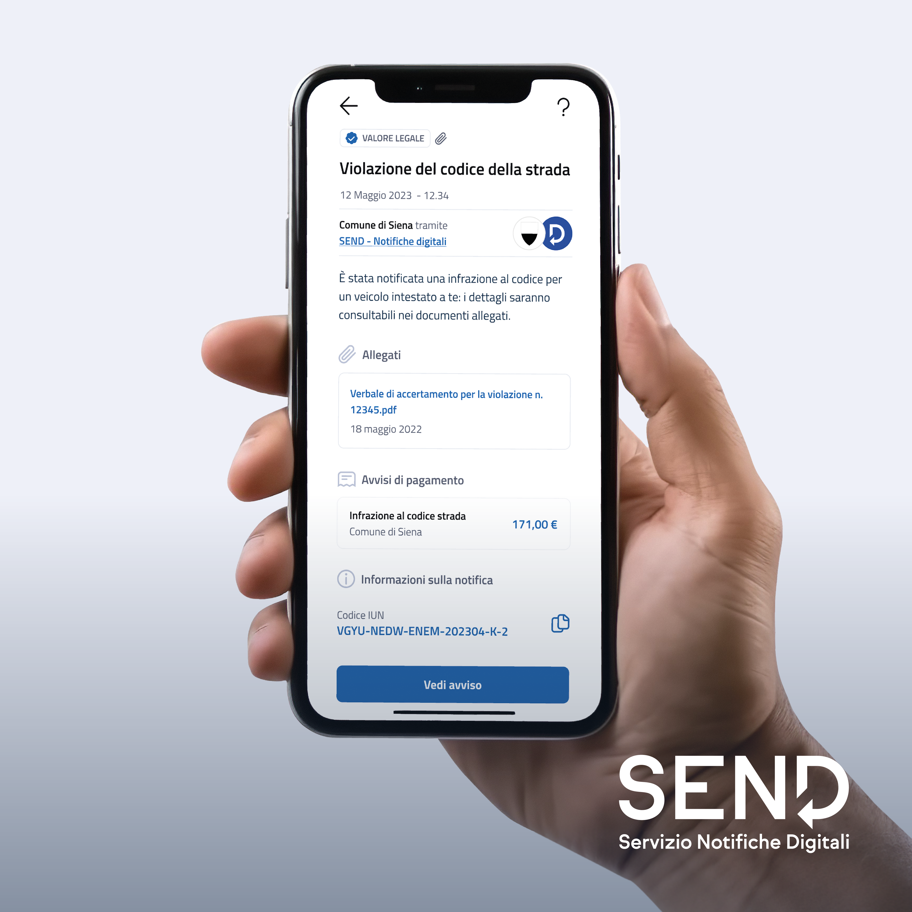

# Template social


Scarica [qui](https://drive.google.com/drive/folders/195rtx3QzJX7nvHFqU2K4StUwuGOcKHSi?usp=drive\_link) gli adattamenti per i post social e le stories


### Suggerimenti copy

Per definire il testo da utilizzare insieme alla creatività in base al contenuto dell’annuncio, di seguito trovi **alcuni template con messaggi standard** per le due casistiche principali mappate ad oggi (1. Annuncio generico di adesione a SEND e 2. Invio notifiche relative a violazioni del codice della strada) che il tuo ente può replicare nelle  comunicazioni ai cittadini attraverso i propri account social istituzionali.&#x20;


Qualora avessi necessità di comunicare altri use case di notifiche non ancora rappresentati in questo toolkit, ti preghiamo di contattare il Team Comunicazione di PagoPA ([comunicazione@pagopa.it](mailto:comunicazione@pagopa.it)) per le opportune verifiche sui contenuti.&#x20;


**Annuncio generico di adesione a SEND**&#x20;

<figure><figcaption>
Immagine per social - soggetto Adesione
</figcaption></figure>

* 🔔Il Comune di xx aderisce a #SEND - Servizio Notifiche Digitali che ti permette di ricevere le nostre comunicazioni a valore legale online.\
  Potrai visualizzarle, gestirle e pagare eventuali costi accedendo a SEND con SPID o CIE o direttamente dall'app @IO. \
  Scopri di più: [https://notifichedigitali.pagopa.it/cittadini](https://notifichedigitali.pagopa.it/cittadini)\

* 📬Da oggi puoi ricevere le comunicazioni a valore legale del Comune di xx su #SEND - Servizio Notifiche Digitali.\
  Esiti di pratiche amministrative, rimborsi o multe: puoi gestire le notifiche online, dal sito di SEND o direttamente dall’app @IO. È facile, veloce e conveniente, si accede tramite SPID o CIE.\
  Scopri di più: [https://notifichedigitali.pagopa.it/cittadini](https://notifichedigitali.pagopa.it/cittadini)\

* Non perderti più nessuna notifica 🔔\
  Con l’adesione del nostro Comune (o Comune di xx) a #SEND - Servizio Notifiche Digitali diventa più semplice ricevere e gestire le comunicazioni a valore legale direttamente online sulla piattaforma dedicata o su app @IO. \
  Scopri come funziona: [https://notifichedigitali.pagopa.it/cittadini](https://notifichedigitali.pagopa.it/cittadini)\

* Da oggi è più facile ricevere e gestire le comunicazioni a valore legale del Comune di XX, grazie all’adesione a #SEND - Servizio Notifiche Digitali.\
  Accedendo a SEND puoi anche visualizzare lo storico delle notifiche ricevute e pagare eventuali costi grazie all'integrazione con pagoPA. In più, ti basta ricevere una delega per leggere anche le notifiche dei tuoi familiari. Scopri come funziona: [https://notifichedigitali.pagopa.it/cittadini](https://notifichedigitali.pagopa.it/cittadini)\

*   Il Comune di xx ti ricorda che con #SEND - Servizio Notifiche Digitali puoi ricevere e gestire le comunicazioni a valore legale online.\
    ⏱️Risparmia il tuo tempo, accedi facilmente alla piattaforma con SPID o CIE per leggere la notifica e, se c’è un importo da pagare, puoi procedere online.  Se attivi il servizio “Notifiche digitali”, puoi visualizzare il contenuto della comunicazione anche sull’app @IO. &#x20;

    Scopri di più su: [https://notifichedigitali.pagopa.it/cittadini](https://notifichedigitali.pagopa.it/cittadini)

**Use case - Violazioni del codice della strada**

<figure><figcaption>
Immagine per social - Soggetto Violazione codice della strada
</figcaption></figure>

*   Sai che puoi ricevere e pagare le multe del Comune di XX online?

    Le notifiche di violazione del codice della strada sono disponibili sulla piattaforma #SEND - Servizio Notifiche Digitali.&#x20;

    Accedi a [https://notifichedigitali.pagopa.it/cittadini](https://notifichedigitali.pagopa.it/cittadini) e completa il pagamento in pochi e semplici passaggi. Il servizio è disponibile anche dall’app @ IO\

*   Con l’adesione del Comune di XXXX a #SEND - Servizio Notifiche Digitali da oggi è più facile gestire le notifiche di violazione del codice della strada.\
    Risparmia tempo e paga direttamente online in modo semplice e sicuro, attraverso la piattaforma dedicata o dall’app IO.&#x20;

    Scopri di più: [https://notifichedigitali.pagopa.it/cittadini](https://notifichedigitali.pagopa.it/cittadini)

**Use case - Bollo auto (per le Regioni)**&#x20;

<figure><figcaption>
Immagine per social - Soggetto Bollo auto
</figcaption></figure>

*   Da oggi puoi ricevere in digitale le notifiche per i mancati pagamenti del bollo auto con #SEND - Servizio Notifiche Digitali.

    Puoi visualizzarle, gestirle e pagare direttamente online,  accedendo alla piattaforma tramite SPID o CIE o attivando il servizio da @IO, l’app dei servizi pubblici.

    Scopri di più: [https://notifichedigitali.pagopa.it/cittadini](https://notifichedigitali.pagopa.it/cittadini)  \

*   Sai che da ora con #SEND puoi ricevere in digitale dalla tua Regione le notifiche sui mancati pagamenti del bollo auto? Puoi anche scegliere di gestire il pagamento direttamente online in pochi passaggi.\
    Accedi alla piattaforma con SPID o CIE o scarica @IO, l’app dei servizi pubblici per attivare il servizio sul tuo smartphone.

    Scopri di più su [https://notifichedigitali.pagopa.it/cittadini](https://notifichedigitali.pagopa.it/cittadini)&#x20;


Quando comunichi sui social media del tuo ente ricorda sempre di:&#x20;

* **taggare gli account ufficiali** di IO (Facebook -[ @IOitaliait](https://www.facebook.com/IOitaliait/), Instagram -[ @IOitaliait](https://www.instagram.com/ioitaliait/?hl=it), Twitter -[ @IOitaliait](https://twitter.com/IOitaliait), LinkedIn -[ IO, l’app dei servizi pubblic](https://www.linkedin.com/showcase/io-l'app-dei-servizi-pubblici/)i) per avere maggiore visibilità
* **usare l’hashtag** #SEND o #IOapp quando opportuno
* **taggare nell’immagine  anche PagoPA S.p.A.** quale società responsabile dello sviluppo di SEND, usando direttamente il tag @pagopaspa su Instagram, [@PagoPA](https://twitter.com/pagopa) su Twitter o includendo il rimando alla pagina [linkedin.com/company/pagopa/](https://www.linkedin.com/company/pagopa/) su LinkedIn&#x20;
* **condividere direttamente** eventuali post dai canali social di PagoPA di interesse per il tuo Ente, senza mai scaricare e poi ripubblicare ex novo quel contenuto (es. un video o un’immagine).

